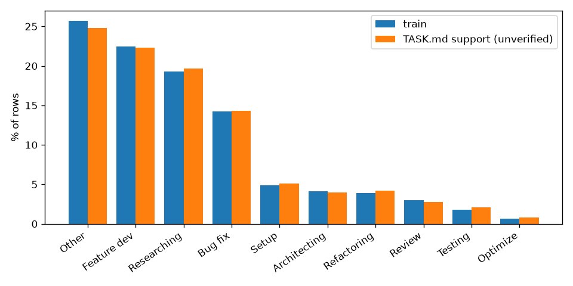
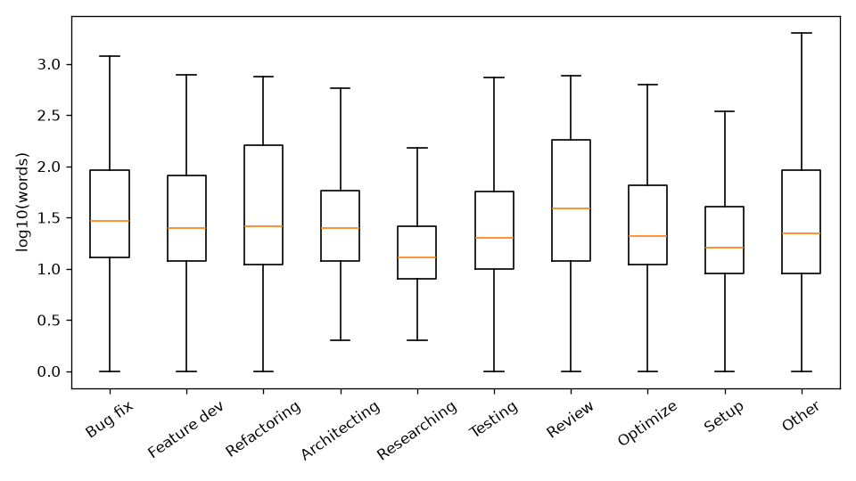
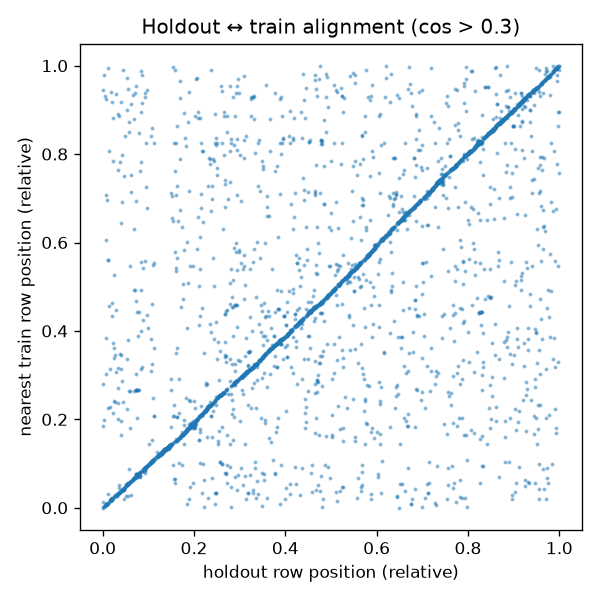

# Step 1 — EDA report

Generated by `src/01_eda.py`.

## 1. Integrity

|         |   rows |   null text |   empty/blank text |   duplicate ids |   duplicate texts |
|:--------|-------:|------------:|-------------------:|----------------:|------------------:|
| train   |  24792 |           0 |                  0 |               0 |                 0 |
| holdout |   6199 |           0 |                  0 |               0 |                 0 |

- Labels outside the 10 names: none
- id overlap train∩holdout: 0
- Holdout rows whose exact text appears in train: 0 (0.0%)
- id prefixes: train {'devgpt': 24792}, holdout {'devgpt': 6199}

## 2. Label distribution

|              |   train n |   train % |   TASK.md support (unverified) |   TASK.md support % |
|:-------------|----------:|----------:|-------------------------------:|--------------------:|
| Other        |    6372.0 |      25.7 |                         1539.0 |                24.8 |
| Feature dev  |    5574.0 |      22.5 |                         1381.0 |                22.3 |
| Researching  |    4782.0 |      19.3 |                         1221.0 |                19.7 |
| Bug fix      |    3536.0 |      14.3 |                          885.0 |                14.3 |
| Setup        |    1214.0 |       4.9 |                          316.0 |                 5.1 |
| Architecting |    1016.0 |       4.1 |                          247.0 |                 4.0 |
| Refactoring  |     971.0 |       3.9 |                          262.0 |                 4.2 |
| Review       |     736.0 |       3.0 |                          171.0 |                 2.8 |
| Testing      |     436.0 |       1.8 |                          128.0 |                 2.1 |
| Optimize     |     155.0 |       0.6 |                           49.0 |                 0.8 |

Imbalance ratio largest/smallest class: 41×



## 3. Text shape

Length (overall):

|               |   train median |   train p90 |   train p99 |   holdout median |   holdout p90 |
|:--------------|---------------:|------------:|------------:|-----------------:|--------------:|
| chars         |            128 |        2008 |        4000 |              127 |          1915 |
| words         |             21 |         281 |         630 |               20 |           281 |
| approx_tokens |             32 |         502 |        1000 |               32 |           478 |
| lines         |              1 |           1 |           1 |                1 |             1 |

- Rows with ≈>128 tokens: train 23.7%, holdout 24.1%
- Rows with ≈>256 tokens: train 17.2%, holdout 17.1%
- Rows with ≈>512 tokens: train 9.7%, holdout 9.1%
- Rows with ≈>1024 tokens: train 0.0%, holdout 0.0%

Per class (fractions are share of rows):

| label        |       n |   median_words |   p90_words |   over_256_tok |   has_code |   has_trace |   has_url |   non_english |
|:-------------|--------:|---------------:|------------:|---------------:|-----------:|------------:|----------:|--------------:|
| Bug fix      | 3536.00 |          29.00 |      269.00 |           0.23 |       0.28 |        0.27 |      0.08 |          0.03 |
| Feature dev  | 5574.00 |          25.00 |      308.70 |           0.19 |       0.28 |        0.03 |      0.06 |          0.05 |
| Refactoring  |  971.00 |          26.00 |      373.00 |           0.29 |       0.45 |        0.06 |      0.06 |          0.02 |
| Architecting | 1016.00 |          25.00 |      139.00 |           0.08 |       0.12 |        0.01 |      0.02 |          0.08 |
| Researching  | 4782.00 |          13.00 |       70.00 |           0.06 |       0.13 |        0.01 |      0.03 |          0.10 |
| Testing      |  436.00 |          20.00 |      228.00 |           0.17 |       0.32 |        0.05 |      0.03 |          0.03 |
| Review       |  736.00 |          39.00 |      401.00 |           0.32 |       0.44 |        0.06 |      0.08 |          0.02 |
| Optimize     |  155.00 |          21.00 |      216.60 |           0.17 |       0.26 |        0.02 |      0.02 |          0.03 |
| Setup        | 1214.00 |          16.00 |      121.70 |           0.09 |       0.10 |        0.08 |      0.09 |          0.04 |
| Other        | 6372.00 |          22.00 |      332.00 |           0.21 |       0.04 |        0.01 |      0.03 |          0.07 |

Holdout content flags: code 0.17, trace 0.06, url 0.05, non-English 0.06 (train: 0.19, 0.06, 0.05, 0.06)



## 4. Label consistency (noise ceiling signals)

- Normalized-text duplicate groups in train: 7 covering 14 rows; groups with conflicting labels: 0 (0.0% of groups)

Nearest-neighbour label agreement in train (TF-IDF 1–2-gram cosine):

| bucket      |      rows |   label_agreement |
|:------------|----------:|------------------:|
| [0.0, 0.3)  | 11543.000 |             0.438 |
| [0.3, 0.5)  |  6961.000 |             0.586 |
| [0.5, 0.7)  |  2565.000 |             0.656 |
| [0.7, 0.8)  |   990.000 |             0.664 |
| [0.8, 0.9)  |  1023.000 |             0.652 |
| [0.9, 0.95) |   574.000 |             0.720 |
| [0.95, 1.0) |  1136.000 |             0.716 |

- Rows with a near-duplicate (cos ≥ 0.9): 1710 (6.9%); of these, label disagrees in 28.3%.
- Label disagreement among near-duplicates is a lower bound on teacher inconsistency.

Most frequent conflicting label pairs among near-duplicates (cos ≥ 0.9):

|                            |   count |
|:---------------------------|--------:|
| Bug fix / Feature dev      |     101 |
| Feature dev / Other        |      39 |
| Feature dev / Review       |      39 |
| Other / Researching        |      38 |
| Feature dev / Refactoring  |      31 |
| Feature dev / Researching  |      30 |
| Bug fix / Researching      |      27 |
| Bug fix / Review           |      26 |
| Bug fix / Refactoring      |      19 |
| Researching / Review       |      12 |
| Architecting / Researching |       9 |
| Refactoring / Review       |       9 |

Examples:

- **Researching**: `Tell me more about 1.21.0.`  
  **Other**: `Tell me more about #1`  (cos 0.93)
- **Researching**: `Here is the PLEX readme, I think this will answer part of your questions, and I hope the answer will become more clear once we review the code in the plex openb`  
  **Review**: `Thank you for reviewing the gnina readme Chat, As per our plan, here is the PLEX Readme. After that, we'll review the gnina files in the plex repo. # PLEX 🧫×🧬→💊`  (cos 0.98)
- **Feature dev**: `convert to french <string name="source">Source</string> <string name="cloud_url">Cloud Url</string> <string name="interval">Interval</string> <string name="auto`  
  **Other**: `<string name="source">Source</string> <string name="cloud_url">Cloud Url</string> <string name="interval">Interval</string> <string name="autosync">Autosync</st`  (cos 1.00)
- **Refactoring**: `<string name="no_images_to_download">No images to download.</string> <string name="this_file_type_is_currently_unsupported">This file type is currently unsuppor`  
  **Feature dev**: `translate to arabic but not any instance of text appearing as myPlanet or planet <string name="no_images_to_download">No images to download.</string> <string na`  (cos 0.97)
- **Other**: `<string name="feedback_type">Feedback Type:</string> <string name="suggestion">Suggestion</string> <string name="no">No</string> <string name="yes">Yes</string>`  
  **Feature dev**: `convert to arabic <string name="feedback_type">Feedback Type:</string> <string name="suggestion">Suggestion</string> <string name="no">No</string> <string name=`  (cos 1.00)
- **Feature dev**: `當使用者沒有上傳頭像照片，在個人的頭像顯示名字的首字母和背景色，react 程式該怎麼設計？`  
  **Architecting**: `React.jsやVue.jsでグローバルステート管理ライブラリを導入するタイミングについて迷います。入れる指標などありますか？`  (cos 1.00)
- **Researching**: `ありがとうございます、とても参考になります。他にもご存知でしたら教えていただけると助かります。（検索は使わないでください）`  
  **Other**: `ありがとうございます。このコーディングをした場合の画面のプレビューを表示できますか。`  (cos 1.00)
- **Architecting**: `https://github.com/Ratescale/spaceweather/issues/4 この作業に関してはたまたま見つけたから考えましたが、もっと効率的に送電線のデータ、東西に伸びる送電線と、電圧レベルが1000kVまたは500kVの送電線を見つけてプロットする方法を提案して。`  
  **Researching**: `QGISでも https://github.com/Ratescale/spaceweather/issues/4 ができるの？`  (cos 0.93)

- Holdout rows with a train near-duplicate (cos ≥ 0.9): 6.9%; cos ≥ 0.7: 14.8%. Median holdout→train similarity 0.32 (train→train 0.31).

### 4b. Same meaning, different teacher label (semantic near-duplicates)

Method: each prompt is embedded with Qwen3-Embedding-8B (with the task instruction, see block 5) and matched to its most similar other prompt in train (cosine). **212 pairs** with cosine ≥ 0.95 carry different teacher labels. Unlike §4 (TF-IDF, shared words), this catches the same request in other words or another language. Most frequent label clashes:

| pair                      |   pairs |
|:--------------------------|--------:|
| Bug fix / Feature dev     |      37 |
| Feature dev / Other       |      21 |
| Bug fix / Review          |      17 |
| Feature dev / Refactoring |      17 |
| Other / Researching       |      15 |
| Feature dev / Review      |      12 |
| Feature dev / Researching |      11 |
| Bug fix / Researching     |       9 |
| Researching / Review      |       8 |
| Bug fix / Setup           |       7 |
| Other / Review            |       7 |
| Bug fix / Refactoring     |       6 |

Examples (consecutive rows within a group are the near-duplicate pairs):

**Review / Optimize / Bug fix**

| row | prompt | teacher label |
|---|---|---|
| 15451 | thanks. can you think of any ways to optimize this code? | **Optimize** |
| 16512 | can this code be improved? | **Review** |
| 21785 | que es lo que has cambiado [what did you change?] | **Researching** |
| 21856 | what did you change? | **Review** |
| 22376 | let { image = '' } = useRouter().query; 이런식으로 기본값을설정하면 버그를 피할 수 있을까? […would setting a default like this avoid the bug?] | **Review** |
| 22377 | let { image } = useRouter().query??'' 이런식으로 하면 버그르르 피할 수 있을까? […would doing it like this avoid the bug?] | **Bug fix** |

**Architecting / Researching / Other**

| row | prompt | teacher label |
|---|---|---|
| 21621 | when a user missed a required field, do you return a 404 or 400? | **Researching** |
| 21622 | So when a user puts in an invalid input, is it 400 or 404? | **Architecting** |
| 3648 | What attributes does a parcel shipment have? | **Researching** |
| 6455 | What attributes does an Air Shipment have to have? | **Architecting** |
| 3683 | What attributes does a full truckload need to have? | **Other** |
| 2699 | What attributes does a less than truckload need to have? | **Architecting** |

**Refactoring / Feature dev**

| row | prompt | teacher label |
|---|---|---|
| 5946 | now integrate this code into the previous code and put it together | **Feature dev** |
| 20864 | Combine the last code with the initial code. | **Refactoring** |
| 18345 | 위에 작성했던 코드에 수정해서 알려줄래? [modify the code you wrote above?] | **Feature dev** |
| 18352 | 이코드를 기존 코드에 맞게 수정해줄래 [modify this code to fit the existing code?] | **Refactoring** |

**Testing / Researching / Other**

| row | prompt | teacher label |
|---|---|---|
| 3889 | can you tell me what will be the output of this testbench | **Researching** |
| 3891 | can you predict the output of this testbench | **Testing** |
| 5275 | このコードを実行してください。main.py [please run this code. main.py] | **Testing** |
| 7053 | main.pyこのコードを実行してください。 [same words, reordered] | **Other** |
| 19363 | Check it with the plugin. | **Testing** |
| 22458 | Can you check with the plugin? | **Other** |

**Setup / Bug fix / Researching**

| row | prompt | teacher label |
|---|---|---|
| 6378 | ModuleNotFoundError: No module named 'panel' | **Setup** |
| 19174 | ModuleNotFoundError: No module named 'evdev' | **Bug fix** |
| 8292 | check which profile aws is using | **Setup** |
| 8294 | aws find which profile is being used | **Researching** |

Any classifier that gives both prompts of such a pair the same label is 'wrong' on one of them; these collisions concentrate in the classes that stay below 0.8 (block 8).

## 5. Row order — are prompts grouped by conversation?

- P(label == previous row's label) = 0.472; expected if order were random = 0.181.
- Same statistic after shuffling rows: 0.179.
- Mean TF-IDF cosine between consecutive rows: train 0.112, holdout 0.073, random pairs 0.008.

P(same label as previous row) per class:

| label        |   P(same as prev) |
|:-------------|------------------:|
| Bug fix      |             0.397 |
| Feature dev  |             0.444 |
| Refactoring  |             0.207 |
| Architecting |             0.265 |
| Researching  |             0.455 |
| Testing      |             0.303 |
| Review       |             0.149 |
| Optimize     |             0.142 |
| Setup        |             0.352 |
| Other        |             0.706 |

- Holdout position vs position of its nearest train row (relative 0–1): Spearman ρ = 0.47; for confident matches (cos > 0.3, n=3419) the median position gap is 0.011 of the file.
- Share of confident matches whose train neighbour lies within ±1% / ±2% / ±5% of the holdout row's relative position: observed 46.9%, 61.8%, 65.6%; if holdout order were unrelated to train order (holdout shuffled, 20 runs): 2.0%, 4.1%, 9.8%.
- ⇒ Both files keep the original order and holdout rows were sampled out of the same conversations. Many holdout prompts have conversational neighbours in train.



How to read the plot: each dot is one holdout row (x = its relative position in holdout.jsonl) paired with its most similar train row by TF-IDF cosine (y = that row's relative position in train.jsonl); only matches with cosine > 0.3 are drawn. If the two files were ordered independently, the dots would fill the square uniformly.

- **Diagonal** (|y − x| ≤ 0.02): 2114 rows, median cosine 0.55. The most similar train prompt sits at the same place in the file — a turn from the same conversation.
- **Background scatter**: 1305 rows, median cosine 0.41. Mostly short, generic prompts ("what about …?", "explain …") that match a similar generic prompt anywhere in train; their position carries no information.
- Faint horizontal bands are single generic train prompts that are the nearest neighbour of many holdout rows (e.g. `What is ^latest_version ?` for 17 of them).

Sample of consecutive train rows (id, label, text start):

- `devgpt-a6d77845f24da9c2` **Feature dev** — Can you write me a python script that plots countries by GDP and area? Include code to fetch this data.
- `devgpt-6c0c81fb217dcdcd` **Bug fix** — I got the following error: Traceback (most recent call last): File "/Users/danielwaltrip/all-files/projects/co
- `devgpt-a0dda346ea7409c2` **Other** — You are now GameGPT, a virtual host facilitating a game. Todays game is called “Super Smash GTP” - a text adve
- `devgpt-8cc26a2729523d28` **Other** — what does netle mean?
- `devgpt-1aa65a2dbf3515c8` **Other** — What is the 'Litany Against Fear'?
- `devgpt-c3bb62c21454ee18` **Other** — You didn't continue. Please give me the entire text of the 'Litany Against Fear'.
- `devgpt-38b6c22d3bef45aa` **Other** — Again, you stopped after four words there. Please continue.
- `devgpt-31610c5303878d67` **Other** — What's going on here? Can you give me the entire text, or not?
- `devgpt-d34c58b7cacce8ee` **Bug fix** — Maybe if you try it line by line?
- `devgpt-2d96be798c3c5b81` **Other** — It seems like you know the full Litany. Could you please give me the complete text of the 'Litany Against Fear
- `devgpt-3c7882967cb2cec1` **Bug fix** — Still truncated. Try whatever you think may work and allow you to give me the complete text.
- `devgpt-3add287817d07e2f` **Bug fix** — Still truncated. Try again.

## 6. Hard pairs — most discriminative words

Smoothed log-odds ratio (informative Dirichlet prior, Monroe et al. 2008) on unigrams+bigrams.

**Refactoring** vs **Optimize**

- → Refactoring: refactor, task refactor, rename, export, follow dependencies, maintain coherence, task move, target dir, target dirs, specified target, best target, coherence, dependencies to, export default, move the
- → Optimize: what, more efficient, how, me, be optimized, at, by, optimize this, on, is, of, optimized, slow, is the, have
  - rows containing `refactor`: Refactoring 13.5% vs Optimize 5.2%; label mix of rows with it: {'Refactoring': 0.61, 'Feature dev': 0.13, 'Other': 0.07, 'Researching': 0.04}
  - rows containing `faster`: Refactoring 0.3% vs Optimize 6.5%; label mix of rows with it: {'Other': 0.22, 'Researching': 0.22, 'Optimize': 0.2, 'Bug fix': 0.08}
  - rows containing `performance`: Refactoring 0.5% vs Optimize 5.2%; label mix of rows with it: {'Other': 0.45, 'Researching': 0.15, 'Feature dev': 0.11, 'Review': 0.07}

**Review** vs **Researching**

- → Review: significant grammatical, grammatical mistakes, technical errors, inaccuracies along, please point, book on, or inaccuracies, any technical, any significant, out any, inaccuracies, grammatical, skip on, errors you, mistakes skip
- → Researching: what, how, explain, what is, the, can, is, in, to, how do, do, what does, does, you explain, of
  - rows containing `review`: Review 6.8% vs Researching 0.3%; label mix of rows with it: {'Other': 0.37, 'Review': 0.19, 'Feature dev': 0.18, 'Architecting': 0.07}
  - rows containing `explain`: Review 1.9% vs Researching 6.4%; label mix of rows with it: {'Researching': 0.55, 'Other': 0.23, 'Feature dev': 0.1, 'Bug fix': 0.05}

**Architecting** vs **Feature dev**

- → Architecting: what, would, is, was, think, how, story, will provide, paragraph, or the, is the, it was, the story, from book, like it
- → Feature dev: write, task implement, following feature, implement the, files when, new files, when needed, feature create, create plan, plan create, needed requirements, implement, create new, feature, script that
  - rows containing `design`: Architecting 5.3% vs Feature dev 1.6%; label mix of rows with it: {'Other': 0.4, 'Feature dev': 0.22, 'Architecting': 0.13, 'Researching': 0.12}
  - rows containing `architecture`: Architecting 1.7% vs Feature dev 0.2%; label mix of rows with it: {'Other': 0.3, 'Researching': 0.2, 'Architecting': 0.17, 'Feature dev': 0.11}

**Setup** vs **Bug fix**

- → Setup: install, how, docker, can, how to, github, pip, cmake, do, will, to install, me, want to, would, create
- → Bug fix: error, fix, typeerror, call last, this error, traceback most, recent call, traceback, not, most recent, cannot, line, type, py line, file users
  - rows containing `install`: Setup 19.3% vs Bug fix 3.7%; label mix of rows with it: {'Feature dev': 0.4, 'Setup': 0.26, 'Bug fix': 0.14, 'Refactoring': 0.1}
  - rows containing `error`: Setup 8.1% vs Bug fix 28.1%; label mix of rows with it: {'Bug fix': 0.54, 'Feature dev': 0.16, 'Researching': 0.06, 'Review': 0.06}

**Bug fix** vs **Feature dev**

- → Bug fix: error, fix, this error, cannot, call last, recent call, traceback most, lib, not, traceback, most recent, py line, typeerror, failed, file users
- → Feature dev: write, implement, task implement, implement the, following feature, files when, when needed, feature create, create plan, new files, feature, plan create, create new, needed requirements, requirements

**Researching** vs **Other**

- → Researching: how, the, code, function, what, can, return, if, does, explain, to, file, use, is, in
- → Other: story, the chapter, the story, paragraph, chapter, will provide, passage, george, the passage, the reader, break the, nothing but, george martin, was written, martin

**Testing** vs **Feature dev**

- → Testing: test, what, tests, was, story, will provide, paragraph, the story, from book, the chapter, chapter, the passage, george, references to, respond with
- → Feature dev: task implement, implement the, following feature, implement, files when, new files, when needed, feature create, create plan, plan create, write, needed requirements, create new, feature, script that

Prompt templates that repeat many times (label mix):

- `I will provide you with a passage`: 631 rows → {'Other': 631}
- `task implement|following feature`: 319 rows → {'Feature dev': 287, 'Refactoring': 13, 'Setup': 11, 'Bug fix': 7, 'Optimize': 1}

## 7. Top-10 n-grams per label

### 7a. Separate TF-IDF vectorizer per label, ranked by mean weight, stop words removed

The IDF is computed inside the label, so words frequent in every label (code, use, make) still rank high.

| label        | top-10 unigram                                                            | top-10 bi-gram                                                                                                                                                               | top-10 tri-gram                                                                                                                                                                                                                                                            |
|:-------------|:--------------------------------------------------------------------------|:-----------------------------------------------------------------------------------------------------------------------------------------------------------------------------|:---------------------------------------------------------------------------------------------------------------------------------------------------------------------------------------------------------------------------------------------------------------------------|
| Other        | passage, like, make, references, write, think, provide, code, use, create | subversion expectations, sound like, chapter story, including references, george martin, passage passage, create paragraph, passage sound, remove references, passage remove | provide passage book, modified version passage, like written george, wall including references, passage book rewrite, chapter story make, passage sound like, book rewrite passage, references break fourth, including references reader                                   |
| Feature dev  | code, add, write, function, want, make, file, create, use, script         | write code, working set, solve task, example start, example end, create new, write python, task description, div class, write function                                       | https github com, change sh shell, shell script creates, sh shell script, script creates changes, creates changes files, changes files does, encode enclose results, files does solve, does solve task                                                                     |
| Researching  | does, use, code, explain, function, example, using, data, python, file    | github com, does mean, https github, step step, look like, javascript example, node js, console log, machine learning, make sure                                             | https github com, markdown code block, think step step, ios interview question, self self self, async req res, loop oriented scheduling, output markdown code, explain line line, tree sitter parser                                                                       |
| Bug fix      | error, type, file, line, code, py, function, js, import, value            | py line, getting error, tests py, failed tests, file users, resolved type, site packages, py assert, assert failed, lib site                                                 | lib site packages, failed tests py, tests py assert, py assert failed, assert failed tests, https github com, write english language, traceback recent file, users ko projects, ko projects new                                                                            |
| Setup        | install, file, run, github, use, docker, command, want, using, make       | docker compose, net snmp, github action, github com, pip install, step step, github actions, package json, https github, file directory                                      | https github com, docker compose yml, lib site packages, modulenotfounderror module named, package lock json, program batch file, operable program batch, internal external command, command operable program, external command operable                                   |
| Architecting | use, want, need, like, data, using, user, code, think, make               | look like, want use, good idea, almacenamiento externo, ok let, la red, want create, best way, want build, web app                                                           | https github com, del almacenamiento externo, tic tac toe, la red bitcoin, does make sense, la red almacenamiento, almacenamiento externo la, externo la red, red almacenamiento externo, la moneda interna                                                                |
| Refactoring  | use, code, function, import, instead, file, return, js, const, make       | add comments, export default, js import, script goal, working set, src frontend, solve task, example end, example start, change sh                                           | shell script creates, creates changes files, change sh shell, sh shell script, script creates changes, changes files does, does solve task, files does solve, output format encode, enclose results change                                                                 |
| Review       | code, return, correct, function, check, self, def, import, string, did    | def self, double check, did change, github com, https github, don think, self self, export default, make sure, base case                                                     | https github com, export default function, following text book, significant grammatical mistakes, inaccuracies significant grammatical, technical errors inaccuracies, point technical errors, errors inaccuracies significant, summarizing content just, just list errors |
| Testing      | test, write, code, tests, run, unit, let, function, add, using            | write test, unit test, test code, test cases, test bench, let test, def self, unit tests, testbench code, make sure                                                          | write test cases, write test bench, def self self, testbench code code, test driven development, div classname styles, write unit tests, test bench module, pytest fixture def, test code work                                                                             |
| Optimize     | use, make, code, optimize, efficient, way, using, try, function, start    | optimize code, make efficient, floating point, processing time, end end, use openmp, running slowly, word vectors, want use, create table                                    | null primary key, int main int, fastest possible way, want fastest possible, integer primary key, secs split txt, split txt flags, txt flags multiline, foreign key references, create table id                                                                            |

### 7b. Distinctive n-grams — one vectorizer on all of train, ranked by mean weight in label − rest

| label        | top-10 unigram                                                                                  | top-10 bi-gram                                                                                                                                                             | top-10 tri-gram                                                                                                                                                                                                                                                              |
|:-------------|:------------------------------------------------------------------------------------------------|:---------------------------------------------------------------------------------------------------------------------------------------------------------------------------|:-----------------------------------------------------------------------------------------------------------------------------------------------------------------------------------------------------------------------------------------------------------------------------|
| Other        | passage, references, story, students, paragraph, chapter, expectations, voice, book, subversion | subversion expectations, including references, chapter story, sound like, george martin, create paragraph, passage passage, passage sound, remove references, passage book | passage book rewrite, make passage sound, passage sound like, written george martin, book rewrite passage, like written george, rewrite passage remove, references break fourth, passage respond modified, martin create paragraph                                           |
| Feature dev  | add, write, code, want, create, function, script, implement, button, files                      | write code, working set, solve task, write python, write function, create new, example start, example end, task description, div class                                     | create new files, write python script, implement following feature, new files needed, task implement following, feature create plan, following feature create, plan create new, create plan create, write python code                                                        |
| Researching  | explain, does, difference, example, use, used, mean, python, tell, know                         | does mean, javascript example, github com, https github, 대해서 알려줘, questions answers, explain code, machine learning, time complexity, line line                      | https github com, markdown code block, ios interview question, loop oriented scheduling, ransomware detection model, output markdown code, think step step, sort object tracking, ip transmission headers, important questions answers                                       |
| Bug fix      | error, type, py, line, fix, failed, lib, users, getting, src                                    | py line, getting error, tests py, file users, resolved type, failed tests, site packages, py assert, assert failed, lib site                                               | lib site packages, failed tests py, tests py assert, py assert failed, assert failed tests, traceback recent file, ko projects new, users ko projects, projects new junior, py line module                                                                                   |
| Setup        | install, run, docker, github, command, file, git, build, env, app                               | docker compose, net snmp, github action, pip install, github actions, env file, package json, file directory, users hella, step step                                       | docker compose yml, https github com, operable program batch, program batch file, internal external command, recognized internal external, external command operable, command operable program, lib site packages, modulenotfounderror module named                          |
| Architecting | want, need, use, think, approach, design, user, good, ありがとうございます, la                  | almacenamiento externo, la red, good idea, want use, ok let, del almacenamiento, cs script, look like, web app, want create                                                | del almacenamiento externo, la red bitcoin, tic tac toe, la red almacenamiento, claves públicas privadas, almacenamiento externo la, does make sense, externo la red, red almacenamiento externo, input output dimensions                                                    |
| Refactoring  | use, function, import, code, instead, const, return, refactor, js, rewrite                      | add comments, js import, export default, script goal, working set, refactor code, src frontend, solve task, example end, example start                                     | import react react, react react import, shell script creates, creates changes files, script creates changes, sh shell script, change sh shell, changes files does, files does solve, does solve task                                                                         |
| Review       | return, correct, def, check, self, did, review, import, code, sure                              | def self, double check, did change, base case, did miss, don think, inaccuracies significant, errors inaccuracies, technical errors, text book                             | following text book, inaccuracies significant grammatical, point technical errors, technical errors inaccuracies, errors inaccuracies significant, significant grammatical mistakes, just list errors, summarizing content just, skip summarizing content, content just list |
| Testing      | test, tests, write, unit, mock, testbench, cases, testing, jest, run                            | write test, unit test, test code, test cases, test bench, testbench code, unit tests, let test, def self, test case                                                        | write test bench, write test cases, testbench code code, write acceptance criteria, def self self, test driven development, div classname styles, test bench module, test code work, following test case                                                                     |
| Optimize     | efficient, optimize, faster, optimized, make, way, vectors, slow, try, large                    | optimize code, make efficient, make faster, word vectors, possible way, secs split, split txt, flags multiline, txt flags, floating point                                  | txt flags multiline, split txt flags, secs split txt, null primary key, output example input, apply function new, new files report, files report ratio, function new files, style overflow visible                                                                           |

## 8. Random samples per class

### Bug fix

- I now think the problem is that what you are calling pebbles-container in my code just has the id 'pebbles'
- channel_gain = self.lifi_aps[user].get_channel_gain(user.position[0], user.position[1]) TypeError: list indices must be integers or slices, not User
- getAUse() cannot be resolved for type DataFlowPublic::CallCfgNode
- no, should be the bottom 5 bits
- The match for document_library provided the file path for the file at the SharePoint URL. Can you change the regex so it matches the first named folder in the URL which is "Shared%20Documents"?
- i am not getting a variation in the graph at all it is stagnant across the time line wtf

### Feature dev

- create vpn proxy golang program I can upload it to a VPS and this program send/receive my packets from my IP and send to destination in Internet
- I wan to build a web app to browse datasets of the following format. Build an html/javascript web app that allow user to browse through instance of data. Use appropriate controls and styling to make the experience intuit…
- Add a option to add a image of user
- I'd like to write a C++ program that simulates hitting a target dummy in a video game to measure how long it takes to kill it.
- Solve should return `(isize, isize)`
- add button to "Clear" the text area and hide the button to reset everything for a fresh request

### Refactoring

- convert this code to split the cost Summary into multiple lines and have multiple text views, one for each line func createMainLayout(tabs *tview.Pages, tabNames *tview.TextView, counts []int, costs []float64) (*tview.Fl…
- separate the html and css scripts
- 基于你本次的回答, 请修改如下的代码: // // Repository.swift // iOSTest // // Created by chenyilong on 2023/7/2. // import Foundation enum ApiError: Error { case urlError case networkError(Error) case decodingError(Error) } protocol Repos…
- I'm going to provide you with a couple of the types & interfaces I've put together and curious if you'd rename anything. Optimize for self-explanatory codebase and take into consideration that either keeping it as is or …
- # Working set src/frontend/components/CommitMessageInput.jsx: ``` import { onCleanup } from 'solid-js'; import { commitMessage, setCommitMessage } from '../stores/commitMessage'; import monitorChangeSignal from '../servi…
- ok, thank you. Can you change the reset in active high, change the name of the output in "spike_out", and change the bit length of refractory period in 8 bits?

### Architecting

- Outline the server side architecture that could be used as the backend for the proposed system
- How can a language compile rule account for differences in toolchains? For instance, what if one c compiler has to build and link in one step while another builds and links with two different executables and another uses…
- What about implementing it from scratch with django models ?
- wouldn't be better to have a "set" function or something like that in the item.cs script so i only access that instead of accessing directly to the itemData.cs script?
- cant the deal status be merged with the lead status
- Where should this code go in my file?

### Researching

- is 0x12345678 part of latin1?
- 为什么：‘setTimeout函数创建的回调不会自动捕获其外围函数的上下文’
- value_function = {} policy = {} for state in graph.nodes.keys(): value_function[state] = 0 # Initialize to 0 policy[state] = None # Initialize to None but here you said each node has a policy. think step by step about wh…
- For Python class or function, is it better to make argument default value as None or empty dictionary such as {}?
- so you are saying that promise.respose is used to maintain consistence in error hadling?
- I am an intelligent computer engineer reading a math-related article. Explain / rewrite this to me relying on foundational principles, without being overtly verbose, and without losing any information: A Schur decomposit…

### Testing

- rspec i want to see stdin values in stdout without printing them. like match exactly what the user would see in the console after manually inputting the values
- ok let's test it now.
- Now in the same way write for swagger - unit testing
- this was the test: describe("PUT /api/buyers/id", () => { it("Test response if data input is correct format", function (done) { request(app) .put("/api/buyers/:id") .send({ firstName: "updated-string", lastName: "updated…
- How can I fix this error? FAIL src/tests/LoginPage.test.js ● Console console.log { data: { user: { id: 1, username: 'test_user', email: 'test@example.com' }, token: 'mock-auth-token' } } at src/pages/login/Login.js:33:25…
- Do you see in the tests that I send, that I already did that?

### Review

- Good day to you, ChatGPT! I desire some coding assistance. I'm going to paste some code, please give me your appraisal of: from typing import Optional import discord from blitzdb import Document, FileBackend from discord…
- did you miss any of the requirements i told you to do. please double check
- Maybe you can also print an array index so I can easily tell you which line to correct. First line asking "Do you want me over here" should be Henrik. The reply "Thanks for having me" should be Fred. Is Sysvile a forest …
- $(document).ready(function () { ここはなぜ変えた？
- i want you to check that the numbers in main's output is in fact correct
- Did you miss any other best practices. I've only gave a few

### Optimize

- Thanks, make it match with mobile.twitter.com also I reckon https://*.twitter.com? Could you make the overall code execute faster without losing functionality? And so that it doesn't hog browser memory?
- Don't fetch all pages for PRs. Only fetch till 3 months ago
- Benchmark how long it takes to turn a Python list of 10,000 300-long floating point list vectors into a numpy array, re-run that benchmark for 1000 and 5000 and 10000 and 20000 and 100000 length
- 如果 carsInDriving 的数量很大，如何改进这段代码？
- Generate the upper and lower bound in the same function, keeping redundant computation to a minimum.
- /goto 2 /implement Review the "process requisition" phase. It might be that the approval workflow is too complex, causing unnecessary delays. Streamlining the approval process could help speed this up.

### Setup

- quiero crear el entrono en windows
- I have a project running in docker. It is using docker volumes. How can I move it to another linux server?
- Now I actually want to test dnsmasq, I've got it running and I indicated that it's `interface=enp113s0` in the dnsmasq.conf file. Now what I think what I want to do is use dhclient to request an dhcp address. And I thoug…
- thanks, that worked. now I'd like to run the current version of this app in my physical iPhone. how can I test this out on my device?
- Defaulting to user installation because normal site-packages is not writeable Requirement already satisfied: evdev in ./.local/lib/python3.10/site-packages (1.6.1)
- (base) esiboni@ESIBONI-M-QPLQ mixitApp % tsc --version zsh: command not found: tsc

### Other

- Sure. I'll be glad to help. Tell me how I can get that information. My data frame is called GCdf .
- I will provide you with a passage from a book. Rewrite the passage to remove all references that break the fourth wall, including references to "the reader" or "the chapter" or "the story". Make the passage sound more li…
- by the way all questions i am asking are for unity 2d
- I saw something today that claimed "Biden's anti-MAGA speech was 'ridiculous': Campaign PAC chair". Do you think that this is likely to be true?
- Please give me the updates for the entire code base. I am very scared that I will do something wrong and get scoldings from my boss
- 1. no concealed augmentation 2. no expectation before inquiry 3. no interaction without consent
