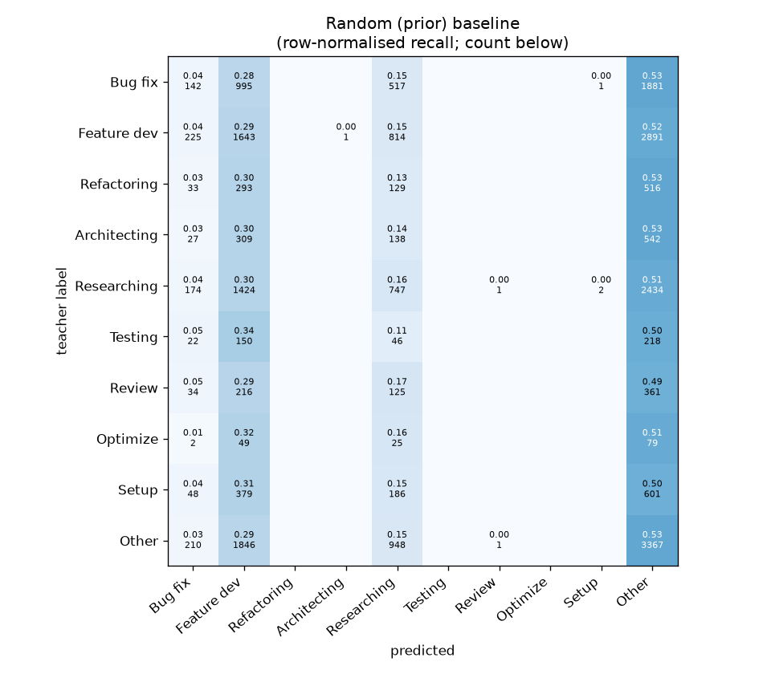
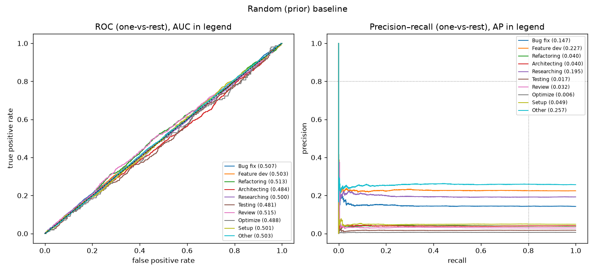

# Step 2 — Folds and evaluation protocol

Generated by `src/02_folds.py`.

## Label distribution per fold (count, % of fold)

| label        | fold 0        | fold 1        | fold 2        | fold 3        | fold 4        |   overall % |
|:-------------|:--------------|:--------------|:--------------|:--------------|:--------------|------------:|
| Bug fix      | 707 (14.26%)  | 708 (14.28%)  | 707 (14.26%)  | 707 (14.26%)  | 707 (14.26%)  |       14.26 |
| Feature dev  | 1115 (22.48%) | 1114 (22.46%) | 1115 (22.49%) | 1115 (22.49%) | 1115 (22.49%) |       22.48 |
| Refactoring  | 194 (3.91%)   | 194 (3.91%)   | 195 (3.93%)   | 194 (3.91%)   | 194 (3.91%)   |        3.92 |
| Architecting | 204 (4.11%)   | 203 (4.09%)   | 203 (4.09%)   | 203 (4.09%)   | 203 (4.09%)   |        4.1  |
| Researching  | 956 (19.28%)  | 956 (19.28%)  | 957 (19.3%)   | 957 (19.3%)   | 956 (19.28%)  |       19.29 |
| Testing      | 87 (1.75%)    | 88 (1.77%)    | 87 (1.75%)    | 87 (1.75%)    | 87 (1.75%)    |        1.76 |
| Review       | 147 (2.96%)   | 147 (2.96%)   | 147 (2.96%)   | 147 (2.96%)   | 148 (2.99%)   |        2.97 |
| Optimize     | 31 (0.63%)    | 31 (0.63%)    | 31 (0.63%)    | 31 (0.63%)    | 31 (0.63%)    |        0.63 |
| Setup        | 243 (4.9%)    | 243 (4.9%)    | 242 (4.88%)   | 243 (4.9%)    | 243 (4.9%)    |        4.9  |
| Other        | 1275 (25.71%) | 1275 (25.71%) | 1274 (25.7%)  | 1274 (25.7%)  | 1274 (25.7%)  |       25.7  |
| rows         | 4959          | 4959          | 4958          | 4958          | 4958          |             |

Max deviation of any class share from its overall share: 0.02 pp.

## Harness sanity check — random classifier (should show AUC≈0.5, large p-values)

### Random baseline

**Threshold metrics (argmax prediction)**

|              |   support (OOF) |   precision |   recall |    F1 | P 95% CI    | R 95% CI    | F1 95% CI   |   p(F1≤0.8) |
|:-------------|----------------:|------------:|---------:|------:|:------------|:------------|:------------|------------:|
| Bug fix      |            3536 |       0.155 |    0.040 | 0.064 | 0.107–0.198 | 0.027–0.053 | 0.044–0.083 |       1.000 |
| Feature dev  |            5574 |       0.225 |    0.295 | 0.255 | 0.209–0.243 | 0.272–0.319 | 0.237–0.276 |       1.000 |
| Refactoring  |             971 |       0.000 |    0.000 | 0.000 | 0.000–0.000 | 0.000–0.000 | 0.000–0.000 |       1.000 |
| Architecting |            1016 |       0.000 |    0.000 | 0.000 | 0.000–0.000 | 0.000–0.000 | 0.000–0.000 |       1.000 |
| Researching  |            4782 |       0.203 |    0.156 | 0.177 | 0.181–0.228 | 0.135–0.178 | 0.155–0.199 |       1.000 |
| Testing      |             436 |       0.000 |    0.000 | 0.000 | 0.000–0.000 | 0.000–0.000 | 0.000–0.000 |       1.000 |
| Review       |             736 |       0.000 |    0.000 | 0.000 | 0.000–0.000 | 0.000–0.000 | 0.000–0.000 |       1.000 |
| Optimize     |             155 |       0.000 |    0.000 | 0.000 | 0.000–0.000 | 0.000–0.000 | 0.000–0.000 |       1.000 |
| Setup        |            1214 |       0.000 |    0.000 | 0.000 | 0.000–0.000 | 0.000–0.000 | 0.000–0.000 |       1.000 |
| Other        |            6372 |       0.261 |    0.528 | 0.350 | 0.250–0.271 | 0.505–0.554 | 0.335–0.364 |       1.000 |

**Ranking metrics (class scores, one-vs-rest)**

|              |   ROC-AUC | ROC-AUC 95% CI   |   p(AUC=0.5) |   PR-AUC (AP) | PR-AUC 95% CI   |   PR-AUC chance (=prevalence) |
|:-------------|----------:|:-----------------|-------------:|--------------:|:----------------|------------------------------:|
| Bug fix      |     0.507 | 0.483–0.527      |        0.096 |         0.147 | 0.138–0.158     |                         0.143 |
| Feature dev  |     0.503 | 0.484–0.520      |        0.230 |         0.227 | 0.218–0.238     |                         0.225 |
| Refactoring  |     0.513 | 0.479–0.549      |        0.082 |         0.040 | 0.037–0.047     |                         0.039 |
| Architecting |     0.484 | 0.450–0.520      |        0.960 |         0.040 | 0.037–0.049     |                         0.041 |
| Researching  |     0.500 | 0.485–0.518      |        0.540 |         0.195 | 0.188–0.207     |                         0.193 |
| Testing      |     0.481 | 0.424–0.536      |        0.910 |         0.017 | 0.015–0.022     |                         0.018 |
| Review       |     0.515 | 0.469–0.553      |        0.082 |         0.032 | 0.028–0.047     |                         0.030 |
| Optimize     |     0.488 | 0.400–0.586      |        0.700 |         0.006 | 0.005–0.009     |                         0.006 |
| Setup        |     0.501 | 0.468–0.538      |        0.440 |         0.049 | 0.044–0.057     |                         0.049 |
| Other        |     0.503 | 0.490–0.519      |        0.230 |         0.257 | 0.248–0.269     |                         0.257 |

**Overall**

|                       |   value |      lo |      hi |   p-value |
|:----------------------|--------:|--------:|--------:|----------:|
| accuracy              |   0.238 |   0.229 |   0.247 |   nan     |
| macro-F1              |   0.085 |   0.081 |   0.089 |     0.015 |
| min-F1 (bar)          |   0.000 |   0.000 |   0.000 |     1.000 |
| classes with F1 ≥ 0.8 |   0.000 | nan     | nan     |   nan     |
| macro ROC-AUC         |   0.500 | nan     | nan     |   nan     |
| macro PR-AUC          |   0.101 | nan     | nan     |   nan     |

