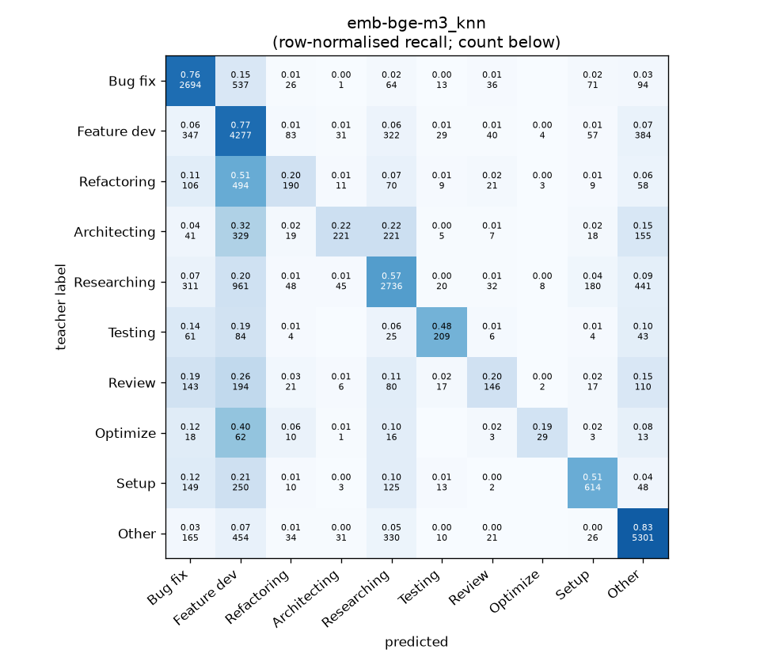
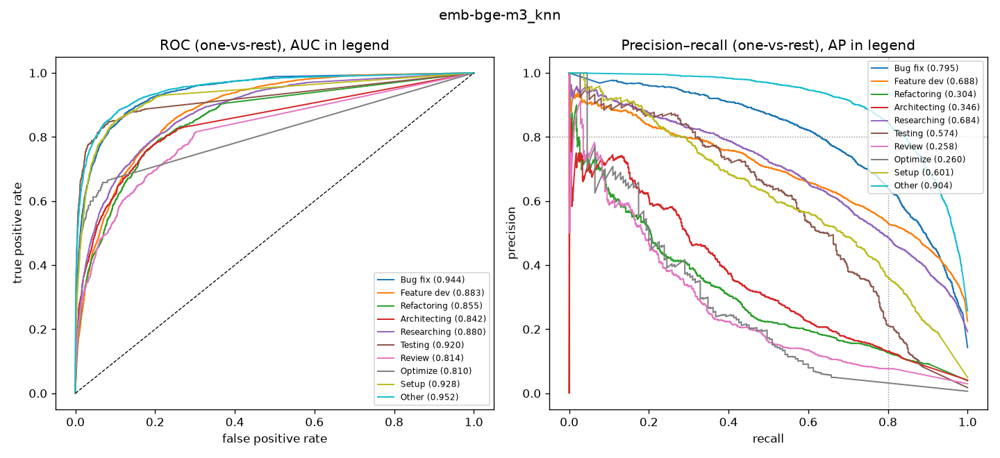

# emb-bge-m3_knn

```
{
 "block": 2,
 "features": "emb-bge-m3",
 "model": "knn",
 "selection": "fold-0 grid, min-F1 then macro-F1",
 "params": "{\"k\": 15}",
 "cv_seconds": 3.1,
 "full_fit_seconds": 1.6
}
```

### emb-bge-m3_knn

**Threshold metrics (argmax prediction)**

|              |   support (OOF) |   precision |   recall |    F1 | P 95% CI    | R 95% CI    | F1 95% CI   |   p(F1≤0.8) |
|:-------------|----------------:|------------:|---------:|------:|:------------|:------------|:------------|------------:|
| Bug fix      |            3536 |       0.668 |    0.762 | 0.712 | 0.645–0.692 | 0.735–0.790 | 0.692–0.732 |       1.000 |
| Feature dev  |            5574 |       0.560 |    0.767 | 0.647 | 0.543–0.574 | 0.745–0.788 | 0.631–0.662 |       1.000 |
| Refactoring  |             971 |       0.427 |    0.196 | 0.268 | 0.339–0.513 | 0.144–0.251 | 0.206–0.332 |       1.000 |
| Architecting |            1016 |       0.631 |    0.218 | 0.324 | 0.543–0.730 | 0.169–0.268 | 0.260–0.385 |       1.000 |
| Researching  |            4782 |       0.686 |    0.572 | 0.624 | 0.664–0.710 | 0.543–0.600 | 0.601–0.646 |       1.000 |
| Testing      |             436 |       0.643 |    0.479 | 0.549 | 0.544–0.737 | 0.385–0.569 | 0.461–0.626 |       1.000 |
| Review       |             736 |       0.465 |    0.198 | 0.278 | 0.361–0.575 | 0.141–0.255 | 0.207–0.346 |       1.000 |
| Optimize     |             155 |       0.630 |    0.187 | 0.289 | 0.333–0.889 | 0.077–0.333 | 0.125–0.453 |       1.000 |
| Setup        |            1214 |       0.615 |    0.506 | 0.555 | 0.559–0.668 | 0.446–0.558 | 0.505–0.600 |       1.000 |
| Other        |            6372 |       0.798 |    0.832 | 0.814 | 0.781–0.815 | 0.812–0.849 | 0.802–0.828 |       0.019 |

**Ranking metrics (class scores, one-vs-rest)**

|              |   ROC-AUC | ROC-AUC 95% CI   |   p(AUC=0.5) |   PR-AUC (AP) | PR-AUC 95% CI   |   PR-AUC chance (=prevalence) |
|:-------------|----------:|:-----------------|-------------:|--------------:|:----------------|------------------------------:|
| Bug fix      |     0.944 | 0.936–0.951      |        0.000 |         0.795 | 0.773–0.819     |                         0.143 |
| Feature dev  |     0.883 | 0.873–0.891      |        0.000 |         0.688 | 0.665–0.708     |                         0.225 |
| Refactoring  |     0.855 | 0.828–0.877      |        0.000 |         0.304 | 0.247–0.357     |                         0.039 |
| Architecting |     0.842 | 0.813–0.873      |        0.000 |         0.346 | 0.295–0.406     |                         0.041 |
| Researching  |     0.880 | 0.871–0.889      |        0.000 |         0.684 | 0.663–0.707     |                         0.193 |
| Testing      |     0.920 | 0.886–0.955      |        0.000 |         0.574 | 0.491–0.661     |                         0.018 |
| Review       |     0.814 | 0.784–0.852      |        0.000 |         0.258 | 0.195–0.336     |                         0.030 |
| Optimize     |     0.810 | 0.725–0.882      |        0.000 |         0.260 | 0.132–0.389     |                         0.006 |
| Setup        |     0.928 | 0.911–0.944      |        0.000 |         0.601 | 0.553–0.643     |                         0.049 |
| Other        |     0.952 | 0.945–0.956      |        0.000 |         0.904 | 0.892–0.912     |                         0.257 |

**Overall**

|                       |   value |      lo |      hi |   p-value |
|:----------------------|--------:|--------:|--------:|----------:|
| accuracy              |   0.662 |   0.652 |   0.673 |   nan     |
| macro-F1              |   0.506 |   0.483 |   0.529 |     0.005 |
| min-F1 (bar)          |   0.268 |   0.125 |   0.295 |     1.000 |
| classes with F1 ≥ 0.8 |   1.000 | nan     | nan     |   nan     |
| macro ROC-AUC         |   0.883 | nan     | nan     |   nan     |
| macro PR-AUC          |   0.541 | nan     | nan     |   nan     |




