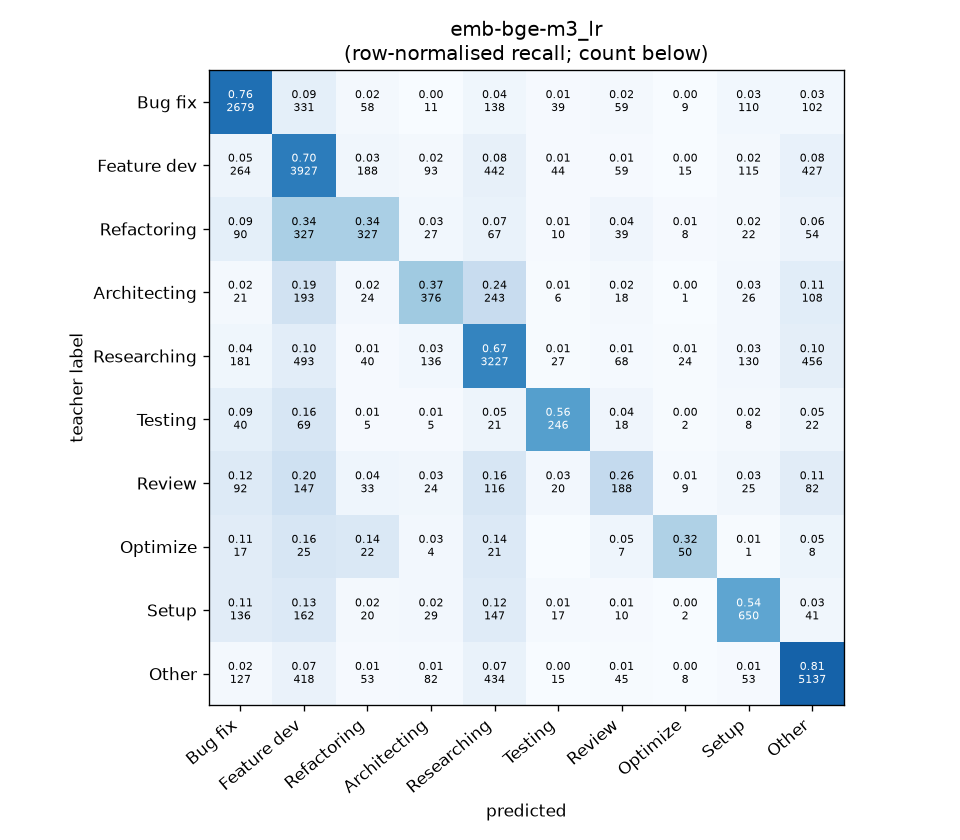
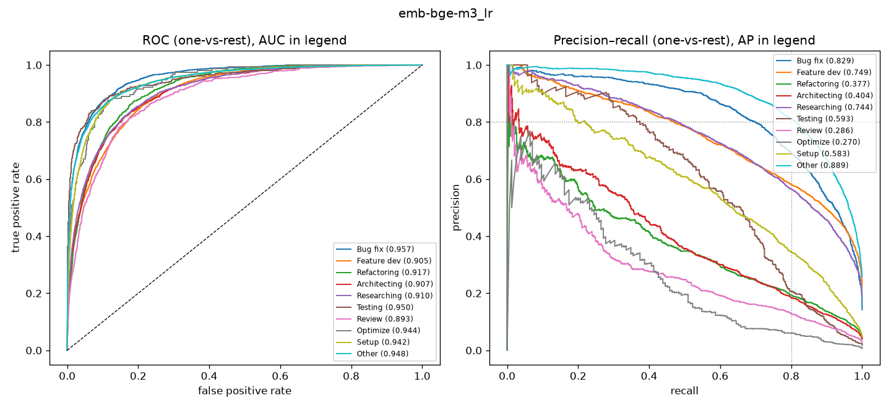

# emb-bge-m3_lr

```
{
 "block": 2,
 "features": "emb-bge-m3",
 "model": "lr",
 "selection": "fold-0 grid, min-F1 then macro-F1",
 "params": "{\"C\": 100.0, \"cw\": null}",
 "cv_seconds": 6.9,
 "full_fit_seconds": 4.5
}
```

### emb-bge-m3_lr

**Threshold metrics (argmax prediction)**

|              |   support (OOF) |   precision |   recall |    F1 | P 95% CI    | R 95% CI    | F1 95% CI   |   p(F1≤0.8) |
|:-------------|----------------:|------------:|---------:|------:|:------------|:------------|:------------|------------:|
| Bug fix      |            3536 |       0.735 |    0.758 | 0.746 | 0.711–0.759 | 0.729–0.785 | 0.726–0.765 |       1.000 |
| Feature dev  |            5574 |       0.645 |    0.705 | 0.673 | 0.625–0.665 | 0.679–0.727 | 0.654–0.692 |       1.000 |
| Refactoring  |             971 |       0.425 |    0.337 | 0.376 | 0.365–0.492 | 0.280–0.399 | 0.319–0.432 |       1.000 |
| Architecting |            1016 |       0.478 |    0.370 | 0.417 | 0.412–0.541 | 0.311–0.429 | 0.358–0.471 |       1.000 |
| Researching  |            4782 |       0.665 |    0.675 | 0.670 | 0.643–0.686 | 0.650–0.702 | 0.651–0.690 |       1.000 |
| Testing      |             436 |       0.580 |    0.564 | 0.572 | 0.500–0.663 | 0.468–0.651 | 0.493–0.640 |       1.000 |
| Review       |             736 |       0.368 |    0.255 | 0.302 | 0.292–0.443 | 0.196–0.321 | 0.236–0.367 |       1.000 |
| Optimize     |             155 |       0.391 |    0.323 | 0.353 | 0.250–0.548 | 0.179–0.462 | 0.209–0.500 |       1.000 |
| Setup        |            1214 |       0.570 |    0.535 | 0.552 | 0.520–0.624 | 0.475–0.591 | 0.502–0.596 |       1.000 |
| Other        |            6372 |       0.798 |    0.806 | 0.802 | 0.780–0.816 | 0.787–0.824 | 0.787–0.816 |       0.411 |

**Ranking metrics (class scores, one-vs-rest)**

|              |   ROC-AUC | ROC-AUC 95% CI   |   p(AUC=0.5) |   PR-AUC (AP) | PR-AUC 95% CI   |   PR-AUC chance (=prevalence) |
|:-------------|----------:|:-----------------|-------------:|--------------:|:----------------|------------------------------:|
| Bug fix      |     0.957 | 0.951–0.962      |        0.000 |         0.829 | 0.809–0.847     |                         0.143 |
| Feature dev  |     0.905 | 0.896–0.913      |        0.000 |         0.749 | 0.726–0.767     |                         0.225 |
| Refactoring  |     0.917 | 0.901–0.929      |        0.000 |         0.377 | 0.323–0.433     |                         0.039 |
| Architecting |     0.907 | 0.891–0.921      |        0.000 |         0.404 | 0.351–0.467     |                         0.041 |
| Researching  |     0.910 | 0.903–0.918      |        0.000 |         0.744 | 0.721–0.767     |                         0.193 |
| Testing      |     0.950 | 0.929–0.971      |        0.000 |         0.593 | 0.519–0.680     |                         0.018 |
| Review       |     0.893 | 0.873–0.913      |        0.000 |         0.286 | 0.241–0.365     |                         0.030 |
| Optimize     |     0.944 | 0.914–0.971      |        0.000 |         0.270 | 0.163–0.446     |                         0.006 |
| Setup        |     0.942 | 0.931–0.952      |        0.000 |         0.583 | 0.527–0.629     |                         0.049 |
| Other        |     0.948 | 0.941–0.953      |        0.000 |         0.889 | 0.877–0.901     |                         0.257 |

**Overall**

|                       |   value |      lo |      hi |   p-value |
|:----------------------|--------:|--------:|--------:|----------:|
| accuracy              |   0.678 |   0.666 |   0.689 |   nan     |
| macro-F1              |   0.546 |   0.526 |   0.566 |     0.005 |
| min-F1 (bar)          |   0.302 |   0.209 |   0.352 |     1.000 |
| classes with F1 ≥ 0.8 |   1.000 | nan     | nan     |   nan     |
| macro ROC-AUC         |   0.927 | nan     | nan     |   nan     |
| macro PR-AUC          |   0.572 | nan     | nan     |   nan     |




