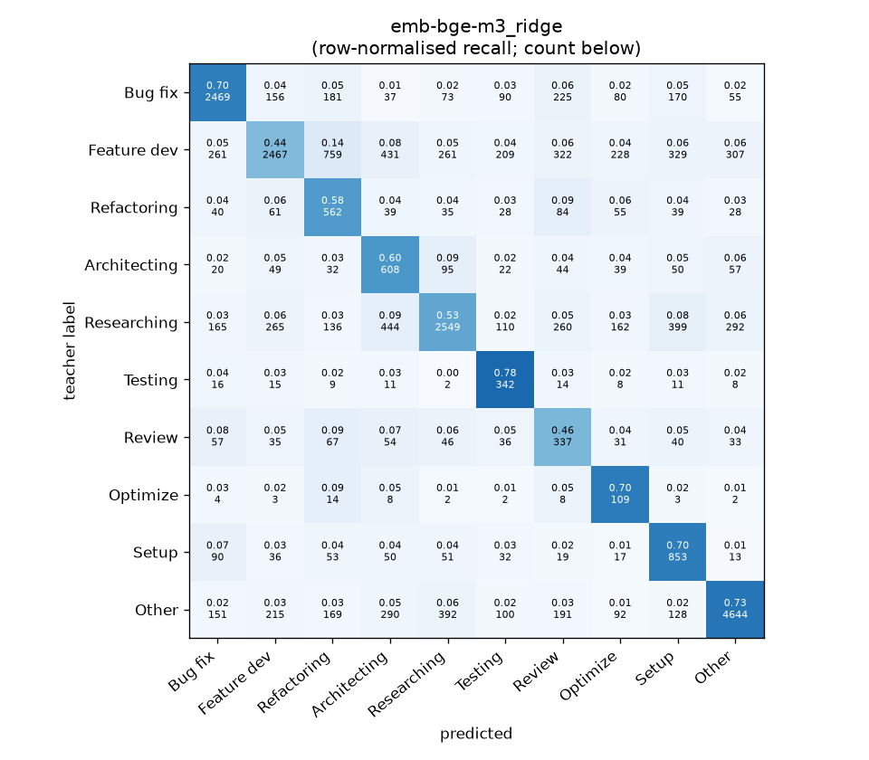
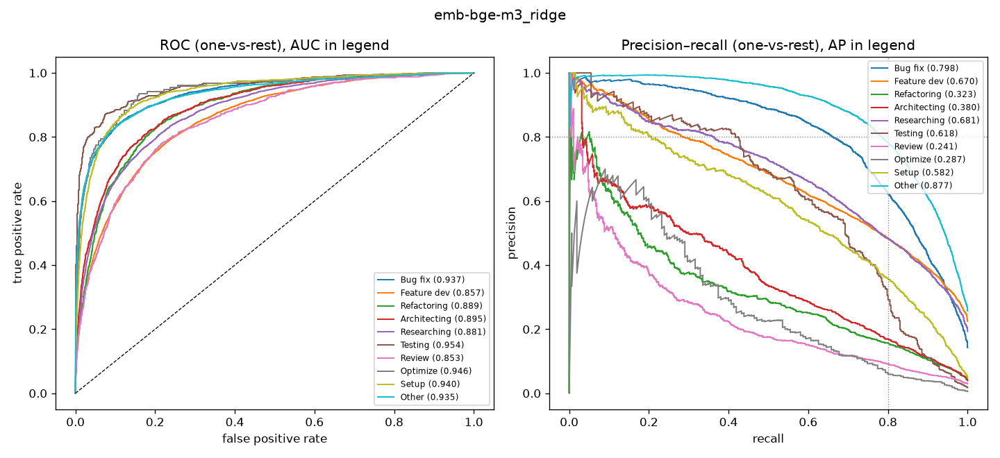

# emb-bge-m3_ridge

```
{
 "block": 2,
 "features": "emb-bge-m3",
 "model": "ridge",
 "selection": "fold-0 grid, min-F1 then macro-F1",
 "params": "{\"alpha\": 0.1, \"cw\": \"balanced\"}",
 "cv_seconds": 1.2,
 "full_fit_seconds": 0.1
}
```

### emb-bge-m3_ridge

**Threshold metrics (argmax prediction)**

|              |   support (OOF) |   precision |   recall |    F1 | P 95% CI    | R 95% CI    | F1 95% CI   |   p(F1≤0.8) |
|:-------------|----------------:|------------:|---------:|------:|:------------|:------------|:------------|------------:|
| Bug fix      |            3536 |       0.754 |    0.698 | 0.725 | 0.730–0.780 | 0.670–0.727 | 0.704–0.748 |       1.000 |
| Feature dev  |            5574 |       0.747 |    0.443 | 0.556 | 0.719–0.774 | 0.417–0.471 | 0.531–0.581 |       1.000 |
| Refactoring  |             971 |       0.284 |    0.579 | 0.381 | 0.256–0.312 | 0.519–0.638 | 0.343–0.417 |       1.000 |
| Architecting |            1016 |       0.308 |    0.598 | 0.407 | 0.277–0.339 | 0.535–0.657 | 0.369–0.444 |       1.000 |
| Researching  |            4782 |       0.727 |    0.533 | 0.615 | 0.701–0.755 | 0.504–0.561 | 0.590–0.639 |       1.000 |
| Testing      |             436 |       0.352 |    0.784 | 0.486 | 0.311–0.395 | 0.706–0.853 | 0.436–0.533 |       1.000 |
| Review       |             736 |       0.224 |    0.458 | 0.301 | 0.191–0.257 | 0.386–0.533 | 0.258–0.346 |       1.000 |
| Optimize     |             155 |       0.133 |    0.703 | 0.223 | 0.106–0.161 | 0.564–0.846 | 0.177–0.268 |       1.000 |
| Setup        |            1214 |       0.422 |    0.703 | 0.527 | 0.389–0.455 | 0.650–0.752 | 0.491–0.562 |       1.000 |
| Other        |            6372 |       0.854 |    0.729 | 0.786 | 0.836–0.871 | 0.706–0.750 | 0.770–0.802 |       0.951 |

**Ranking metrics (class scores, one-vs-rest)**

|              |   ROC-AUC | ROC-AUC 95% CI   |   p(AUC=0.5) |   PR-AUC (AP) | PR-AUC 95% CI   |   PR-AUC chance (=prevalence) |
|:-------------|----------:|:-----------------|-------------:|--------------:|:----------------|------------------------------:|
| Bug fix      |     0.937 | 0.929–0.946      |        0.000 |         0.798 | 0.777–0.822     |                         0.143 |
| Feature dev  |     0.857 | 0.845–0.866      |        0.000 |         0.670 | 0.646–0.688     |                         0.225 |
| Refactoring  |     0.889 | 0.870–0.906      |        0.000 |         0.323 | 0.272–0.386     |                         0.039 |
| Architecting |     0.895 | 0.876–0.915      |        0.000 |         0.380 | 0.330–0.449     |                         0.041 |
| Researching  |     0.881 | 0.872–0.889      |        0.000 |         0.681 | 0.657–0.704     |                         0.193 |
| Testing      |     0.954 | 0.931–0.976      |        0.000 |         0.618 | 0.544–0.704     |                         0.018 |
| Review       |     0.853 | 0.824–0.877      |        0.000 |         0.241 | 0.194–0.313     |                         0.030 |
| Optimize     |     0.946 | 0.898–0.977      |        0.000 |         0.287 | 0.179–0.464     |                         0.006 |
| Setup        |     0.940 | 0.927–0.953      |        0.000 |         0.582 | 0.538–0.628     |                         0.049 |
| Other        |     0.935 | 0.927–0.940      |        0.000 |         0.877 | 0.863–0.888     |                         0.257 |

**Overall**

|                       |   value |      lo |      hi |   p-value |
|:----------------------|--------:|--------:|--------:|----------:|
| accuracy              |   0.603 |   0.590 |   0.615 |   nan     |
| macro-F1              |   0.501 |   0.487 |   0.514 |     0.005 |
| min-F1 (bar)          |   0.223 |   0.177 |   0.268 |     1.000 |
| classes with F1 ≥ 0.8 |   0.000 | nan     | nan     |   nan     |
| macro ROC-AUC         |   0.909 | nan     | nan     |   nan     |
| macro PR-AUC          |   0.546 | nan     | nan     |   nan     |




