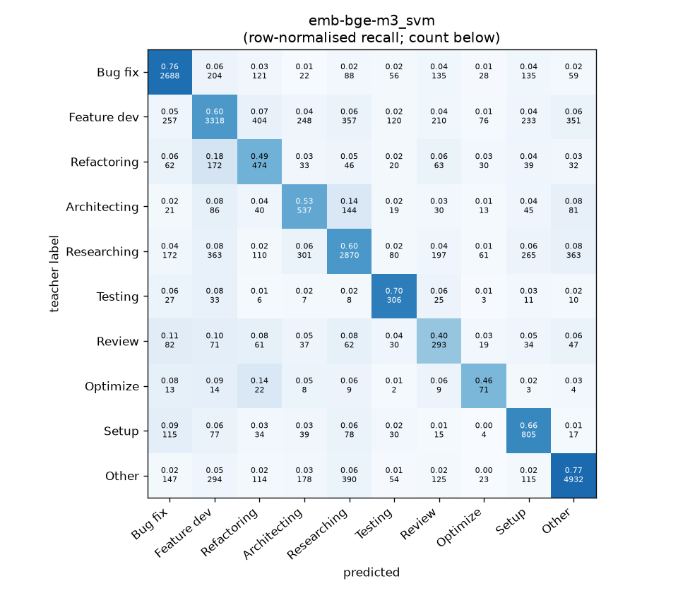
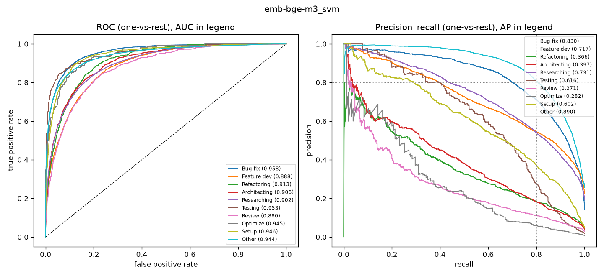

# emb-bge-m3_svm

```
{
 "block": 2,
 "features": "emb-bge-m3",
 "model": "svm",
 "selection": "fold-0 grid, min-F1 then macro-F1",
 "params": "{\"C\": 1.0, \"cw\": \"balanced\"}",
 "cv_seconds": 15.5,
 "full_fit_seconds": 14.9
}
```

### emb-bge-m3_svm

**Threshold metrics (argmax prediction)**

|              |   support (OOF) |   precision |   recall |    F1 | P 95% CI    | R 95% CI    | F1 95% CI   |   p(F1≤0.8) |
|:-------------|----------------:|------------:|---------:|------:|:------------|:------------|:------------|------------:|
| Bug fix      |            3536 |       0.750 |    0.760 | 0.755 | 0.726–0.775 | 0.733–0.788 | 0.734–0.776 |       1.000 |
| Feature dev  |            5574 |       0.716 |    0.595 | 0.650 | 0.692–0.740 | 0.569–0.621 | 0.629–0.671 |       1.000 |
| Refactoring  |             971 |       0.342 |    0.488 | 0.402 | 0.303–0.386 | 0.424–0.547 | 0.356–0.447 |       1.000 |
| Architecting |            1016 |       0.381 |    0.529 | 0.443 | 0.339–0.424 | 0.465–0.591 | 0.397–0.487 |       1.000 |
| Researching  |            4782 |       0.708 |    0.600 | 0.650 | 0.685–0.733 | 0.573–0.630 | 0.626–0.672 |       1.000 |
| Testing      |             436 |       0.427 |    0.702 | 0.531 | 0.372–0.483 | 0.615–0.780 | 0.469–0.589 |       1.000 |
| Review       |             736 |       0.266 |    0.398 | 0.319 | 0.222–0.308 | 0.326–0.467 | 0.265–0.367 |       1.000 |
| Optimize     |             155 |       0.216 |    0.458 | 0.294 | 0.151–0.292 | 0.308–0.615 | 0.204–0.393 |       1.000 |
| Setup        |            1214 |       0.478 |    0.663 | 0.555 | 0.440–0.518 | 0.607–0.713 | 0.516–0.592 |       1.000 |
| Other        |            6372 |       0.836 |    0.774 | 0.804 | 0.818–0.854 | 0.753–0.793 | 0.788–0.819 |       0.299 |

**Ranking metrics (class scores, one-vs-rest)**

|              |   ROC-AUC | ROC-AUC 95% CI   |   p(AUC=0.5) |   PR-AUC (AP) | PR-AUC 95% CI   |   PR-AUC chance (=prevalence) |
|:-------------|----------:|:-----------------|-------------:|--------------:|:----------------|------------------------------:|
| Bug fix      |     0.958 | 0.952–0.964      |        0.000 |         0.830 | 0.811–0.848     |                         0.143 |
| Feature dev  |     0.888 | 0.878–0.897      |        0.000 |         0.717 | 0.692–0.736     |                         0.225 |
| Refactoring  |     0.913 | 0.897–0.926      |        0.000 |         0.366 | 0.312–0.421     |                         0.039 |
| Architecting |     0.906 | 0.889–0.923      |        0.000 |         0.397 | 0.350–0.462     |                         0.041 |
| Researching  |     0.902 | 0.894–0.911      |        0.000 |         0.731 | 0.709–0.750     |                         0.193 |
| Testing      |     0.953 | 0.930–0.972      |        0.000 |         0.616 | 0.538–0.699     |                         0.018 |
| Review       |     0.880 | 0.854–0.901      |        0.000 |         0.271 | 0.229–0.348     |                         0.030 |
| Optimize     |     0.945 | 0.913–0.971      |        0.000 |         0.282 | 0.166–0.467     |                         0.006 |
| Setup        |     0.946 | 0.936–0.957      |        0.000 |         0.602 | 0.554–0.648     |                         0.049 |
| Other        |     0.944 | 0.937–0.949      |        0.000 |         0.890 | 0.876–0.901     |                         0.257 |

**Overall**

|                       |   value |      lo |      hi |   p-value |
|:----------------------|--------:|--------:|--------:|----------:|
| accuracy              |   0.657 |   0.645 |   0.669 |   nan     |
| macro-F1              |   0.540 |   0.524 |   0.557 |     0.005 |
| min-F1 (bar)          |   0.294 |   0.204 |   0.345 |     1.000 |
| classes with F1 ≥ 0.8 |   1.000 | nan     | nan     |   nan     |
| macro ROC-AUC         |   0.924 | nan     | nan     |   nan     |
| macro PR-AUC          |   0.570 | nan     | nan     |   nan     |




