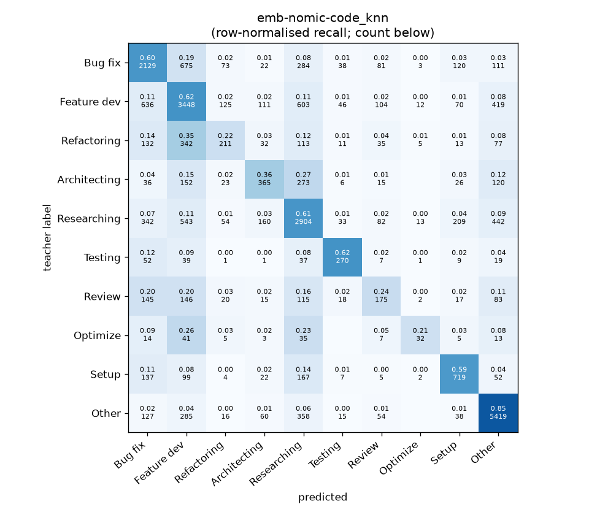
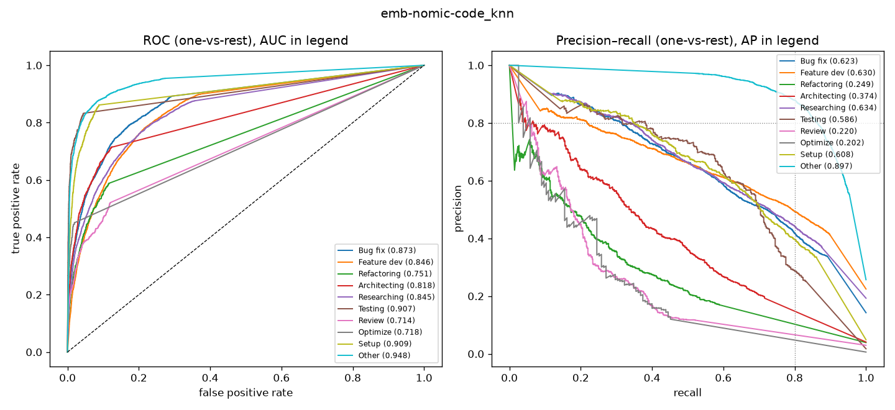

# emb-nomic-code_knn

```
{
 "block": 5,
 "features": "emb-nomic-code",
 "model": "knn",
 "selection": "fold-0 grid, min-F1 then macro-F1",
 "params": "{\"k\": 5}",
 "cv_seconds": 4.8,
 "full_fit_seconds": 2.0
}
```

### emb-nomic-code_knn

**Threshold metrics (argmax prediction)**

|              |   support (OOF) |   precision |   recall |    F1 | P 95% CI    | R 95% CI    | F1 95% CI   |   p(F1≤0.8) |
|:-------------|----------------:|------------:|---------:|------:|:------------|:------------|:------------|------------:|
| Bug fix      |            3536 |       0.568 |    0.602 | 0.584 | 0.541–0.594 | 0.570–0.636 | 0.558–0.610 |       1.000 |
| Feature dev  |            5574 |       0.598 |    0.619 | 0.608 | 0.577–0.618 | 0.595–0.645 | 0.589–0.627 |       1.000 |
| Refactoring  |             971 |       0.397 |    0.217 | 0.281 | 0.320–0.480 | 0.169–0.272 | 0.223–0.342 |       1.000 |
| Architecting |            1016 |       0.461 |    0.359 | 0.404 | 0.398–0.523 | 0.299–0.417 | 0.346–0.458 |       1.000 |
| Researching  |            4782 |       0.594 |    0.607 | 0.601 | 0.572–0.617 | 0.579–0.636 | 0.579–0.623 |       1.000 |
| Testing      |             436 |       0.608 |    0.619 | 0.614 | 0.532–0.689 | 0.532–0.706 | 0.538–0.681 |       1.000 |
| Review       |             736 |       0.310 |    0.238 | 0.269 | 0.243–0.380 | 0.179–0.299 | 0.209–0.331 |       1.000 |
| Optimize     |             155 |       0.457 |    0.206 | 0.284 | 0.231–0.688 | 0.077–0.333 | 0.127–0.436 |       1.000 |
| Setup        |            1214 |       0.586 |    0.592 | 0.589 | 0.540–0.638 | 0.538–0.644 | 0.545–0.632 |       1.000 |
| Other        |            6372 |       0.802 |    0.850 | 0.826 | 0.787–0.818 | 0.832–0.868 | 0.813–0.839 |       0.000 |

**Ranking metrics (class scores, one-vs-rest)**

|              |   ROC-AUC | ROC-AUC 95% CI   |   p(AUC=0.5) |   PR-AUC (AP) | PR-AUC 95% CI   |   PR-AUC chance (=prevalence) |
|:-------------|----------:|:-----------------|-------------:|--------------:|:----------------|------------------------------:|
| Bug fix      |     0.873 | 0.860–0.887      |        0.000 |         0.623 | 0.589–0.650     |                         0.143 |
| Feature dev  |     0.846 | 0.835–0.857      |        0.000 |         0.630 | 0.606–0.651     |                         0.225 |
| Refactoring  |     0.751 | 0.715–0.779      |        0.000 |         0.249 | 0.207–0.305     |                         0.039 |
| Architecting |     0.818 | 0.789–0.846      |        0.000 |         0.374 | 0.313–0.431     |                         0.041 |
| Researching  |     0.845 | 0.831–0.860      |        0.000 |         0.634 | 0.607–0.663     |                         0.193 |
| Testing      |     0.907 | 0.868–0.937      |        0.000 |         0.586 | 0.494–0.671     |                         0.018 |
| Review       |     0.714 | 0.678–0.752      |        0.000 |         0.220 | 0.159–0.282     |                         0.030 |
| Optimize     |     0.718 | 0.632–0.788      |        0.000 |         0.202 | 0.092–0.322     |                         0.006 |
| Setup        |     0.909 | 0.891–0.928      |        0.000 |         0.608 | 0.562–0.659     |                         0.049 |
| Other        |     0.948 | 0.941–0.954      |        0.000 |         0.897 | 0.882–0.908     |                         0.257 |

**Overall**

|                       |   value |      lo |      hi |   p-value |
|:----------------------|--------:|--------:|--------:|----------:|
| accuracy              |   0.632 |   0.620 |   0.644 |   nan     |
| macro-F1              |   0.506 |   0.485 |   0.527 |     0.005 |
| min-F1 (bar)          |   0.269 |   0.127 |   0.296 |     1.000 |
| classes with F1 ≥ 0.8 |   1.000 | nan     | nan     |   nan     |
| macro ROC-AUC         |   0.833 | nan     | nan     |   nan     |
| macro PR-AUC          |   0.502 | nan     | nan     |   nan     |




