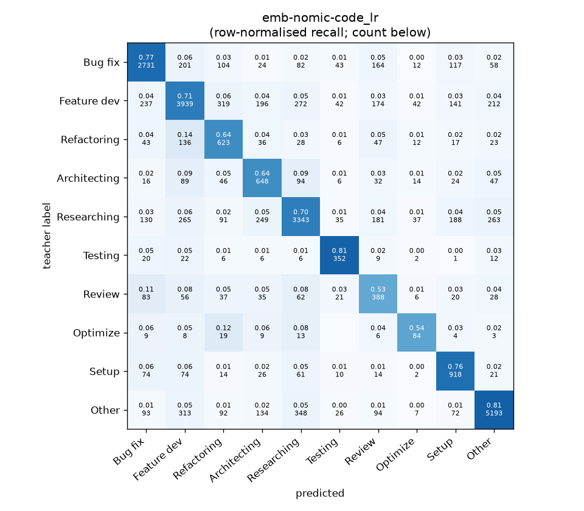
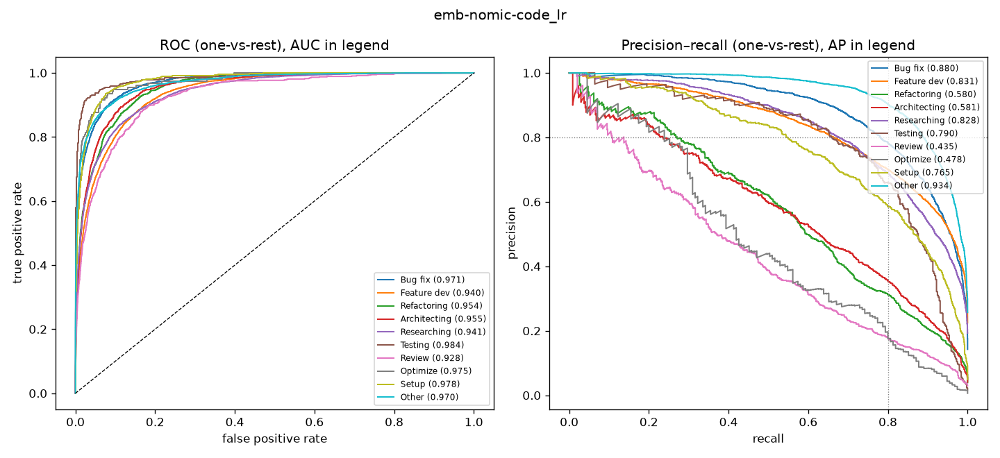

# emb-nomic-code_lr

```
{
 "block": 5,
 "features": "emb-nomic-code",
 "model": "lr",
 "selection": "fold-0 grid, min-F1 then macro-F1",
 "params": "{\"C\": 10.0, \"cw\": \"balanced\"}",
 "cv_seconds": 13.7,
 "full_fit_seconds": 4.0
}
```

### emb-nomic-code_lr

**Threshold metrics (argmax prediction)**

|              |   support (OOF) |   precision |   recall |    F1 | P 95% CI    | R 95% CI    | F1 95% CI   |   p(F1≤0.8) |
|:-------------|----------------:|------------:|---------:|------:|:------------|:------------|:------------|------------:|
| Bug fix      |            3536 |       0.795 |    0.772 | 0.783 | 0.771–0.820 | 0.744–0.801 | 0.762–0.803 |       0.951 |
| Feature dev  |            5574 |       0.772 |    0.707 | 0.738 | 0.751–0.792 | 0.681–0.730 | 0.718–0.756 |       1.000 |
| Refactoring  |             971 |       0.461 |    0.642 | 0.537 | 0.422–0.506 | 0.584–0.700 | 0.494–0.583 |       1.000 |
| Architecting |            1016 |       0.475 |    0.638 | 0.545 | 0.433–0.519 | 0.579–0.697 | 0.499–0.587 |       1.000 |
| Researching  |            4782 |       0.776 |    0.699 | 0.735 | 0.753–0.798 | 0.672–0.727 | 0.715–0.755 |       1.000 |
| Testing      |             436 |       0.651 |    0.807 | 0.721 | 0.582–0.717 | 0.734–0.872 | 0.664–0.773 |       1.000 |
| Review       |             736 |       0.350 |    0.527 | 0.421 | 0.308–0.396 | 0.451–0.598 | 0.370–0.470 |       1.000 |
| Optimize     |             155 |       0.385 |    0.542 | 0.450 | 0.288–0.491 | 0.385–0.692 | 0.340–0.562 |       1.000 |
| Setup        |            1214 |       0.611 |    0.756 | 0.676 | 0.572–0.653 | 0.710–0.802 | 0.641–0.710 |       1.000 |
| Other        |            6372 |       0.886 |    0.815 | 0.849 | 0.870–0.902 | 0.796–0.834 | 0.835–0.863 |       0.000 |

**Ranking metrics (class scores, one-vs-rest)**

|              |   ROC-AUC | ROC-AUC 95% CI   |   p(AUC=0.5) |   PR-AUC (AP) | PR-AUC 95% CI   |   PR-AUC chance (=prevalence) |
|:-------------|----------:|:-----------------|-------------:|--------------:|:----------------|------------------------------:|
| Bug fix      |     0.971 | 0.967–0.976      |        0.000 |         0.880 | 0.863–0.894     |                         0.143 |
| Feature dev  |     0.940 | 0.933–0.945      |        0.000 |         0.831 | 0.814–0.845     |                         0.225 |
| Refactoring  |     0.954 | 0.946–0.963      |        0.000 |         0.580 | 0.526–0.637     |                         0.039 |
| Architecting |     0.955 | 0.945–0.964      |        0.000 |         0.581 | 0.530–0.646     |                         0.041 |
| Researching  |     0.941 | 0.933–0.947      |        0.000 |         0.828 | 0.807–0.845     |                         0.193 |
| Testing      |     0.984 | 0.973–0.993      |        0.000 |         0.790 | 0.725–0.850     |                         0.018 |
| Review       |     0.928 | 0.910–0.945      |        0.000 |         0.435 | 0.386–0.508     |                         0.030 |
| Optimize     |     0.975 | 0.952–0.990      |        0.000 |         0.478 | 0.341–0.617     |                         0.006 |
| Setup        |     0.978 | 0.971–0.983      |        0.000 |         0.765 | 0.721–0.799     |                         0.049 |
| Other        |     0.970 | 0.965–0.973      |        0.000 |         0.934 | 0.926–0.943     |                         0.257 |

**Overall**

|                       |   value |      lo |      hi |   p-value |
|:----------------------|--------:|--------:|--------:|----------:|
| accuracy              |   0.735 |   0.723 |   0.746 |   nan     |
| macro-F1              |   0.645 |   0.626 |   0.663 |     0.005 |
| min-F1 (bar)          |   0.421 |   0.340 |   0.463 |     1.000 |
| classes with F1 ≥ 0.8 |   1.000 | nan     | nan     |   nan     |
| macro ROC-AUC         |   0.959 | nan     | nan     |   nan     |
| macro PR-AUC          |   0.710 | nan     | nan     |   nan     |




