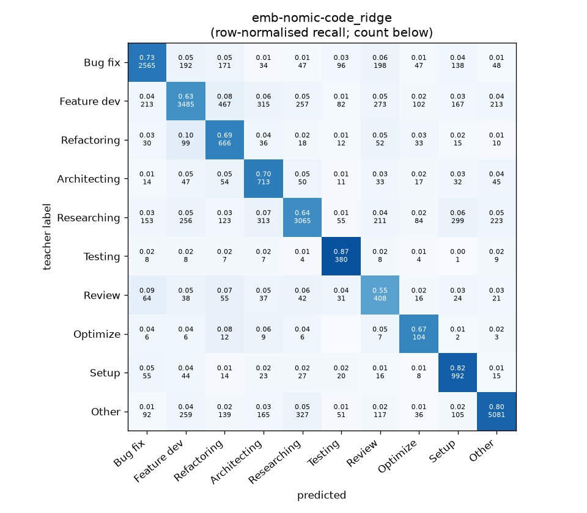
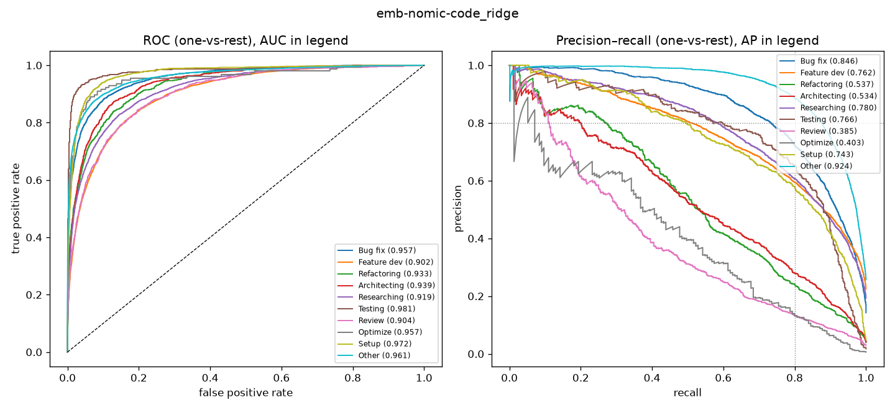

# emb-nomic-code_ridge

```
{
 "block": 5,
 "features": "emb-nomic-code",
 "model": "ridge",
 "selection": "fold-0 grid, min-F1 then macro-F1",
 "params": "{\"alpha\": 1.0, \"cw\": \"balanced\"}",
 "cv_seconds": 1.5,
 "full_fit_seconds": 0.3
}
```

### emb-nomic-code_ridge

**Threshold metrics (argmax prediction)**

|              |   support (OOF) |   precision |   recall |    F1 | P 95% CI    | R 95% CI    | F1 95% CI   |   p(F1≤0.8) |
|:-------------|----------------:|------------:|---------:|------:|:------------|:------------|:------------|------------:|
| Bug fix      |            3536 |       0.802 |    0.725 | 0.762 | 0.776–0.828 | 0.696–0.755 | 0.739–0.783 |       1.000 |
| Feature dev  |            5574 |       0.786 |    0.625 | 0.696 | 0.765–0.806 | 0.599–0.650 | 0.676–0.715 |       1.000 |
| Refactoring  |             971 |       0.390 |    0.686 | 0.497 | 0.357–0.424 | 0.630–0.745 | 0.458–0.536 |       1.000 |
| Architecting |            1016 |       0.432 |    0.702 | 0.534 | 0.395–0.466 | 0.642–0.756 | 0.493–0.571 |       1.000 |
| Researching  |            4782 |       0.798 |    0.641 | 0.711 | 0.775–0.822 | 0.613–0.667 | 0.689–0.731 |       1.000 |
| Testing      |             436 |       0.515 |    0.872 | 0.647 | 0.464–0.573 | 0.807–0.927 | 0.597–0.698 |       1.000 |
| Review       |             736 |       0.308 |    0.554 | 0.396 | 0.274–0.350 | 0.484–0.630 | 0.353–0.447 |       1.000 |
| Optimize     |             155 |       0.231 |    0.671 | 0.343 | 0.178–0.287 | 0.513–0.821 | 0.267–0.417 |       1.000 |
| Setup        |            1214 |       0.559 |    0.817 | 0.664 | 0.522–0.596 | 0.776–0.858 | 0.629–0.696 |       1.000 |
| Other        |            6372 |       0.896 |    0.797 | 0.844 | 0.881–0.911 | 0.778–0.816 | 0.830–0.858 |       0.000 |

**Ranking metrics (class scores, one-vs-rest)**

|              |   ROC-AUC | ROC-AUC 95% CI   |   p(AUC=0.5) |   PR-AUC (AP) | PR-AUC 95% CI   |   PR-AUC chance (=prevalence) |
|:-------------|----------:|:-----------------|-------------:|--------------:|:----------------|------------------------------:|
| Bug fix      |     0.957 | 0.950–0.964      |        0.000 |         0.846 | 0.829–0.867     |                         0.143 |
| Feature dev  |     0.902 | 0.894–0.909      |        0.000 |         0.762 | 0.743–0.776     |                         0.225 |
| Refactoring  |     0.933 | 0.920–0.947      |        0.000 |         0.537 | 0.481–0.592     |                         0.039 |
| Architecting |     0.939 | 0.928–0.952      |        0.000 |         0.534 | 0.482–0.602     |                         0.041 |
| Researching  |     0.919 | 0.911–0.927      |        0.000 |         0.780 | 0.760–0.799     |                         0.193 |
| Testing      |     0.981 | 0.967–0.992      |        0.000 |         0.766 | 0.691–0.829     |                         0.018 |
| Review       |     0.904 | 0.886–0.926      |        0.000 |         0.385 | 0.326–0.467     |                         0.030 |
| Optimize     |     0.957 | 0.911–0.989      |        0.000 |         0.403 | 0.259–0.566     |                         0.006 |
| Setup        |     0.972 | 0.964–0.979      |        0.000 |         0.743 | 0.702–0.776     |                         0.049 |
| Other        |     0.961 | 0.955–0.966      |        0.000 |         0.924 | 0.914–0.934     |                         0.257 |

**Overall**

|                       |   value |      lo |      hi |   p-value |
|:----------------------|--------:|--------:|--------:|----------:|
| accuracy              |   0.704 |   0.693 |   0.714 |   nan     |
| macro-F1              |   0.610 |   0.594 |   0.624 |     0.005 |
| min-F1 (bar)          |   0.343 |   0.267 |   0.406 |     1.000 |
| classes with F1 ≥ 0.8 |   1.000 | nan     | nan     |   nan     |
| macro ROC-AUC         |   0.943 | nan     | nan     |   nan     |
| macro PR-AUC          |   0.668 | nan     | nan     |   nan     |




