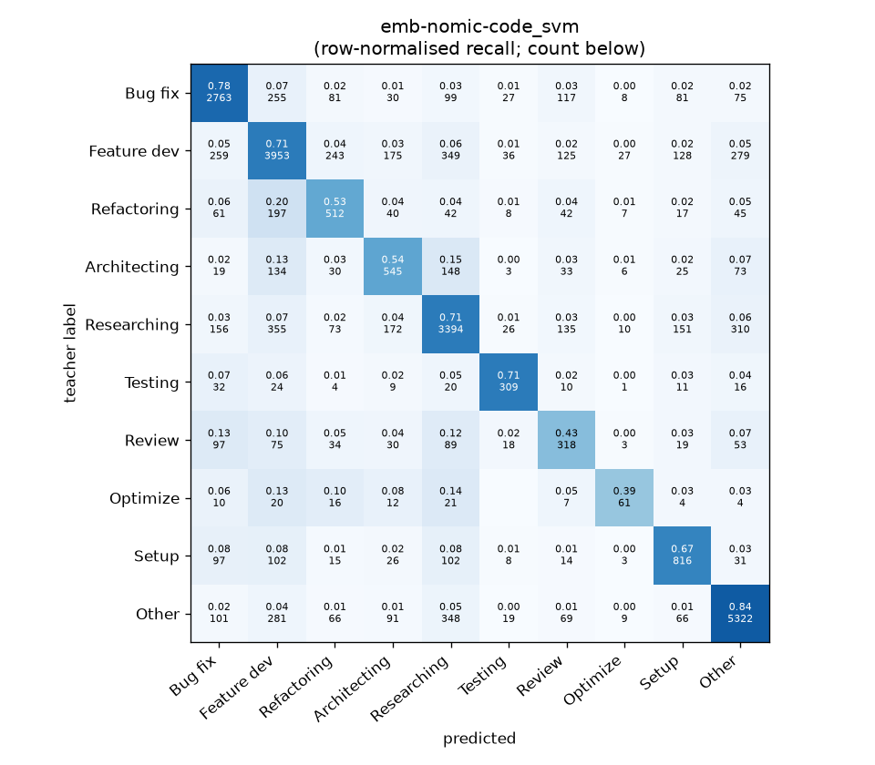
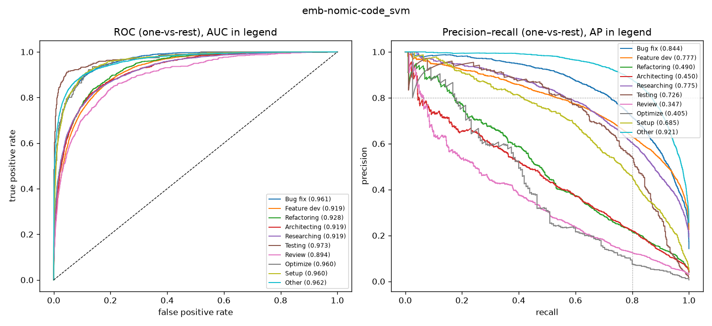

# emb-nomic-code_svm

```
{
 "block": 5,
 "features": "emb-nomic-code",
 "model": "svm",
 "selection": "fold-0 grid, min-F1 then macro-F1",
 "params": "{\"C\": 10.0, \"cw\": \"balanced\"}",
 "cv_seconds": 168.8,
 "full_fit_seconds": 71.6
}
```

### emb-nomic-code_svm

**Threshold metrics (argmax prediction)**

|              |   support (OOF) |   precision |   recall |    F1 | P 95% CI    | R 95% CI    | F1 95% CI   |   p(F1≤0.8) |
|:-------------|----------------:|------------:|---------:|------:|:------------|:------------|:------------|------------:|
| Bug fix      |            3536 |       0.769 |    0.781 | 0.775 | 0.746–0.793 | 0.756–0.809 | 0.755–0.794 |       0.994 |
| Feature dev  |            5574 |       0.733 |    0.709 | 0.721 | 0.713–0.753 | 0.685–0.732 | 0.702–0.738 |       1.000 |
| Refactoring  |             971 |       0.477 |    0.527 | 0.501 | 0.431–0.526 | 0.465–0.597 | 0.455–0.550 |       1.000 |
| Architecting |            1016 |       0.482 |    0.536 | 0.508 | 0.434–0.536 | 0.476–0.594 | 0.460–0.556 |       1.000 |
| Researching  |            4782 |       0.736 |    0.710 | 0.723 | 0.714–0.757 | 0.684–0.735 | 0.704–0.743 |       1.000 |
| Testing      |             436 |       0.681 |    0.709 | 0.694 | 0.611–0.757 | 0.633–0.789 | 0.630–0.756 |       1.000 |
| Review       |             736 |       0.366 |    0.432 | 0.396 | 0.316–0.423 | 0.359–0.505 | 0.340–0.457 |       1.000 |
| Optimize     |             155 |       0.452 |    0.394 | 0.421 | 0.314–0.609 | 0.256–0.538 | 0.286–0.553 |       1.000 |
| Setup        |            1214 |       0.619 |    0.672 | 0.645 | 0.573–0.663 | 0.617–0.719 | 0.604–0.682 |       1.000 |
| Other        |            6372 |       0.857 |    0.835 | 0.846 | 0.841–0.874 | 0.817–0.852 | 0.833–0.859 |       0.000 |

**Ranking metrics (class scores, one-vs-rest)**

|              |   ROC-AUC | ROC-AUC 95% CI   |   p(AUC=0.5) |   PR-AUC (AP) | PR-AUC 95% CI   |   PR-AUC chance (=prevalence) |
|:-------------|----------:|:-----------------|-------------:|--------------:|:----------------|------------------------------:|
| Bug fix      |     0.961 | 0.955–0.967      |        0.000 |         0.844 | 0.825–0.863     |                         0.143 |
| Feature dev  |     0.919 | 0.913–0.925      |        0.000 |         0.777 | 0.760–0.793     |                         0.225 |
| Refactoring  |     0.928 | 0.915–0.942      |        0.000 |         0.490 | 0.432–0.545     |                         0.039 |
| Architecting |     0.919 | 0.904–0.934      |        0.000 |         0.450 | 0.402–0.518     |                         0.041 |
| Researching  |     0.919 | 0.910–0.927      |        0.000 |         0.775 | 0.755–0.795     |                         0.193 |
| Testing      |     0.973 | 0.959–0.987      |        0.000 |         0.726 | 0.654–0.804     |                         0.018 |
| Review       |     0.894 | 0.870–0.919      |        0.000 |         0.347 | 0.286–0.425     |                         0.030 |
| Optimize     |     0.960 | 0.927–0.981      |        0.000 |         0.405 | 0.283–0.556     |                         0.006 |
| Setup        |     0.960 | 0.949–0.968      |        0.000 |         0.685 | 0.635–0.725     |                         0.049 |
| Other        |     0.962 | 0.957–0.966      |        0.000 |         0.921 | 0.911–0.930     |                         0.257 |

**Overall**

|                       |   value |      lo |      hi |   p-value |
|:----------------------|--------:|--------:|--------:|----------:|
| accuracy              |   0.726 |   0.715 |   0.737 |   nan     |
| macro-F1              |   0.623 |   0.603 |   0.644 |     0.005 |
| min-F1 (bar)          |   0.396 |   0.286 |   0.442 |     1.000 |
| classes with F1 ≥ 0.8 |   1.000 | nan     | nan     |   nan     |
| macro ROC-AUC         |   0.940 | nan     | nan     |   nan     |
| macro PR-AUC          |   0.642 | nan     | nan     |   nan     |




