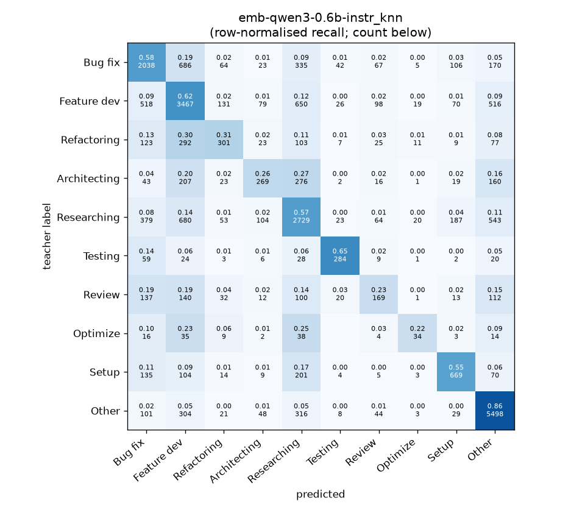
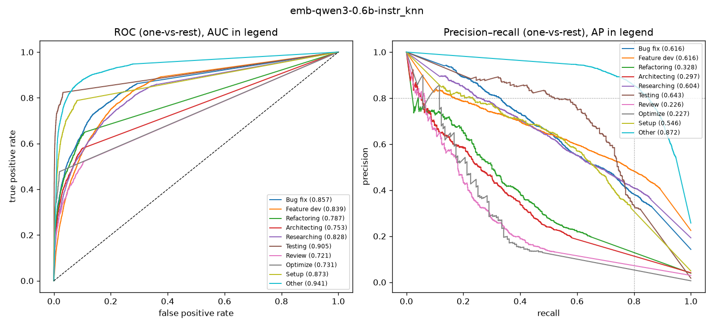

# emb-qwen3-0.6b-instr_knn

```
{
 "block": 2,
 "features": "emb-qwen3-0.6b-instr",
 "model": "knn",
 "selection": "fold-0 grid, min-F1 then macro-F1",
 "params": "{\"k\": 5}",
 "cv_seconds": 2.8,
 "full_fit_seconds": 1.2
}
```

### emb-qwen3-0.6b-instr_knn

**Threshold metrics (argmax prediction)**

|              |   support (OOF) |   precision |   recall |    F1 | P 95% CI    | R 95% CI    | F1 95% CI   |   p(F1≤0.8) |
|:-------------|----------------:|------------:|---------:|------:|:------------|:------------|:------------|------------:|
| Bug fix      |            3536 |       0.574 |    0.576 | 0.575 | 0.548–0.602 | 0.543–0.609 | 0.549–0.600 |       1.000 |
| Feature dev  |            5574 |       0.584 |    0.622 | 0.602 | 0.563–0.604 | 0.598–0.646 | 0.583–0.621 |       1.000 |
| Refactoring  |             971 |       0.462 |    0.310 | 0.371 | 0.398–0.532 | 0.259–0.366 | 0.316–0.430 |       1.000 |
| Architecting |            1016 |       0.468 |    0.265 | 0.338 | 0.399–0.540 | 0.217–0.319 | 0.283–0.396 |       1.000 |
| Researching  |            4782 |       0.571 |    0.571 | 0.571 | 0.549–0.596 | 0.540–0.599 | 0.548–0.596 |       1.000 |
| Testing      |             436 |       0.683 |    0.651 | 0.667 | 0.604–0.769 | 0.560–0.743 | 0.589–0.733 |       1.000 |
| Review       |             736 |       0.337 |    0.230 | 0.273 | 0.263–0.416 | 0.168–0.293 | 0.210–0.338 |       1.000 |
| Optimize     |             155 |       0.347 |    0.219 | 0.269 | 0.176–0.545 | 0.103–0.359 | 0.127–0.412 |       1.000 |
| Setup        |            1214 |       0.604 |    0.551 | 0.576 | 0.554–0.654 | 0.495–0.601 | 0.531–0.620 |       1.000 |
| Other        |            6372 |       0.766 |    0.863 | 0.811 | 0.749–0.781 | 0.845–0.879 | 0.797–0.824 |       0.043 |

**Ranking metrics (class scores, one-vs-rest)**

|              |   ROC-AUC | ROC-AUC 95% CI   |   p(AUC=0.5) |   PR-AUC (AP) | PR-AUC 95% CI   |   PR-AUC chance (=prevalence) |
|:-------------|----------:|:-----------------|-------------:|--------------:|:----------------|------------------------------:|
| Bug fix      |     0.857 | 0.843–0.872      |        0.000 |         0.616 | 0.586–0.648     |                         0.143 |
| Feature dev  |     0.839 | 0.827–0.850      |        0.000 |         0.616 | 0.592–0.639     |                         0.225 |
| Refactoring  |     0.787 | 0.755–0.821      |        0.000 |         0.328 | 0.277–0.389     |                         0.039 |
| Architecting |     0.753 | 0.723–0.792      |        0.000 |         0.297 | 0.251–0.367     |                         0.041 |
| Researching  |     0.828 | 0.814–0.842      |        0.000 |         0.604 | 0.580–0.629     |                         0.193 |
| Testing      |     0.905 | 0.873–0.940      |        0.000 |         0.643 | 0.555–0.730     |                         0.018 |
| Review       |     0.721 | 0.683–0.757      |        0.000 |         0.226 | 0.161–0.296     |                         0.030 |
| Optimize     |     0.731 | 0.644–0.812      |        0.000 |         0.227 | 0.089–0.383     |                         0.006 |
| Setup        |     0.873 | 0.849–0.895      |        0.000 |         0.546 | 0.495–0.606     |                         0.049 |
| Other        |     0.941 | 0.933–0.947      |        0.000 |         0.872 | 0.858–0.885     |                         0.257 |

**Overall**

|                       |   value |      lo |      hi |   p-value |
|:----------------------|--------:|--------:|--------:|----------:|
| accuracy              |   0.624 |   0.612 |   0.635 |   nan     |
| macro-F1              |   0.505 |   0.485 |   0.526 |     0.005 |
| min-F1 (bar)          |   0.269 |   0.127 |   0.310 |     1.000 |
| classes with F1 ≥ 0.8 |   1.000 | nan     | nan     |   nan     |
| macro ROC-AUC         |   0.823 | nan     | nan     |   nan     |
| macro PR-AUC          |   0.498 | nan     | nan     |   nan     |




