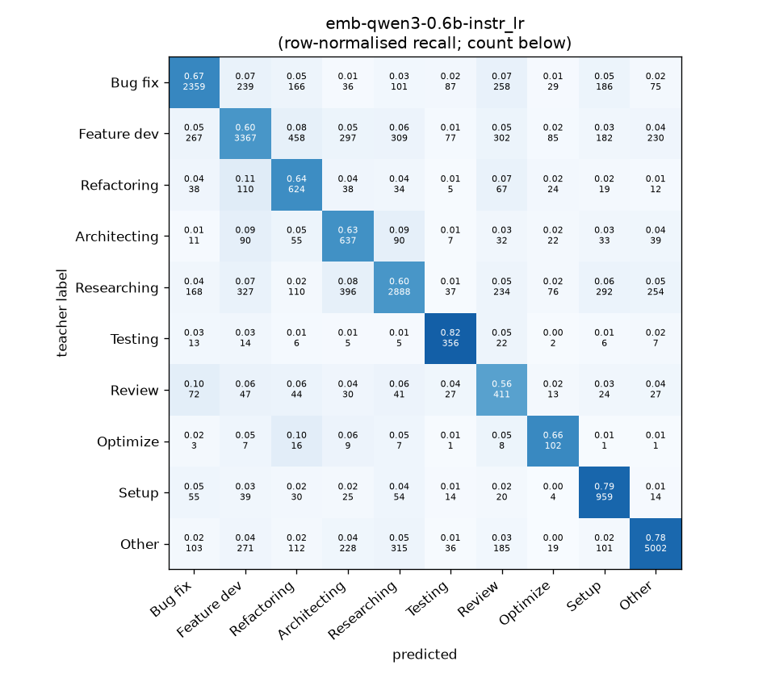
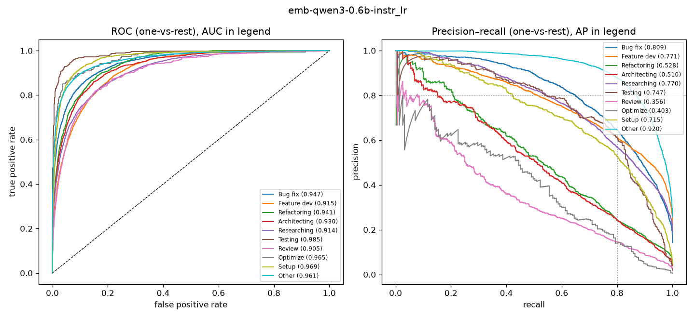

# emb-qwen3-0.6b-instr_lr

```
{
 "block": 2,
 "features": "emb-qwen3-0.6b-instr",
 "model": "lr",
 "selection": "fold-0 grid, min-F1 then macro-F1",
 "params": "{\"C\": 10.0, \"cw\": \"balanced\"}",
 "cv_seconds": 3.6,
 "full_fit_seconds": 2.2
}
```

### emb-qwen3-0.6b-instr_lr

**Threshold metrics (argmax prediction)**

|              |   support (OOF) |   precision |   recall |    F1 | P 95% CI    | R 95% CI    | F1 95% CI   |   p(F1≤0.8) |
|:-------------|----------------:|------------:|---------:|------:|:------------|:------------|:------------|------------:|
| Bug fix      |            3536 |       0.764 |    0.667 | 0.712 | 0.736–0.791 | 0.636–0.699 | 0.688–0.736 |       1.000 |
| Feature dev  |            5574 |       0.746 |    0.604 | 0.668 | 0.723–0.769 | 0.580–0.629 | 0.648–0.688 |       1.000 |
| Refactoring  |             971 |       0.385 |    0.643 | 0.481 | 0.349–0.425 | 0.580–0.704 | 0.441–0.525 |       1.000 |
| Architecting |            1016 |       0.374 |    0.627 | 0.469 | 0.341–0.408 | 0.571–0.681 | 0.430–0.509 |       1.000 |
| Researching  |            4782 |       0.751 |    0.604 | 0.670 | 0.727–0.776 | 0.577–0.633 | 0.647–0.693 |       1.000 |
| Testing      |             436 |       0.550 |    0.817 | 0.657 | 0.494–0.610 | 0.734–0.890 | 0.603–0.713 |       1.000 |
| Review       |             736 |       0.267 |    0.558 | 0.361 | 0.233–0.303 | 0.489–0.636 | 0.317–0.406 |       1.000 |
| Optimize     |             155 |       0.271 |    0.658 | 0.384 | 0.214–0.341 | 0.513–0.821 | 0.304–0.470 |       1.000 |
| Setup        |            1214 |       0.532 |    0.790 | 0.636 | 0.497–0.569 | 0.746–0.835 | 0.603–0.670 |       1.000 |
| Other        |            6372 |       0.884 |    0.785 | 0.831 | 0.868–0.900 | 0.765–0.804 | 0.817–0.845 |       0.000 |

**Ranking metrics (class scores, one-vs-rest)**

|              |   ROC-AUC | ROC-AUC 95% CI   |   p(AUC=0.5) |   PR-AUC (AP) | PR-AUC 95% CI   |   PR-AUC chance (=prevalence) |
|:-------------|----------:|:-----------------|-------------:|--------------:|:----------------|------------------------------:|
| Bug fix      |     0.947 | 0.941–0.955      |        0.000 |         0.809 | 0.787–0.830     |                         0.143 |
| Feature dev  |     0.915 | 0.907–0.922      |        0.000 |         0.771 | 0.749–0.788     |                         0.225 |
| Refactoring  |     0.941 | 0.930–0.952      |        0.000 |         0.528 | 0.475–0.591     |                         0.039 |
| Architecting |     0.930 | 0.917–0.944      |        0.000 |         0.510 | 0.462–0.570     |                         0.041 |
| Researching  |     0.914 | 0.905–0.924      |        0.000 |         0.770 | 0.749–0.792     |                         0.193 |
| Testing      |     0.985 | 0.974–0.991      |        0.000 |         0.747 | 0.677–0.822     |                         0.018 |
| Review       |     0.905 | 0.883–0.926      |        0.000 |         0.356 | 0.298–0.446     |                         0.030 |
| Optimize     |     0.965 | 0.925–0.986      |        0.000 |         0.403 | 0.288–0.591     |                         0.006 |
| Setup        |     0.969 | 0.960–0.976      |        0.000 |         0.715 | 0.666–0.760     |                         0.049 |
| Other        |     0.961 | 0.956–0.965      |        0.000 |         0.920 | 0.912–0.928     |                         0.257 |

**Overall**

|                       |   value |      lo |      hi |   p-value |
|:----------------------|--------:|--------:|--------:|----------:|
| accuracy              |   0.674 |   0.663 |   0.686 |   nan     |
| macro-F1              |   0.587 |   0.572 |   0.603 |     0.005 |
| min-F1 (bar)          |   0.361 |   0.303 |   0.398 |     1.000 |
| classes with F1 ≥ 0.8 |   1.000 | nan     | nan     |   nan     |
| macro ROC-AUC         |   0.943 | nan     | nan     |   nan     |
| macro PR-AUC          |   0.653 | nan     | nan     |   nan     |




