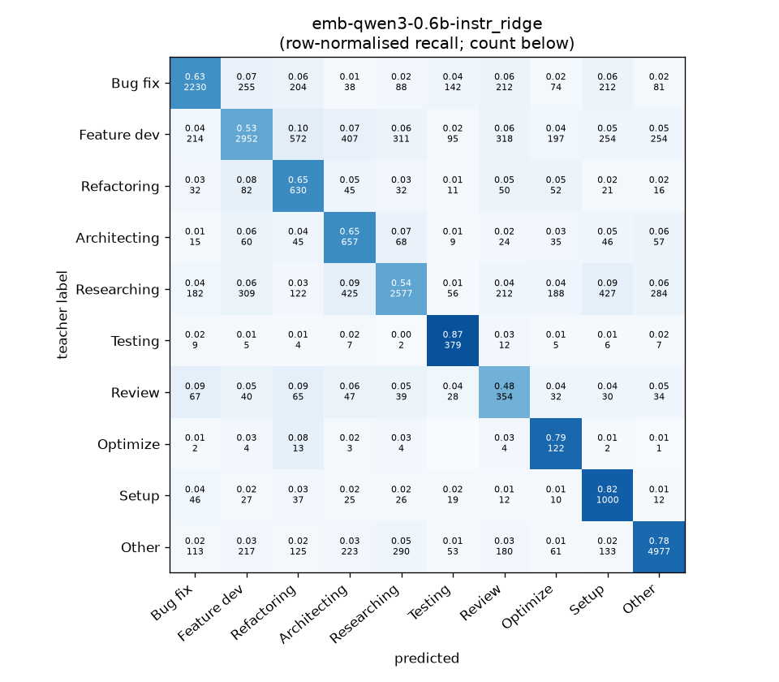
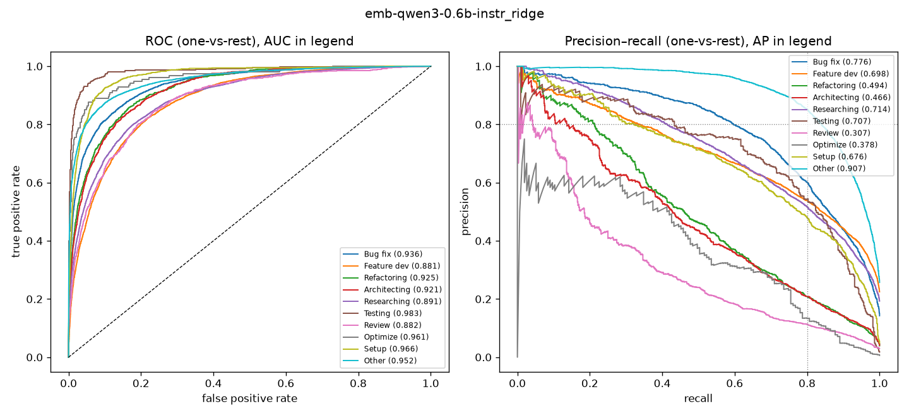

# emb-qwen3-0.6b-instr_ridge

```
{
 "block": 2,
 "features": "emb-qwen3-0.6b-instr",
 "model": "ridge",
 "selection": "fold-0 grid, min-F1 then macro-F1",
 "params": "{\"alpha\": 1.0, \"cw\": \"balanced\"}",
 "cv_seconds": 1.2,
 "full_fit_seconds": 0.1
}
```

### emb-qwen3-0.6b-instr_ridge

**Threshold metrics (argmax prediction)**

|              |   support (OOF) |   precision |   recall |    F1 | P 95% CI    | R 95% CI    | F1 95% CI   |   p(F1≤0.8) |
|:-------------|----------------:|------------:|---------:|------:|:------------|:------------|:------------|------------:|
| Bug fix      |            3536 |       0.766 |    0.631 | 0.692 | 0.739–0.794 | 0.598–0.663 | 0.664–0.718 |       1.000 |
| Feature dev  |            5574 |       0.747 |    0.530 | 0.620 | 0.722–0.772 | 0.505–0.555 | 0.598–0.641 |       1.000 |
| Refactoring  |             971 |       0.347 |    0.649 | 0.452 | 0.314–0.383 | 0.588–0.712 | 0.415–0.493 |       1.000 |
| Architecting |            1016 |       0.350 |    0.647 | 0.454 | 0.320–0.381 | 0.591–0.705 | 0.419–0.492 |       1.000 |
| Researching  |            4782 |       0.750 |    0.539 | 0.627 | 0.724–0.777 | 0.512–0.567 | 0.603–0.651 |       1.000 |
| Testing      |             436 |       0.479 |    0.869 | 0.617 | 0.428–0.532 | 0.807–0.927 | 0.566–0.664 |       1.000 |
| Review       |             736 |       0.257 |    0.481 | 0.335 | 0.220–0.300 | 0.413–0.560 | 0.289–0.385 |       1.000 |
| Optimize     |             155 |       0.157 |    0.787 | 0.262 | 0.130–0.188 | 0.641–0.897 | 0.218–0.309 |       1.000 |
| Setup        |            1214 |       0.469 |    0.824 | 0.598 | 0.439–0.502 | 0.779–0.865 | 0.567–0.628 |       1.000 |
| Other        |            6372 |       0.870 |    0.781 | 0.823 | 0.853–0.886 | 0.761–0.800 | 0.809–0.837 |       0.001 |

**Ranking metrics (class scores, one-vs-rest)**

|              |   ROC-AUC | ROC-AUC 95% CI   |   p(AUC=0.5) |   PR-AUC (AP) | PR-AUC 95% CI   |   PR-AUC chance (=prevalence) |
|:-------------|----------:|:-----------------|-------------:|--------------:|:----------------|------------------------------:|
| Bug fix      |     0.936 | 0.928–0.944      |        0.000 |         0.776 | 0.753–0.798     |                         0.143 |
| Feature dev  |     0.881 | 0.872–0.890      |        0.000 |         0.698 | 0.677–0.718     |                         0.225 |
| Refactoring  |     0.925 | 0.909–0.937      |        0.000 |         0.494 | 0.444–0.557     |                         0.039 |
| Architecting |     0.921 | 0.904–0.937      |        0.000 |         0.466 | 0.424–0.518     |                         0.041 |
| Researching  |     0.891 | 0.881–0.902      |        0.000 |         0.714 | 0.691–0.737     |                         0.193 |
| Testing      |     0.983 | 0.971–0.992      |        0.000 |         0.707 | 0.624–0.789     |                         0.018 |
| Review       |     0.882 | 0.858–0.906      |        0.000 |         0.307 | 0.249–0.396     |                         0.030 |
| Optimize     |     0.961 | 0.923–0.988      |        0.000 |         0.378 | 0.260–0.564     |                         0.006 |
| Setup        |     0.966 | 0.957–0.974      |        0.000 |         0.676 | 0.630–0.717     |                         0.049 |
| Other        |     0.952 | 0.947–0.957      |        0.000 |         0.907 | 0.898–0.916     |                         0.257 |

**Overall**

|                       |   value |      lo |      hi |   p-value |
|:----------------------|--------:|--------:|--------:|----------:|
| accuracy              |   0.640 |   0.629 |   0.652 |   nan     |
| macro-F1              |   0.548 |   0.535 |   0.562 |     0.005 |
| min-F1 (bar)          |   0.262 |   0.218 |   0.308 |     1.000 |
| classes with F1 ≥ 0.8 |   1.000 | nan     | nan     |   nan     |
| macro ROC-AUC         |   0.930 | nan     | nan     |   nan     |
| macro PR-AUC          |   0.612 | nan     | nan     |   nan     |




