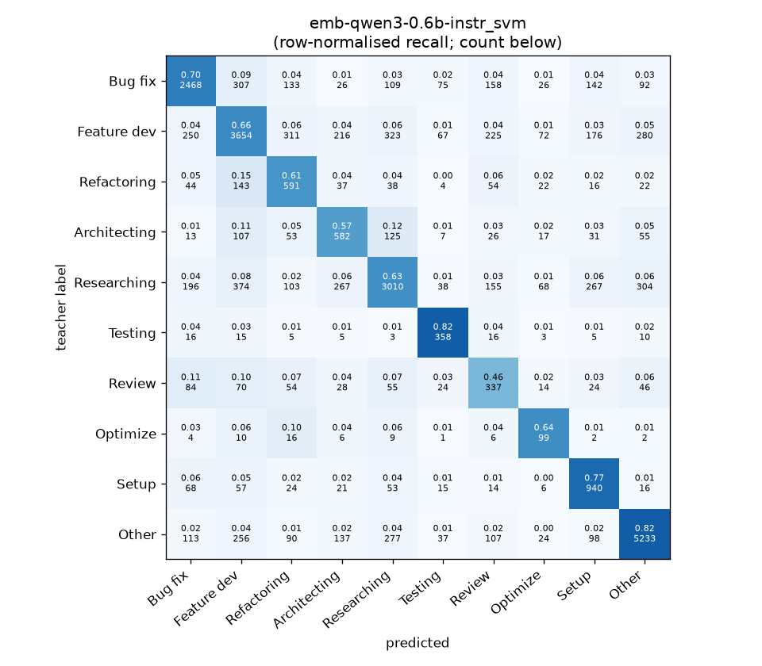
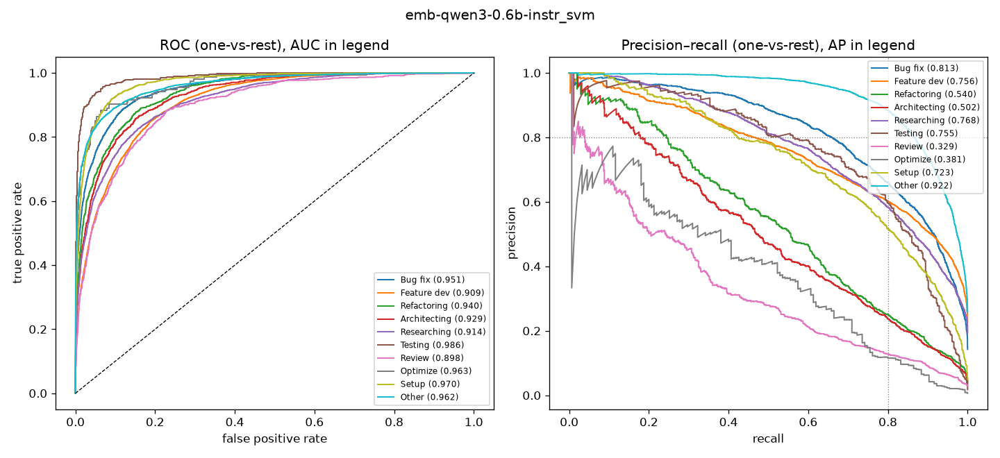

# emb-qwen3-0.6b-instr_svm

```
{
 "block": 2,
 "features": "emb-qwen3-0.6b-instr",
 "model": "svm",
 "selection": "fold-0 grid, min-F1 then macro-F1",
 "params": "{\"C\": 1.0, \"cw\": \"balanced\"}",
 "cv_seconds": 16.7,
 "full_fit_seconds": 16.1
}
```

### emb-qwen3-0.6b-instr_svm

**Threshold metrics (argmax prediction)**

|              |   support (OOF) |   precision |   recall |    F1 | P 95% CI    | R 95% CI    | F1 95% CI   |   p(F1≤0.8) |
|:-------------|----------------:|------------:|---------:|------:|:------------|:------------|:------------|------------:|
| Bug fix      |            3536 |       0.758 |    0.698 | 0.727 | 0.731–0.784 | 0.667–0.729 | 0.702–0.750 |       1.000 |
| Feature dev  |            5574 |       0.732 |    0.656 | 0.692 | 0.709–0.753 | 0.631–0.681 | 0.673–0.711 |       1.000 |
| Refactoring  |             971 |       0.428 |    0.609 | 0.503 | 0.388–0.472 | 0.543–0.675 | 0.459–0.550 |       1.000 |
| Architecting |            1016 |       0.439 |    0.573 | 0.497 | 0.398–0.483 | 0.516–0.634 | 0.455–0.542 |       1.000 |
| Researching  |            4782 |       0.752 |    0.629 | 0.685 | 0.728–0.776 | 0.601–0.657 | 0.665–0.708 |       1.000 |
| Testing      |             436 |       0.572 |    0.821 | 0.674 | 0.512–0.632 | 0.743–0.890 | 0.615–0.729 |       1.000 |
| Review       |             736 |       0.307 |    0.458 | 0.368 | 0.260–0.356 | 0.386–0.533 | 0.313–0.421 |       1.000 |
| Optimize     |             155 |       0.282 |    0.639 | 0.391 | 0.216–0.362 | 0.487–0.795 | 0.299–0.491 |       1.000 |
| Setup        |            1214 |       0.553 |    0.774 | 0.645 | 0.517–0.593 | 0.729–0.818 | 0.610–0.681 |       1.000 |
| Other        |            6372 |       0.864 |    0.821 | 0.842 | 0.846–0.879 | 0.803–0.839 | 0.828–0.855 |       0.000 |

**Ranking metrics (class scores, one-vs-rest)**

|              |   ROC-AUC | ROC-AUC 95% CI   |   p(AUC=0.5) |   PR-AUC (AP) | PR-AUC 95% CI   |   PR-AUC chance (=prevalence) |
|:-------------|----------:|:-----------------|-------------:|--------------:|:----------------|------------------------------:|
| Bug fix      |     0.951 | 0.945–0.958      |        0.000 |         0.813 | 0.791–0.834     |                         0.143 |
| Feature dev  |     0.909 | 0.901–0.916      |        0.000 |         0.756 | 0.737–0.773     |                         0.225 |
| Refactoring  |     0.940 | 0.928–0.951      |        0.000 |         0.540 | 0.490–0.600     |                         0.039 |
| Architecting |     0.929 | 0.914–0.943      |        0.000 |         0.502 | 0.455–0.556     |                         0.041 |
| Researching  |     0.914 | 0.905–0.923      |        0.000 |         0.768 | 0.747–0.790     |                         0.193 |
| Testing      |     0.986 | 0.978–0.992      |        0.000 |         0.755 | 0.685–0.827     |                         0.018 |
| Review       |     0.898 | 0.876–0.920      |        0.000 |         0.329 | 0.263–0.415     |                         0.030 |
| Optimize     |     0.963 | 0.925–0.984      |        0.000 |         0.381 | 0.278–0.556     |                         0.006 |
| Setup        |     0.970 | 0.961–0.976      |        0.000 |         0.723 | 0.684–0.763     |                         0.049 |
| Other        |     0.962 | 0.957–0.966      |        0.000 |         0.922 | 0.915–0.929     |                         0.257 |

**Overall**

|                       |   value |      lo |      hi |   p-value |
|:----------------------|--------:|--------:|--------:|----------:|
| accuracy              |   0.697 |   0.686 |   0.709 |   nan     |
| macro-F1              |   0.602 |   0.586 |   0.620 |     0.005 |
| min-F1 (bar)          |   0.368 |   0.297 |   0.410 |     1.000 |
| classes with F1 ≥ 0.8 |   1.000 | nan     | nan     |   nan     |
| macro ROC-AUC         |   0.942 | nan     | nan     |   nan     |
| macro PR-AUC          |   0.649 | nan     | nan     |   nan     |




