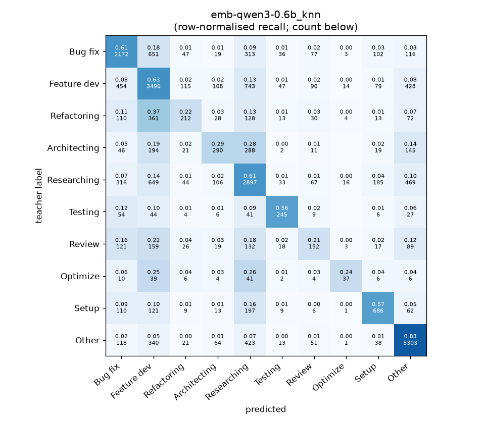
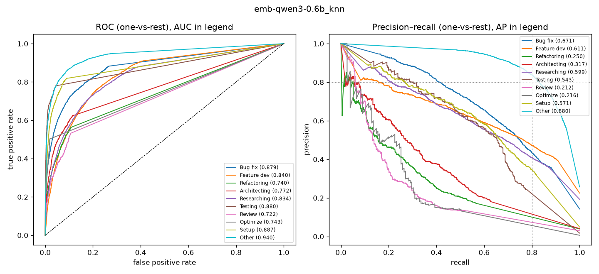

# emb-qwen3-0.6b_knn

```
{
 "block": 2,
 "features": "emb-qwen3-0.6b",
 "model": "knn",
 "selection": "fold-0 grid, min-F1 then macro-F1",
 "params": "{\"k\": 5}",
 "cv_seconds": 2.8,
 "full_fit_seconds": 1.5
}
```

### emb-qwen3-0.6b_knn

**Threshold metrics (argmax prediction)**

|              |   support (OOF) |   precision |   recall |    F1 | P 95% CI    | R 95% CI    | F1 95% CI   |   p(F1≤0.8) |
|:-------------|----------------:|------------:|---------:|------:|:------------|:------------|:------------|------------:|
| Bug fix      |            3536 |       0.619 |    0.614 | 0.616 | 0.593–0.646 | 0.586–0.647 | 0.593–0.642 |       1.000 |
| Feature dev  |            5574 |       0.577 |    0.627 | 0.601 | 0.559–0.599 | 0.601–0.651 | 0.582–0.621 |       1.000 |
| Refactoring  |             971 |       0.420 |    0.218 | 0.287 | 0.343–0.507 | 0.165–0.272 | 0.225–0.349 |       1.000 |
| Architecting |            1016 |       0.441 |    0.285 | 0.347 | 0.369–0.509 | 0.228–0.346 | 0.287–0.405 |       1.000 |
| Researching  |            4782 |       0.557 |    0.606 | 0.580 | 0.536–0.579 | 0.578–0.633 | 0.560–0.602 |       1.000 |
| Testing      |             436 |       0.586 |    0.562 | 0.574 | 0.510–0.670 | 0.468–0.661 | 0.497–0.647 |       1.000 |
| Review       |             736 |       0.306 |    0.207 | 0.247 | 0.238–0.380 | 0.152–0.266 | 0.187–0.307 |       1.000 |
| Optimize     |             155 |       0.468 |    0.239 | 0.316 | 0.263–0.682 | 0.103–0.385 | 0.148–0.476 |       1.000 |
| Setup        |            1214 |       0.596 |    0.565 | 0.580 | 0.550–0.646 | 0.512–0.620 | 0.537–0.624 |       1.000 |
| Other        |            6372 |       0.789 |    0.832 | 0.810 | 0.771–0.807 | 0.814–0.850 | 0.796–0.824 |       0.072 |

**Ranking metrics (class scores, one-vs-rest)**

|              |   ROC-AUC | ROC-AUC 95% CI   |   p(AUC=0.5) |   PR-AUC (AP) | PR-AUC 95% CI   |   PR-AUC chance (=prevalence) |
|:-------------|----------:|:-----------------|-------------:|--------------:|:----------------|------------------------------:|
| Bug fix      |     0.879 | 0.867–0.893      |        0.000 |         0.671 | 0.646–0.695     |                         0.143 |
| Feature dev  |     0.840 | 0.828–0.850      |        0.000 |         0.611 | 0.588–0.632     |                         0.225 |
| Refactoring  |     0.740 | 0.708–0.768      |        0.000 |         0.250 | 0.199–0.313     |                         0.039 |
| Architecting |     0.772 | 0.744–0.801      |        0.000 |         0.317 | 0.265–0.375     |                         0.041 |
| Researching  |     0.834 | 0.819–0.847      |        0.000 |         0.599 | 0.574–0.628     |                         0.193 |
| Testing      |     0.880 | 0.842–0.918      |        0.000 |         0.543 | 0.455–0.647     |                         0.018 |
| Review       |     0.722 | 0.687–0.759      |        0.000 |         0.212 | 0.152–0.273     |                         0.030 |
| Optimize     |     0.743 | 0.656–0.814      |        0.000 |         0.216 | 0.098–0.372     |                         0.006 |
| Setup        |     0.887 | 0.865–0.906      |        0.000 |         0.571 | 0.524–0.623     |                         0.049 |
| Other        |     0.940 | 0.933–0.947      |        0.000 |         0.880 | 0.866–0.895     |                         0.257 |

**Overall**

|                       |   value |      lo |      hi |   p-value |
|:----------------------|--------:|--------:|--------:|----------:|
| accuracy              |   0.625 |   0.614 |   0.636 |   nan     |
| macro-F1              |   0.496 |   0.475 |   0.517 |     0.005 |
| min-F1 (bar)          |   0.247 |   0.148 |   0.291 |     1.000 |
| classes with F1 ≥ 0.8 |   1.000 | nan     | nan     |   nan     |
| macro ROC-AUC         |   0.824 | nan     | nan     |   nan     |
| macro PR-AUC          |   0.487 | nan     | nan     |   nan     |




