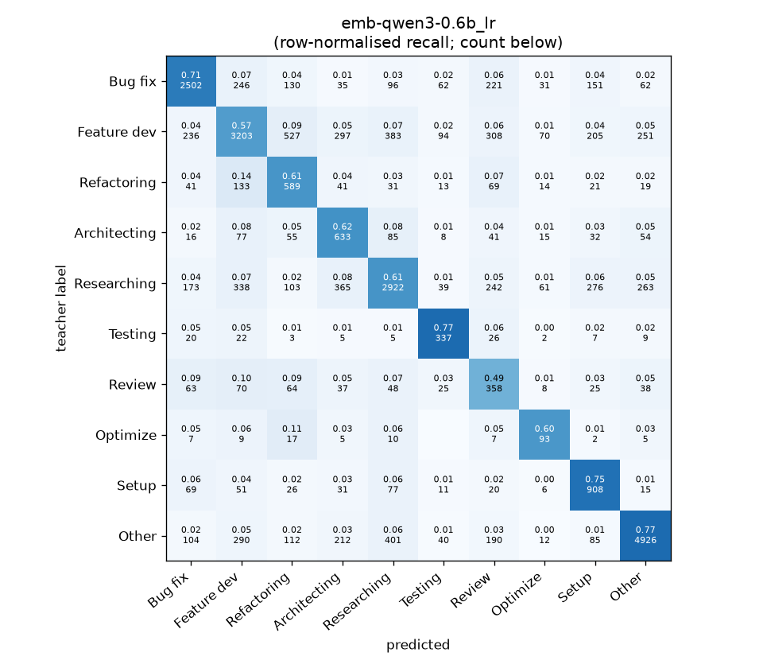
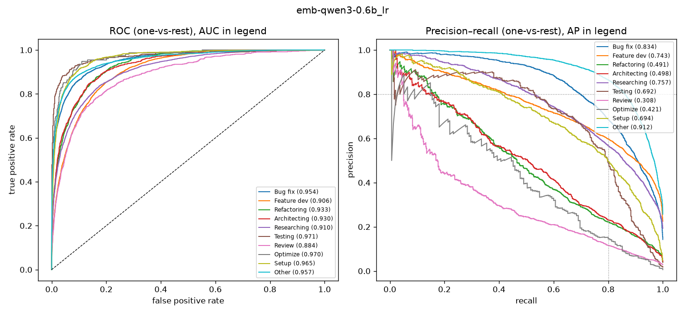

# emb-qwen3-0.6b_lr

```
{
 "block": 2,
 "features": "emb-qwen3-0.6b",
 "model": "lr",
 "selection": "fold-0 grid, min-F1 then macro-F1",
 "params": "{\"C\": 10.0, \"cw\": \"balanced\"}",
 "cv_seconds": 3.5,
 "full_fit_seconds": 2.0
}
```

### emb-qwen3-0.6b_lr

**Threshold metrics (argmax prediction)**

|              |   support (OOF) |   precision |   recall |    F1 | P 95% CI    | R 95% CI    | F1 95% CI   |   p(F1≤0.8) |
|:-------------|----------------:|------------:|---------:|------:|:------------|:------------|:------------|------------:|
| Bug fix      |            3536 |       0.774 |    0.708 | 0.739 | 0.749–0.800 | 0.680–0.738 | 0.717–0.760 |       1.000 |
| Feature dev  |            5574 |       0.722 |    0.575 | 0.640 | 0.699–0.747 | 0.549–0.600 | 0.620–0.662 |       1.000 |
| Refactoring  |             971 |       0.362 |    0.607 | 0.454 | 0.329–0.402 | 0.543–0.667 | 0.412–0.495 |       1.000 |
| Architecting |            1016 |       0.381 |    0.623 | 0.473 | 0.345–0.415 | 0.559–0.681 | 0.433–0.512 |       1.000 |
| Researching  |            4782 |       0.720 |    0.611 | 0.661 | 0.696–0.744 | 0.584–0.639 | 0.639–0.684 |       1.000 |
| Testing      |             436 |       0.536 |    0.773 | 0.633 | 0.480–0.599 | 0.688–0.844 | 0.575–0.691 |       1.000 |
| Review       |             736 |       0.242 |    0.486 | 0.323 | 0.207–0.278 | 0.418–0.560 | 0.278–0.368 |       1.000 |
| Optimize     |             155 |       0.298 |    0.600 | 0.398 | 0.226–0.385 | 0.436–0.744 | 0.305–0.500 |       1.000 |
| Setup        |            1214 |       0.530 |    0.748 | 0.621 | 0.494–0.571 | 0.700–0.792 | 0.585–0.659 |       1.000 |
| Other        |            6372 |       0.873 |    0.773 | 0.820 | 0.856–0.889 | 0.751–0.792 | 0.805–0.834 |       0.004 |

**Ranking metrics (class scores, one-vs-rest)**

|              |   ROC-AUC | ROC-AUC 95% CI   |   p(AUC=0.5) |   PR-AUC (AP) | PR-AUC 95% CI   |   PR-AUC chance (=prevalence) |
|:-------------|----------:|:-----------------|-------------:|--------------:|:----------------|------------------------------:|
| Bug fix      |     0.954 | 0.947–0.960      |        0.000 |         0.834 | 0.815–0.851     |                         0.143 |
| Feature dev  |     0.906 | 0.899–0.914      |        0.000 |         0.743 | 0.719–0.760     |                         0.225 |
| Refactoring  |     0.933 | 0.922–0.944      |        0.000 |         0.491 | 0.431–0.551     |                         0.039 |
| Architecting |     0.930 | 0.918–0.942      |        0.000 |         0.498 | 0.446–0.546     |                         0.041 |
| Researching  |     0.910 | 0.901–0.918      |        0.000 |         0.757 | 0.734–0.779     |                         0.193 |
| Testing      |     0.971 | 0.953–0.985      |        0.000 |         0.692 | 0.602–0.786     |                         0.018 |
| Review       |     0.884 | 0.859–0.909      |        0.000 |         0.308 | 0.260–0.384     |                         0.030 |
| Optimize     |     0.970 | 0.937–0.989      |        0.000 |         0.421 | 0.301–0.582     |                         0.006 |
| Setup        |     0.965 | 0.956–0.972      |        0.000 |         0.694 | 0.646–0.744     |                         0.049 |
| Other        |     0.957 | 0.950–0.962      |        0.000 |         0.912 | 0.902–0.921     |                         0.257 |

**Overall**

|                       |   value |      lo |      hi |   p-value |
|:----------------------|--------:|--------:|--------:|----------:|
| accuracy              |   0.664 |   0.654 |   0.677 |   nan     |
| macro-F1              |   0.576 |   0.560 |   0.593 |     0.005 |
| min-F1 (bar)          |   0.323 |   0.278 |   0.364 |     1.000 |
| classes with F1 ≥ 0.8 |   1.000 | nan     | nan     |   nan     |
| macro ROC-AUC         |   0.938 | nan     | nan     |   nan     |
| macro PR-AUC          |   0.635 | nan     | nan     |   nan     |




