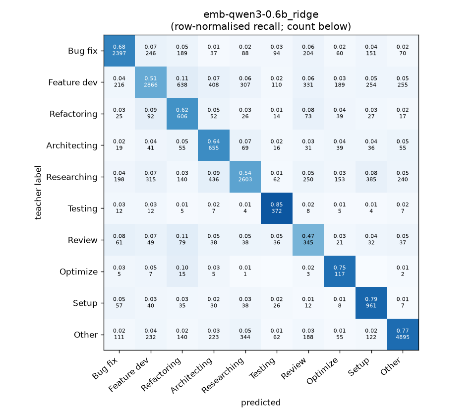
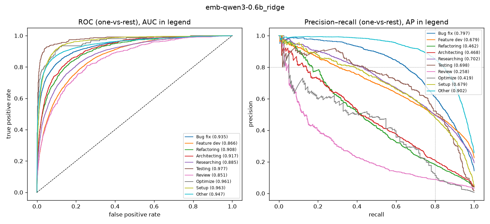

# emb-qwen3-0.6b_ridge

```
{
 "block": 2,
 "features": "emb-qwen3-0.6b",
 "model": "ridge",
 "selection": "fold-0 grid, min-F1 then macro-F1",
 "params": "{\"alpha\": 0.1, \"cw\": \"balanced\"}",
 "cv_seconds": 1.2,
 "full_fit_seconds": 0.1
}
```

### emb-qwen3-0.6b_ridge

**Threshold metrics (argmax prediction)**

|              |   support (OOF) |   precision |   recall |    F1 | P 95% CI    | R 95% CI    | F1 95% CI   |   p(F1≤0.8) |
|:-------------|----------------:|------------:|---------:|------:|:------------|:------------|:------------|------------:|
| Bug fix      |            3536 |       0.773 |    0.678 | 0.722 | 0.746–0.801 | 0.648–0.706 | 0.700–0.743 |       1.000 |
| Feature dev  |            5574 |       0.735 |    0.514 | 0.605 | 0.709–0.763 | 0.489–0.542 | 0.582–0.629 |       1.000 |
| Refactoring  |             971 |       0.319 |    0.624 | 0.422 | 0.288–0.351 | 0.560–0.687 | 0.384–0.463 |       1.000 |
| Architecting |            1016 |       0.346 |    0.645 | 0.451 | 0.315–0.380 | 0.583–0.701 | 0.413–0.488 |       1.000 |
| Researching  |            4782 |       0.740 |    0.544 | 0.627 | 0.715–0.765 | 0.519–0.572 | 0.604–0.651 |       1.000 |
| Testing      |             436 |       0.470 |    0.853 | 0.606 | 0.422–0.524 | 0.780–0.917 | 0.556–0.658 |       1.000 |
| Review       |             736 |       0.239 |    0.469 | 0.316 | 0.203–0.275 | 0.402–0.543 | 0.272–0.362 |       1.000 |
| Optimize     |             155 |       0.171 |    0.755 | 0.278 | 0.140–0.207 | 0.615–0.897 | 0.230–0.337 |       1.000 |
| Setup        |            1214 |       0.487 |    0.792 | 0.603 | 0.454–0.523 | 0.746–0.835 | 0.568–0.638 |       1.000 |
| Other        |            6372 |       0.876 |    0.768 | 0.819 | 0.860–0.894 | 0.747–0.790 | 0.803–0.833 |       0.012 |

**Ranking metrics (class scores, one-vs-rest)**

|              |   ROC-AUC | ROC-AUC 95% CI   |   p(AUC=0.5) |   PR-AUC (AP) | PR-AUC 95% CI   |   PR-AUC chance (=prevalence) |
|:-------------|----------:|:-----------------|-------------:|--------------:|:----------------|------------------------------:|
| Bug fix      |     0.935 | 0.926–0.943      |        0.000 |         0.797 | 0.779–0.818     |                         0.143 |
| Feature dev  |     0.866 | 0.856–0.875      |        0.000 |         0.679 | 0.657–0.697     |                         0.225 |
| Refactoring  |     0.908 | 0.890–0.924      |        0.000 |         0.462 | 0.413–0.522     |                         0.039 |
| Architecting |     0.917 | 0.902–0.933      |        0.000 |         0.468 | 0.421–0.527     |                         0.041 |
| Researching  |     0.885 | 0.873–0.895      |        0.000 |         0.702 | 0.679–0.724     |                         0.193 |
| Testing      |     0.977 | 0.956–0.989      |        0.000 |         0.698 | 0.610–0.779     |                         0.018 |
| Review       |     0.851 | 0.826–0.884      |        0.000 |         0.258 | 0.210–0.332     |                         0.030 |
| Optimize     |     0.961 | 0.920–0.986      |        0.000 |         0.419 | 0.282–0.630     |                         0.006 |
| Setup        |     0.963 | 0.951–0.971      |        0.000 |         0.679 | 0.634–0.720     |                         0.049 |
| Other        |     0.947 | 0.940–0.953      |        0.000 |         0.902 | 0.890–0.912     |                         0.257 |

**Overall**

|                       |   value |      lo |      hi |   p-value |
|:----------------------|--------:|--------:|--------:|----------:|
| accuracy              |   0.638 |   0.627 |   0.649 |   nan     |
| macro-F1              |   0.545 |   0.532 |   0.558 |     0.005 |
| min-F1 (bar)          |   0.278 |   0.230 |   0.323 |     1.000 |
| classes with F1 ≥ 0.8 |   1.000 | nan     | nan     |   nan     |
| macro ROC-AUC         |   0.921 | nan     | nan     |   nan     |
| macro PR-AUC          |   0.606 | nan     | nan     |   nan     |




