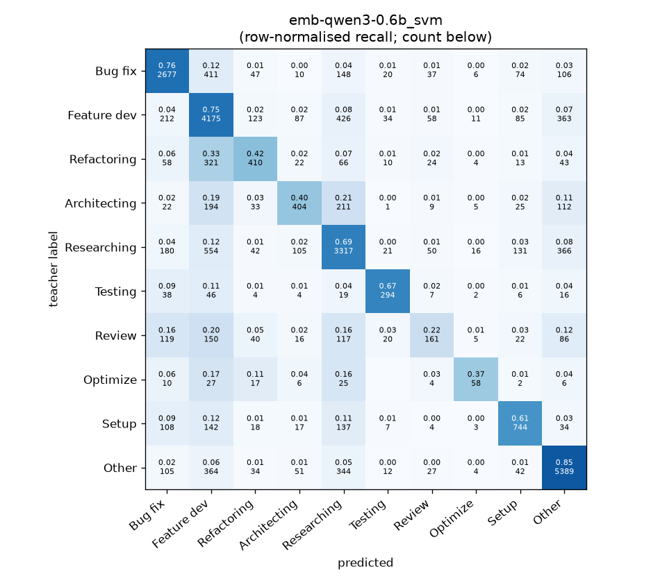
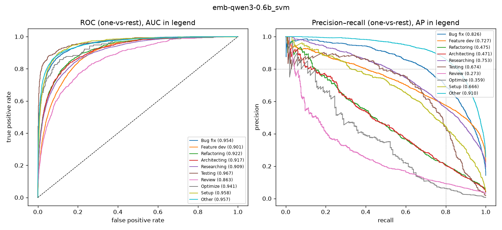

# emb-qwen3-0.6b_svm

```
{
 "block": 2,
 "features": "emb-qwen3-0.6b",
 "model": "svm",
 "selection": "fold-0 grid, min-F1 then macro-F1",
 "params": "{\"C\": 10.0, \"cw\": null}",
 "cv_seconds": 22.6,
 "full_fit_seconds": 21.5
}
```

### emb-qwen3-0.6b_svm

**Threshold metrics (argmax prediction)**

|              |   support (OOF) |   precision |   recall |    F1 | P 95% CI    | R 95% CI    | F1 95% CI   |   p(F1≤0.8) |
|:-------------|----------------:|------------:|---------:|------:|:------------|:------------|:------------|------------:|
| Bug fix      |            3536 |       0.759 |    0.757 | 0.758 | 0.734–0.783 | 0.730–0.783 | 0.737–0.778 |       1.000 |
| Feature dev  |            5574 |       0.654 |    0.749 | 0.698 | 0.636–0.672 | 0.727–0.770 | 0.681–0.715 |       1.000 |
| Refactoring  |             971 |       0.534 |    0.422 | 0.472 | 0.474–0.596 | 0.362–0.486 | 0.416–0.527 |       1.000 |
| Architecting |            1016 |       0.560 |    0.398 | 0.465 | 0.494–0.625 | 0.342–0.457 | 0.410–0.517 |       1.000 |
| Researching  |            4782 |       0.690 |    0.694 | 0.692 | 0.668–0.713 | 0.669–0.719 | 0.673–0.712 |       1.000 |
| Testing      |             436 |       0.702 |    0.674 | 0.688 | 0.629–0.783 | 0.587–0.752 | 0.623–0.752 |       1.000 |
| Review       |             736 |       0.423 |    0.219 | 0.288 | 0.330–0.511 | 0.163–0.277 | 0.216–0.355 |       1.000 |
| Optimize     |             155 |       0.509 |    0.374 | 0.431 | 0.364–0.692 | 0.231–0.538 | 0.290–0.571 |       1.000 |
| Setup        |            1214 |       0.650 |    0.613 | 0.631 | 0.602–0.703 | 0.561–0.663 | 0.589–0.674 |       1.000 |
| Other        |            6372 |       0.826 |    0.846 | 0.836 | 0.809–0.843 | 0.829–0.863 | 0.822–0.849 |       0.000 |

**Ranking metrics (class scores, one-vs-rest)**

|              |   ROC-AUC | ROC-AUC 95% CI   |   p(AUC=0.5) |   PR-AUC (AP) | PR-AUC 95% CI   |   PR-AUC chance (=prevalence) |
|:-------------|----------:|:-----------------|-------------:|--------------:|:----------------|------------------------------:|
| Bug fix      |     0.954 | 0.948–0.960      |        0.000 |         0.826 | 0.805–0.845     |                         0.143 |
| Feature dev  |     0.901 | 0.892–0.907      |        0.000 |         0.727 | 0.701–0.744     |                         0.225 |
| Refactoring  |     0.922 | 0.906–0.936      |        0.000 |         0.475 | 0.422–0.536     |                         0.039 |
| Architecting |     0.917 | 0.902–0.930      |        0.000 |         0.471 | 0.415–0.523     |                         0.041 |
| Researching  |     0.909 | 0.899–0.917      |        0.000 |         0.753 | 0.733–0.773     |                         0.193 |
| Testing      |     0.967 | 0.947–0.981      |        0.000 |         0.674 | 0.582–0.761     |                         0.018 |
| Review       |     0.863 | 0.837–0.894      |        0.000 |         0.273 | 0.221–0.351     |                         0.030 |
| Optimize     |     0.941 | 0.888–0.974      |        0.000 |         0.359 | 0.235–0.523     |                         0.006 |
| Setup        |     0.958 | 0.948–0.966      |        0.000 |         0.666 | 0.618–0.717     |                         0.049 |
| Other        |     0.957 | 0.950–0.962      |        0.000 |         0.910 | 0.899–0.919     |                         0.257 |

**Overall**

|                       |   value |      lo |      hi |   p-value |
|:----------------------|--------:|--------:|--------:|----------:|
| accuracy              |   0.711 |   0.701 |   0.722 |   nan     |
| macro-F1              |   0.596 |   0.575 |   0.617 |     0.005 |
| min-F1 (bar)          |   0.288 |   0.215 |   0.354 |     1.000 |
| classes with F1 ≥ 0.8 |   1.000 | nan     | nan     |   nan     |
| macro ROC-AUC         |   0.929 | nan     | nan     |   nan     |
| macro PR-AUC          |   0.613 | nan     | nan     |   nan     |




