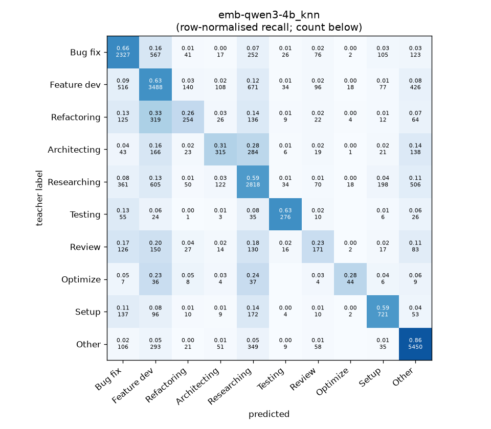
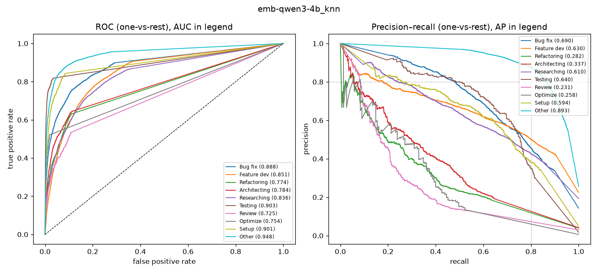

# emb-qwen3-4b_knn

```
{
 "block": 5,
 "features": "emb-qwen3-4b",
 "model": "knn",
 "selection": "fold-0 grid, min-F1 then macro-F1",
 "params": "{\"k\": 5}",
 "cv_seconds": 4.7,
 "full_fit_seconds": 1.5
}
```

### emb-qwen3-4b_knn

**Threshold metrics (argmax prediction)**

|              |   support (OOF) |   precision |   recall |    F1 | P 95% CI    | R 95% CI    | F1 95% CI   |   p(F1≤0.8) |
|:-------------|----------------:|------------:|---------:|------:|:------------|:------------|:------------|------------:|
| Bug fix      |            3536 |       0.612 |    0.658 | 0.634 | 0.588–0.639 | 0.628–0.689 | 0.610–0.657 |       1.000 |
| Feature dev  |            5574 |       0.607 |    0.626 | 0.616 | 0.586–0.629 | 0.600–0.652 | 0.598–0.637 |       1.000 |
| Refactoring  |             971 |       0.442 |    0.262 | 0.329 | 0.375–0.518 | 0.206–0.317 | 0.270–0.388 |       1.000 |
| Architecting |            1016 |       0.471 |    0.310 | 0.374 | 0.404–0.539 | 0.256–0.366 | 0.314–0.434 |       1.000 |
| Researching  |            4782 |       0.577 |    0.589 | 0.583 | 0.555–0.600 | 0.560–0.617 | 0.560–0.605 |       1.000 |
| Testing      |             436 |       0.667 |    0.633 | 0.649 | 0.580–0.750 | 0.541–0.725 | 0.573–0.718 |       1.000 |
| Review       |             736 |       0.319 |    0.232 | 0.269 | 0.250–0.394 | 0.174–0.293 | 0.207–0.334 |       1.000 |
| Optimize     |             155 |       0.484 |    0.284 | 0.358 | 0.278–0.684 | 0.154–0.436 | 0.197–0.500 |       1.000 |
| Setup        |            1214 |       0.602 |    0.594 | 0.598 | 0.556–0.648 | 0.538–0.647 | 0.554–0.638 |       1.000 |
| Other        |            6372 |       0.792 |    0.855 | 0.823 | 0.775–0.808 | 0.838–0.871 | 0.809–0.835 |       0.000 |

**Ranking metrics (class scores, one-vs-rest)**

|              |   ROC-AUC | ROC-AUC 95% CI   |   p(AUC=0.5) |   PR-AUC (AP) | PR-AUC 95% CI   |   PR-AUC chance (=prevalence) |
|:-------------|----------:|:-----------------|-------------:|--------------:|:----------------|------------------------------:|
| Bug fix      |     0.888 | 0.876–0.900      |        0.000 |         0.690 | 0.664–0.718     |                         0.143 |
| Feature dev  |     0.851 | 0.839–0.861      |        0.000 |         0.630 | 0.607–0.653     |                         0.225 |
| Refactoring  |     0.774 | 0.744–0.801      |        0.000 |         0.282 | 0.235–0.341     |                         0.039 |
| Architecting |     0.784 | 0.754–0.818      |        0.000 |         0.337 | 0.275–0.402     |                         0.041 |
| Researching  |     0.836 | 0.822–0.849      |        0.000 |         0.610 | 0.585–0.638     |                         0.193 |
| Testing      |     0.903 | 0.869–0.930      |        0.000 |         0.640 | 0.560–0.723     |                         0.018 |
| Review       |     0.725 | 0.692–0.770      |        0.000 |         0.231 | 0.172–0.300     |                         0.030 |
| Optimize     |     0.754 | 0.685–0.830      |        0.000 |         0.258 | 0.129–0.425     |                         0.006 |
| Setup        |     0.901 | 0.878–0.919      |        0.000 |         0.594 | 0.546–0.642     |                         0.049 |
| Other        |     0.948 | 0.941–0.955      |        0.000 |         0.893 | 0.881–0.905     |                         0.257 |

**Overall**

|                       |   value |      lo |      hi |   p-value |
|:----------------------|--------:|--------:|--------:|----------:|
| accuracy              |   0.640 |   0.629 |   0.651 |   nan     |
| macro-F1              |   0.523 |   0.501 |   0.544 |     0.005 |
| min-F1 (bar)          |   0.269 |   0.190 |   0.320 |     1.000 |
| classes with F1 ≥ 0.8 |   1.000 | nan     | nan     |   nan     |
| macro ROC-AUC         |   0.836 | nan     | nan     |   nan     |
| macro PR-AUC          |   0.517 | nan     | nan     |   nan     |




