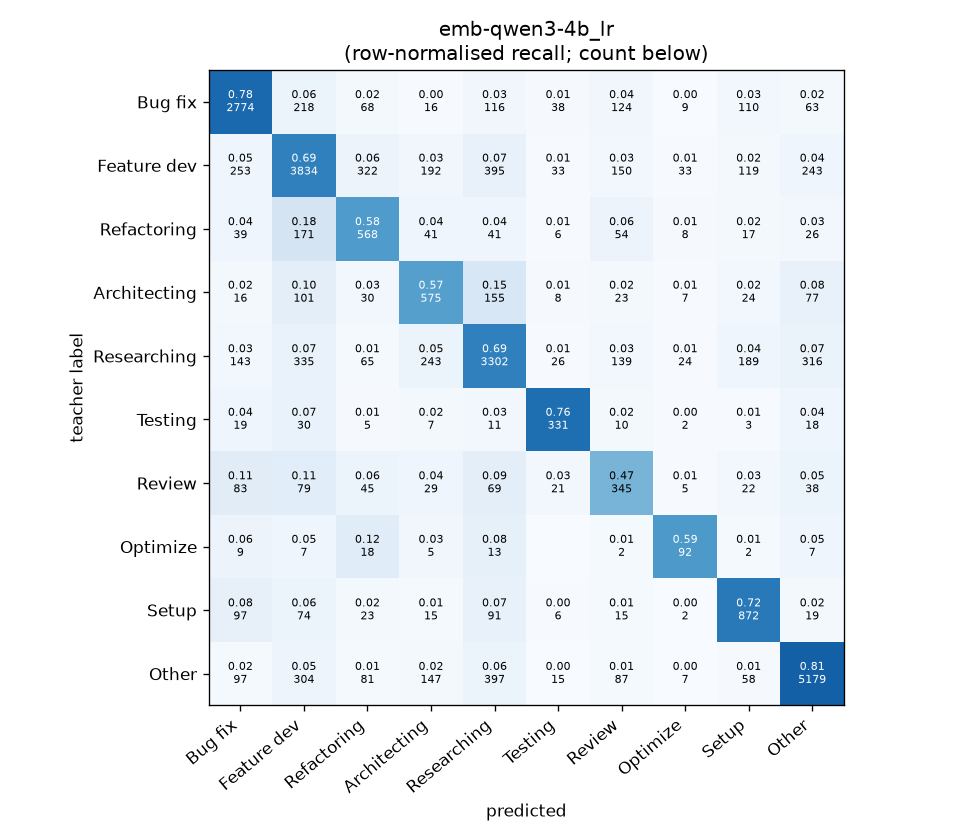
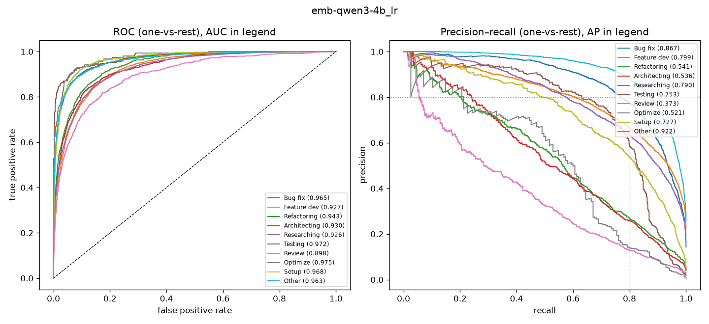

# emb-qwen3-4b_lr

```
{
 "block": 5,
 "features": "emb-qwen3-4b",
 "model": "lr",
 "selection": "fold-0 grid, min-F1 then macro-F1",
 "params": "{\"C\": 100.0, \"cw\": \"balanced\"}",
 "cv_seconds": 13.0,
 "full_fit_seconds": 8.2
}
```

### emb-qwen3-4b_lr

**Threshold metrics (argmax prediction)**

|              |   support (OOF) |   precision |   recall |    F1 | P 95% CI    | R 95% CI    | F1 95% CI   |   p(F1≤0.8) |
|:-------------|----------------:|------------:|---------:|------:|:------------|:------------|:------------|------------:|
| Bug fix      |            3536 |       0.786 |    0.785 | 0.785 | 0.763–0.809 | 0.757–0.808 | 0.765–0.803 |       0.949 |
| Feature dev  |            5574 |       0.744 |    0.688 | 0.715 | 0.722–0.766 | 0.664–0.712 | 0.696–0.733 |       1.000 |
| Refactoring  |             971 |       0.464 |    0.585 | 0.517 | 0.419–0.515 | 0.523–0.650 | 0.472–0.565 |       1.000 |
| Architecting |            1016 |       0.453 |    0.566 | 0.503 | 0.413–0.495 | 0.504–0.622 | 0.459–0.546 |       1.000 |
| Researching  |            4782 |       0.719 |    0.691 | 0.705 | 0.699–0.743 | 0.665–0.717 | 0.685–0.727 |       1.000 |
| Testing      |             436 |       0.684 |    0.759 | 0.720 | 0.618–0.761 | 0.679–0.826 | 0.658–0.778 |       0.996 |
| Review       |             736 |       0.364 |    0.469 | 0.409 | 0.316–0.420 | 0.402–0.543 | 0.356–0.467 |       1.000 |
| Optimize     |             155 |       0.487 |    0.594 | 0.535 | 0.375–0.610 | 0.436–0.744 | 0.419–0.651 |       1.000 |
| Setup        |            1214 |       0.616 |    0.718 | 0.663 | 0.575–0.657 | 0.663–0.766 | 0.624–0.701 |       1.000 |
| Other        |            6372 |       0.865 |    0.813 | 0.838 | 0.848–0.881 | 0.792–0.831 | 0.824–0.851 |       0.000 |

**Ranking metrics (class scores, one-vs-rest)**

|              |   ROC-AUC | ROC-AUC 95% CI   |   p(AUC=0.5) |   PR-AUC (AP) | PR-AUC 95% CI   |   PR-AUC chance (=prevalence) |
|:-------------|----------:|:-----------------|-------------:|--------------:|:----------------|------------------------------:|
| Bug fix      |     0.965 | 0.959–0.971      |        0.000 |         0.867 | 0.849–0.886     |                         0.143 |
| Feature dev  |     0.927 | 0.921–0.933      |        0.000 |         0.799 | 0.781–0.813     |                         0.225 |
| Refactoring  |     0.943 | 0.931–0.953      |        0.000 |         0.541 | 0.477–0.590     |                         0.039 |
| Architecting |     0.930 | 0.916–0.945      |        0.000 |         0.536 | 0.481–0.596     |                         0.041 |
| Researching  |     0.926 | 0.918–0.934      |        0.000 |         0.790 | 0.769–0.810     |                         0.193 |
| Testing      |     0.972 | 0.955–0.986      |        0.000 |         0.753 | 0.680–0.826     |                         0.018 |
| Review       |     0.898 | 0.869–0.921      |        0.000 |         0.373 | 0.308–0.465     |                         0.030 |
| Optimize     |     0.975 | 0.944–0.991      |        0.000 |         0.521 | 0.370–0.679     |                         0.006 |
| Setup        |     0.968 | 0.960–0.975      |        0.000 |         0.727 | 0.677–0.765     |                         0.049 |
| Other        |     0.963 | 0.959–0.968      |        0.000 |         0.922 | 0.913–0.930     |                         0.257 |

**Overall**

|                       |   value |      lo |      hi |   p-value |
|:----------------------|--------:|--------:|--------:|----------:|
| accuracy              |   0.721 |   0.710 |   0.732 |   nan     |
| macro-F1              |   0.639 |   0.621 |   0.657 |     0.005 |
| min-F1 (bar)          |   0.409 |   0.355 |   0.465 |     1.000 |
| classes with F1 ≥ 0.8 |   1.000 | nan     | nan     |   nan     |
| macro ROC-AUC         |   0.947 | nan     | nan     |   nan     |
| macro PR-AUC          |   0.683 | nan     | nan     |   nan     |




