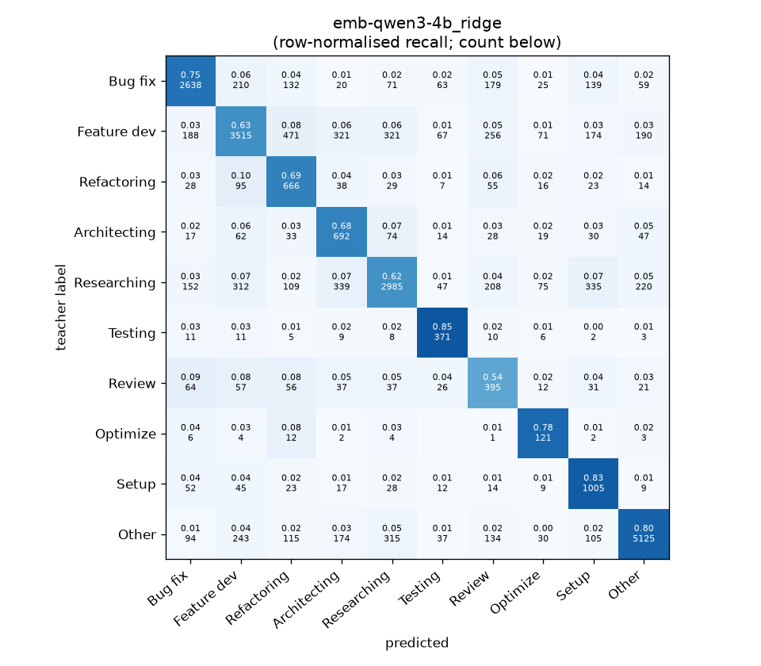
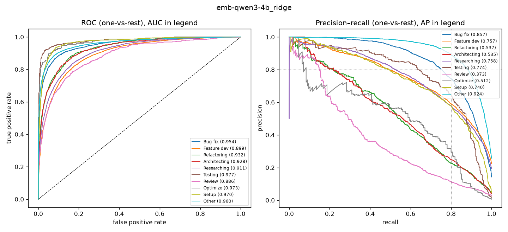

# emb-qwen3-4b_ridge

```
{
 "block": 5,
 "features": "emb-qwen3-4b",
 "model": "ridge",
 "selection": "fold-0 grid, min-F1 then macro-F1",
 "params": "{\"alpha\": 0.1, \"cw\": \"balanced\"}",
 "cv_seconds": 0.8,
 "full_fit_seconds": 0.2
}
```

### emb-qwen3-4b_ridge

**Threshold metrics (argmax prediction)**

|              |   support (OOF) |   precision |   recall |    F1 | P 95% CI    | R 95% CI    | F1 95% CI   |   p(F1≤0.8) |
|:-------------|----------------:|------------:|---------:|------:|:------------|:------------|:------------|------------:|
| Bug fix      |            3536 |       0.812 |    0.746 | 0.777 | 0.788–0.836 | 0.717–0.775 | 0.757–0.797 |       0.984 |
| Feature dev  |            5574 |       0.772 |    0.631 | 0.694 | 0.749–0.795 | 0.605–0.657 | 0.674–0.714 |       1.000 |
| Refactoring  |             971 |       0.411 |    0.686 | 0.514 | 0.378–0.450 | 0.626–0.745 | 0.475–0.553 |       1.000 |
| Architecting |            1016 |       0.420 |    0.681 | 0.519 | 0.384–0.457 | 0.622–0.736 | 0.479–0.557 |       1.000 |
| Researching  |            4782 |       0.771 |    0.624 | 0.690 | 0.747–0.795 | 0.596–0.652 | 0.667–0.714 |       1.000 |
| Testing      |             436 |       0.576 |    0.851 | 0.687 | 0.522–0.644 | 0.780–0.908 | 0.635–0.742 |       1.000 |
| Review       |             736 |       0.309 |    0.537 | 0.392 | 0.271–0.351 | 0.467–0.609 | 0.345–0.441 |       1.000 |
| Optimize     |             155 |       0.315 |    0.781 | 0.449 | 0.258–0.383 | 0.641–0.897 | 0.370–0.531 |       1.000 |
| Setup        |            1214 |       0.544 |    0.828 | 0.657 | 0.509–0.581 | 0.785–0.868 | 0.625–0.689 |       1.000 |
| Other        |            6372 |       0.901 |    0.804 | 0.850 | 0.885–0.915 | 0.784–0.822 | 0.836–0.862 |       0.000 |

**Ranking metrics (class scores, one-vs-rest)**

|              |   ROC-AUC | ROC-AUC 95% CI   |   p(AUC=0.5) |   PR-AUC (AP) | PR-AUC 95% CI   |   PR-AUC chance (=prevalence) |
|:-------------|----------:|:-----------------|-------------:|--------------:|:----------------|------------------------------:|
| Bug fix      |     0.954 | 0.947–0.961      |        0.000 |         0.857 | 0.840–0.874     |                         0.143 |
| Feature dev  |     0.899 | 0.889–0.906      |        0.000 |         0.757 | 0.734–0.772     |                         0.225 |
| Refactoring  |     0.932 | 0.916–0.945      |        0.000 |         0.537 | 0.484–0.587     |                         0.039 |
| Architecting |     0.928 | 0.914–0.944      |        0.000 |         0.535 | 0.479–0.595     |                         0.041 |
| Researching  |     0.911 | 0.901–0.920      |        0.000 |         0.758 | 0.734–0.783     |                         0.193 |
| Testing      |     0.977 | 0.958–0.991      |        0.000 |         0.774 | 0.699–0.844     |                         0.018 |
| Review       |     0.886 | 0.861–0.913      |        0.000 |         0.373 | 0.321–0.444     |                         0.030 |
| Optimize     |     0.973 | 0.938–0.993      |        0.000 |         0.512 | 0.378–0.685     |                         0.006 |
| Setup        |     0.970 | 0.959–0.976      |        0.000 |         0.740 | 0.699–0.780     |                         0.049 |
| Other        |     0.960 | 0.954–0.965      |        0.000 |         0.924 | 0.916–0.934     |                         0.257 |

**Overall**

|                       |   value |      lo |      hi |   p-value |
|:----------------------|--------:|--------:|--------:|----------:|
| accuracy              |   0.706 |   0.695 |   0.718 |   nan     |
| macro-F1              |   0.623 |   0.608 |   0.638 |     0.005 |
| min-F1 (bar)          |   0.392 |   0.344 |   0.437 |     1.000 |
| classes with F1 ≥ 0.8 |   1.000 | nan     | nan     |   nan     |
| macro ROC-AUC         |   0.939 | nan     | nan     |   nan     |
| macro PR-AUC          |   0.677 | nan     | nan     |   nan     |




