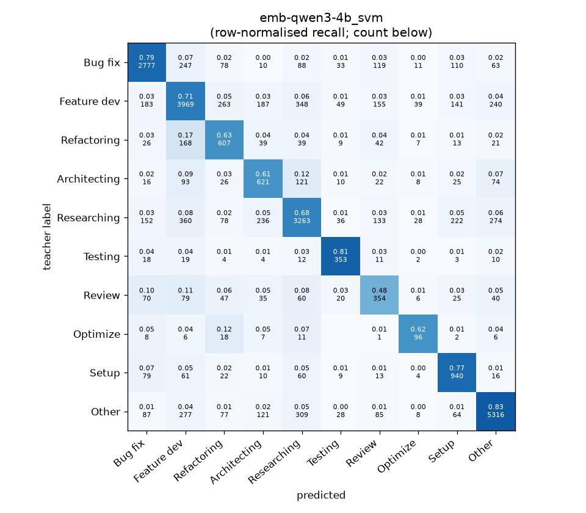
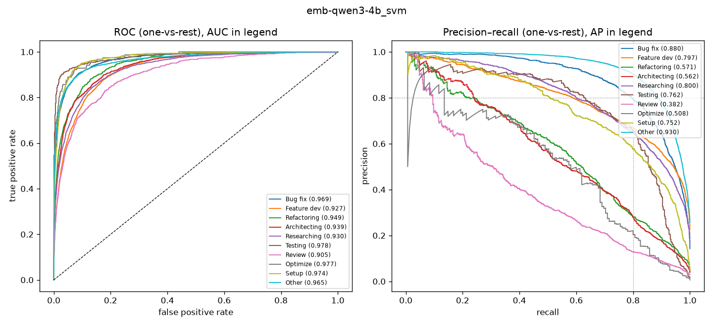

# emb-qwen3-4b_svm

```
{
 "block": 5,
 "features": "emb-qwen3-4b",
 "model": "svm",
 "selection": "fold-0 grid, min-F1 then macro-F1",
 "params": "{\"C\": 1.0, \"cw\": \"balanced\"}",
 "cv_seconds": 47.7,
 "full_fit_seconds": 30.0
}
```

### emb-qwen3-4b_svm

**Threshold metrics (argmax prediction)**

|              |   support (OOF) |   precision |   recall |    F1 | P 95% CI    | R 95% CI    | F1 95% CI   |   p(F1≤0.8) |
|:-------------|----------------:|------------:|---------:|------:|:------------|:------------|:------------|------------:|
| Bug fix      |            3536 |       0.813 |    0.785 | 0.799 | 0.790–0.837 | 0.759–0.811 | 0.778–0.818 |       0.536 |
| Feature dev  |            5574 |       0.752 |    0.712 | 0.731 | 0.731–0.772 | 0.689–0.735 | 0.714–0.749 |       1.000 |
| Refactoring  |             971 |       0.498 |    0.625 | 0.554 | 0.457–0.545 | 0.564–0.687 | 0.511–0.603 |       1.000 |
| Architecting |            1016 |       0.489 |    0.611 | 0.543 | 0.447–0.535 | 0.551–0.669 | 0.499–0.588 |       1.000 |
| Researching  |            4782 |       0.757 |    0.682 | 0.718 | 0.734–0.782 | 0.655–0.709 | 0.697–0.738 |       1.000 |
| Testing      |             436 |       0.645 |    0.810 | 0.718 | 0.580–0.720 | 0.734–0.881 | 0.659–0.774 |       0.997 |
| Review       |             736 |       0.379 |    0.481 | 0.424 | 0.330–0.436 | 0.413–0.554 | 0.372–0.481 |       1.000 |
| Optimize     |             155 |       0.459 |    0.619 | 0.527 | 0.356–0.581 | 0.462–0.769 | 0.418–0.637 |       1.000 |
| Setup        |            1214 |       0.608 |    0.774 | 0.681 | 0.571–0.649 | 0.729–0.818 | 0.646–0.715 |       1.000 |
| Other        |            6372 |       0.877 |    0.834 | 0.855 | 0.861–0.892 | 0.815–0.852 | 0.842–0.867 |       0.000 |

**Ranking metrics (class scores, one-vs-rest)**

|              |   ROC-AUC | ROC-AUC 95% CI   |   p(AUC=0.5) |   PR-AUC (AP) | PR-AUC 95% CI   |   PR-AUC chance (=prevalence) |
|:-------------|----------:|:-----------------|-------------:|--------------:|:----------------|------------------------------:|
| Bug fix      |     0.969 | 0.963–0.974      |        0.000 |         0.880 | 0.862–0.895     |                         0.143 |
| Feature dev  |     0.927 | 0.921–0.933      |        0.000 |         0.797 | 0.780–0.810     |                         0.225 |
| Refactoring  |     0.949 | 0.937–0.959      |        0.000 |         0.571 | 0.513–0.624     |                         0.039 |
| Architecting |     0.939 | 0.926–0.952      |        0.000 |         0.562 | 0.506–0.619     |                         0.041 |
| Researching  |     0.930 | 0.922–0.938      |        0.000 |         0.800 | 0.778–0.822     |                         0.193 |
| Testing      |     0.978 | 0.959–0.989      |        0.000 |         0.762 | 0.679–0.844     |                         0.018 |
| Review       |     0.905 | 0.881–0.928      |        0.000 |         0.382 | 0.326–0.468     |                         0.030 |
| Optimize     |     0.977 | 0.955–0.991      |        0.000 |         0.508 | 0.366–0.681     |                         0.006 |
| Setup        |     0.974 | 0.967–0.980      |        0.000 |         0.752 | 0.706–0.789     |                         0.049 |
| Other        |     0.965 | 0.961–0.969      |        0.000 |         0.930 | 0.922–0.938     |                         0.257 |

**Overall**

|                       |   value |      lo |      hi |   p-value |
|:----------------------|--------:|--------:|--------:|----------:|
| accuracy              |   0.738 |   0.727 |   0.749 |   nan     |
| macro-F1              |   0.655 |   0.637 |   0.673 |     0.005 |
| min-F1 (bar)          |   0.424 |   0.371 |   0.477 |     1.000 |
| classes with F1 ≥ 0.8 |   1.000 | nan     | nan     |   nan     |
| macro ROC-AUC         |   0.951 | nan     | nan     |   nan     |
| macro PR-AUC          |   0.694 | nan     | nan     |   nan     |




