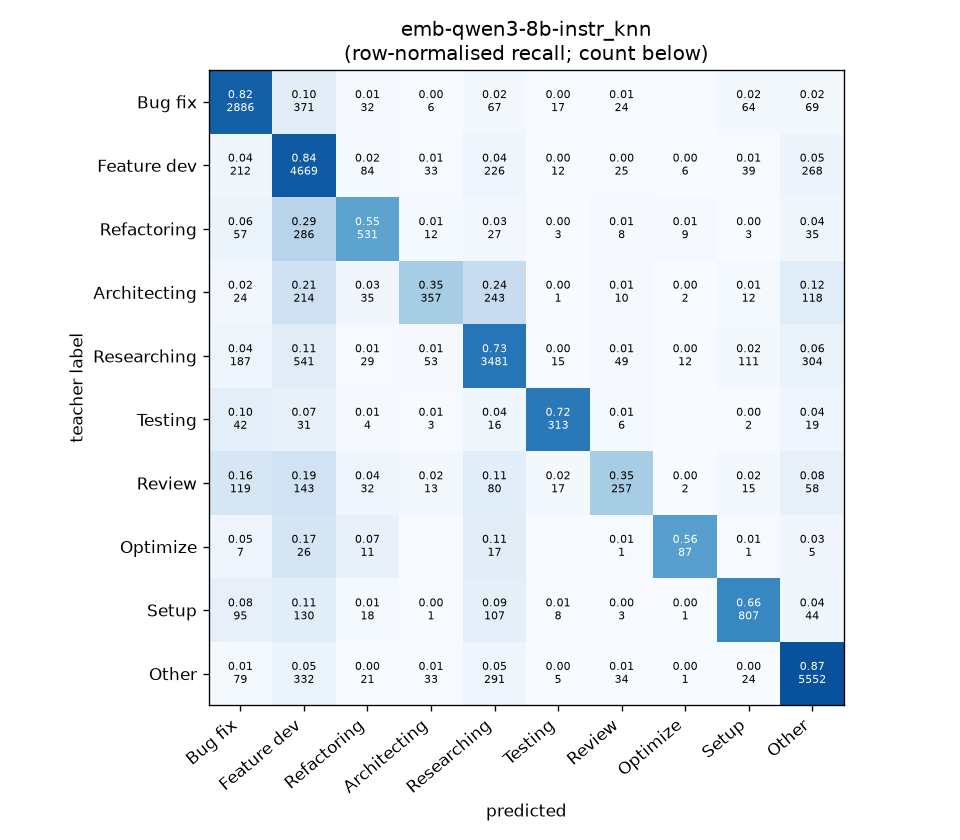
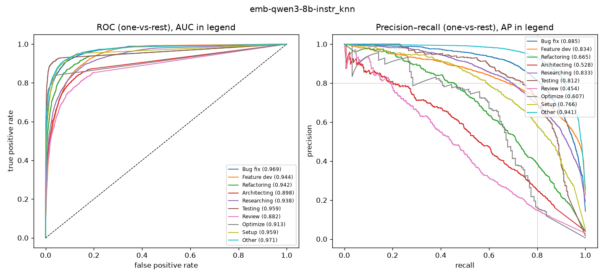

# emb-qwen3-8b-instr_knn

```
{
 "block": 5,
 "features": "emb-qwen3-8b-instr",
 "model": "knn",
 "selection": "fold-0 grid, min-F1 then macro-F1",
 "params": "{\"k\": 15}",
 "cv_seconds": 5.9,
 "full_fit_seconds": 1.8
}
```

### emb-qwen3-8b-instr_knn

**Threshold metrics (argmax prediction)**

|              |   support (OOF) |   precision |   recall |    F1 | P 95% CI    | R 95% CI    | F1 95% CI   |   p(F1≤0.8) |
|:-------------|----------------:|------------:|---------:|------:|:------------|:------------|:------------|------------:|
| Bug fix      |            3536 |       0.778 |    0.816 | 0.797 | 0.755–0.801 | 0.791–0.844 | 0.778–0.814 |       0.606 |
| Feature dev  |            5574 |       0.692 |    0.838 | 0.758 | 0.674–0.710 | 0.819–0.857 | 0.743–0.772 |       1.000 |
| Refactoring  |             971 |       0.666 |    0.547 | 0.601 | 0.611–0.729 | 0.481–0.613 | 0.548–0.656 |       1.000 |
| Architecting |            1016 |       0.699 |    0.351 | 0.468 | 0.623–0.777 | 0.291–0.406 | 0.402–0.524 |       1.000 |
| Researching  |            4782 |       0.764 |    0.728 | 0.746 | 0.744–0.787 | 0.703–0.753 | 0.728–0.764 |       1.000 |
| Testing      |             436 |       0.801 |    0.718 | 0.757 | 0.728–0.874 | 0.633–0.798 | 0.693–0.821 |       0.921 |
| Review       |             736 |       0.616 |    0.349 | 0.446 | 0.531–0.706 | 0.283–0.418 | 0.373–0.515 |       1.000 |
| Optimize     |             155 |       0.725 |    0.561 | 0.633 | 0.581–0.880 | 0.410–0.718 | 0.500–0.754 |       0.999 |
| Setup        |            1214 |       0.749 |    0.665 | 0.704 | 0.702–0.798 | 0.611–0.713 | 0.662–0.743 |       1.000 |
| Other        |            6372 |       0.858 |    0.871 | 0.865 | 0.842–0.873 | 0.854–0.887 | 0.853–0.876 |       0.000 |

**Ranking metrics (class scores, one-vs-rest)**

|              |   ROC-AUC | ROC-AUC 95% CI   |   p(AUC=0.5) |   PR-AUC (AP) | PR-AUC 95% CI   |   PR-AUC chance (=prevalence) |
|:-------------|----------:|:-----------------|-------------:|--------------:|:----------------|------------------------------:|
| Bug fix      |     0.969 | 0.962–0.974      |        0.000 |         0.885 | 0.869–0.901     |                         0.143 |
| Feature dev  |     0.944 | 0.938–0.949      |        0.000 |         0.834 | 0.814–0.850     |                         0.225 |
| Refactoring  |     0.942 | 0.923–0.958      |        0.000 |         0.665 | 0.616–0.721     |                         0.039 |
| Architecting |     0.898 | 0.876–0.921      |        0.000 |         0.528 | 0.482–0.591     |                         0.041 |
| Researching  |     0.938 | 0.930–0.945      |        0.000 |         0.833 | 0.815–0.847     |                         0.193 |
| Testing      |     0.959 | 0.934–0.983      |        0.000 |         0.812 | 0.747–0.872     |                         0.018 |
| Review       |     0.882 | 0.853–0.914      |        0.000 |         0.454 | 0.386–0.527     |                         0.030 |
| Optimize     |     0.913 | 0.850–0.972      |        0.000 |         0.607 | 0.457–0.743     |                         0.006 |
| Setup        |     0.959 | 0.943–0.969      |        0.000 |         0.766 | 0.726–0.802     |                         0.049 |
| Other        |     0.971 | 0.967–0.976      |        0.000 |         0.941 | 0.932–0.950     |                         0.257 |

**Overall**

|                       |   value |      lo |      hi |   p-value |
|:----------------------|--------:|--------:|--------:|----------:|
| accuracy              |   0.764 |   0.754 |   0.774 |   nan     |
| macro-F1              |   0.677 |   0.658 |   0.697 |     0.005 |
| min-F1 (bar)          |   0.446 |   0.373 |   0.491 |     1.000 |
| classes with F1 ≥ 0.8 |   1.000 | nan     | nan     |   nan     |
| macro ROC-AUC         |   0.937 | nan     | nan     |   nan     |
| macro PR-AUC          |   0.732 | nan     | nan     |   nan     |




