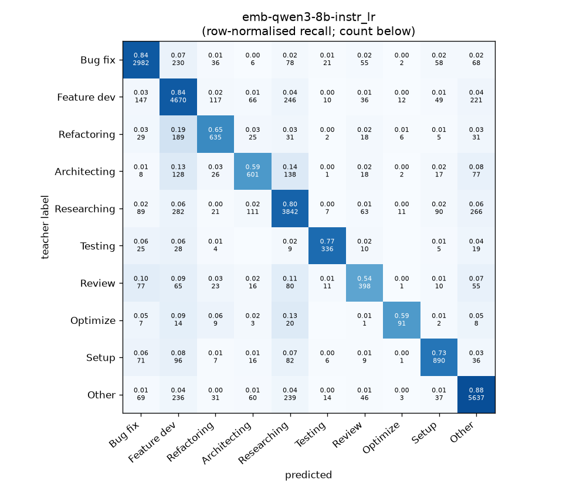
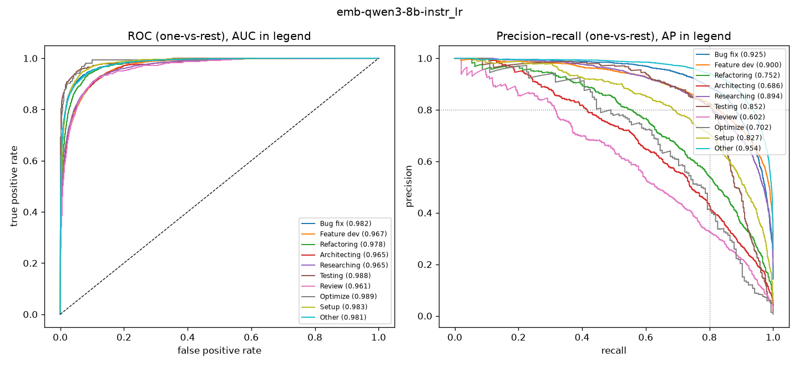

# emb-qwen3-8b-instr_lr

```
{
 "block": 2,
 "features": "emb-qwen3-8b-instr",
 "model": "lr",
 "selection": "fold-0 grid, min-F1 then macro-F1",
 "params": "{\"C\": 100.0, \"cw\": null}",
 "cv_seconds": 17.5,
 "full_fit_seconds": 11.6
}
```

### emb-qwen3-8b-instr_lr

**Threshold metrics (argmax prediction)**

|              |   support (OOF) |   precision |   recall |    F1 | P 95% CI    | R 95% CI    | F1 95% CI   |   p(F1≤0.8) |
|:-------------|----------------:|------------:|---------:|------:|:------------|:------------|:------------|------------:|
| Bug fix      |            3536 |       0.851 |    0.843 | 0.847 | 0.830–0.872 | 0.818–0.867 | 0.829–0.863 |       0.000 |
| Feature dev  |            5574 |       0.786 |    0.838 | 0.811 | 0.767–0.805 | 0.818–0.857 | 0.796–0.826 |       0.086 |
| Refactoring  |             971 |       0.699 |    0.654 | 0.676 | 0.649–0.752 | 0.597–0.720 | 0.629–0.722 |       1.000 |
| Architecting |            1016 |       0.665 |    0.592 | 0.626 | 0.617–0.723 | 0.531–0.650 | 0.575–0.678 |       1.000 |
| Researching  |            4782 |       0.806 |    0.803 | 0.805 | 0.787–0.827 | 0.782–0.826 | 0.788–0.821 |       0.274 |
| Testing      |             436 |       0.824 |    0.771 | 0.796 | 0.754–0.889 | 0.688–0.844 | 0.735–0.850 |       0.585 |
| Review       |             736 |       0.609 |    0.541 | 0.573 | 0.545–0.679 | 0.467–0.614 | 0.515–0.633 |       1.000 |
| Optimize     |             155 |       0.705 |    0.587 | 0.641 | 0.576–0.857 | 0.436–0.719 | 0.515–0.754 |       0.996 |
| Setup        |            1214 |       0.765 |    0.733 | 0.749 | 0.722–0.807 | 0.680–0.782 | 0.708–0.785 |       0.996 |
| Other        |            6372 |       0.878 |    0.885 | 0.881 | 0.864–0.893 | 0.868–0.898 | 0.870–0.892 |       0.000 |

**Ranking metrics (class scores, one-vs-rest)**

|              |   ROC-AUC | ROC-AUC 95% CI   |   p(AUC=0.5) |   PR-AUC (AP) | PR-AUC 95% CI   |   PR-AUC chance (=prevalence) |
|:-------------|----------:|:-----------------|-------------:|--------------:|:----------------|------------------------------:|
| Bug fix      |     0.982 | 0.978–0.985      |        0.000 |         0.925 | 0.912–0.935     |                         0.143 |
| Feature dev  |     0.967 | 0.962–0.970      |        0.000 |         0.900 | 0.887–0.910     |                         0.225 |
| Refactoring  |     0.978 | 0.971–0.983      |        0.000 |         0.752 | 0.702–0.791     |                         0.039 |
| Architecting |     0.965 | 0.957–0.973      |        0.000 |         0.686 | 0.645–0.732     |                         0.041 |
| Researching  |     0.965 | 0.961–0.970      |        0.000 |         0.894 | 0.880–0.907     |                         0.193 |
| Testing      |     0.988 | 0.981–0.995      |        0.000 |         0.852 | 0.796–0.905     |                         0.018 |
| Review       |     0.961 | 0.945–0.973      |        0.000 |         0.602 | 0.531–0.681     |                         0.030 |
| Optimize     |     0.989 | 0.969–0.997      |        0.000 |         0.702 | 0.575–0.821     |                         0.006 |
| Setup        |     0.983 | 0.978–0.988      |        0.000 |         0.827 | 0.793–0.858     |                         0.049 |
| Other        |     0.981 | 0.978–0.984      |        0.000 |         0.954 | 0.947–0.961     |                         0.257 |

**Overall**

|                       |   value |      lo |      hi |   p-value |
|:----------------------|--------:|--------:|--------:|----------:|
| accuracy              |   0.810 |   0.800 |   0.820 |   nan     |
| macro-F1              |   0.740 |   0.722 |   0.759 |     0.005 |
| min-F1 (bar)          |   0.573 |   0.505 |   0.620 |     1.000 |
| classes with F1 ≥ 0.8 |   4.000 | nan     | nan     |   nan     |
| macro ROC-AUC         |   0.976 | nan     | nan     |   nan     |
| macro PR-AUC          |   0.809 | nan     | nan     |   nan     |




