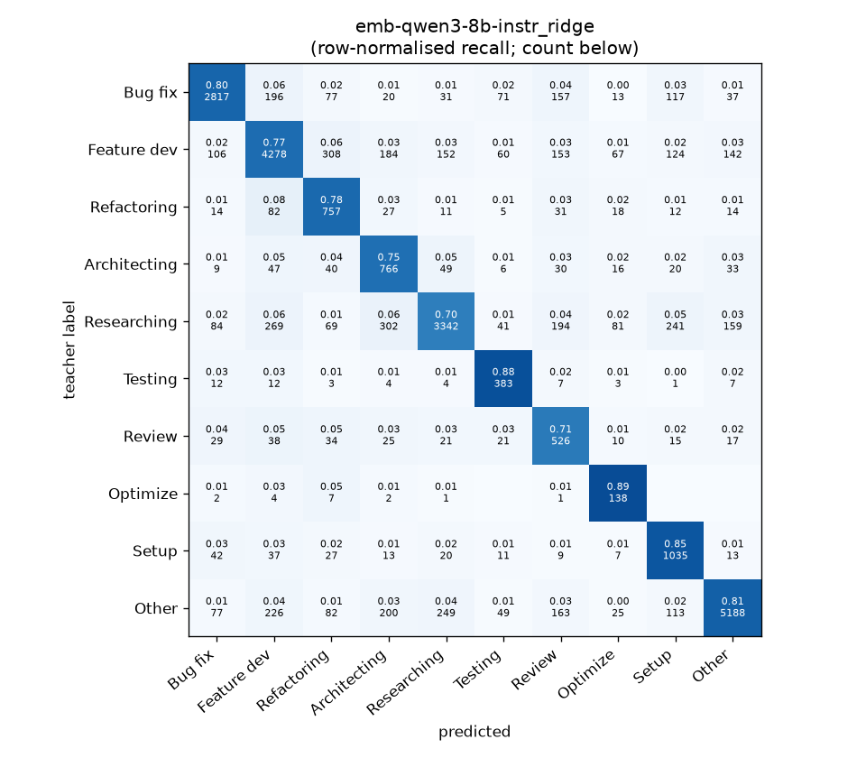
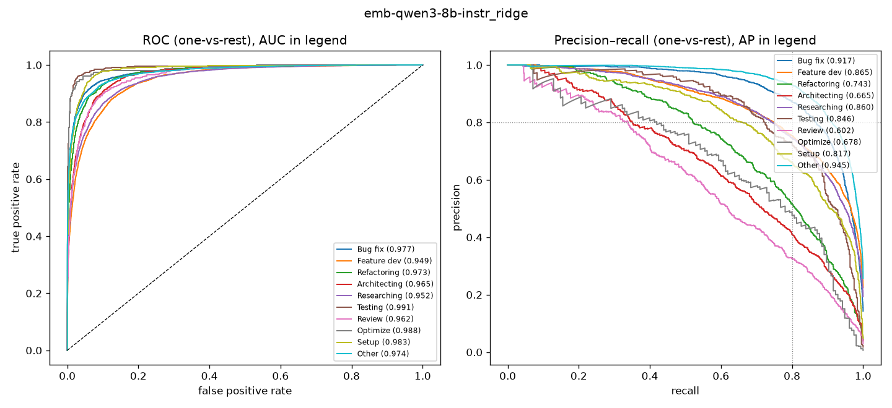

# emb-qwen3-8b-instr_ridge

```
{
 "block": 5,
 "features": "emb-qwen3-8b-instr",
 "model": "ridge",
 "selection": "fold-0 grid, min-F1 then macro-F1",
 "params": "{\"alpha\": 1.0, \"cw\": \"balanced\"}",
 "cv_seconds": 2.5,
 "full_fit_seconds": 0.6
}
```

### emb-qwen3-8b-instr_ridge

**Threshold metrics (argmax prediction)**

|              |   support (OOF) |   precision |   recall |    F1 | P 95% CI    | R 95% CI    | F1 95% CI   |   p(F1≤0.8) |
|:-------------|----------------:|------------:|---------:|------:|:------------|:------------|:------------|------------:|
| Bug fix      |            3536 |       0.883 |    0.797 | 0.837 | 0.860–0.903 | 0.769–0.824 | 0.818–0.856 |       0.000 |
| Feature dev  |            5574 |       0.824 |    0.767 | 0.795 | 0.806–0.842 | 0.746–0.790 | 0.779–0.811 |       0.745 |
| Refactoring  |             971 |       0.539 |    0.780 | 0.637 | 0.501–0.582 | 0.724–0.831 | 0.599–0.676 |       1.000 |
| Architecting |            1016 |       0.496 |    0.754 | 0.599 | 0.460–0.538 | 0.701–0.803 | 0.561–0.637 |       1.000 |
| Researching  |            4782 |       0.861 |    0.699 | 0.772 | 0.842–0.880 | 0.671–0.728 | 0.751–0.792 |       0.995 |
| Testing      |             436 |       0.592 |    0.878 | 0.707 | 0.534–0.655 | 0.807–0.936 | 0.655–0.759 |       0.999 |
| Review       |             736 |       0.414 |    0.715 | 0.524 | 0.377–0.459 | 0.652–0.783 | 0.482–0.570 |       1.000 |
| Optimize     |             155 |       0.365 |    0.890 | 0.518 | 0.311–0.434 | 0.769–0.974 | 0.449–0.593 |       1.000 |
| Setup        |            1214 |       0.617 |    0.853 | 0.716 | 0.579–0.654 | 0.812–0.891 | 0.682–0.748 |       1.000 |
| Other        |            6372 |       0.925 |    0.814 | 0.866 | 0.911–0.938 | 0.795–0.832 | 0.853–0.878 |       0.000 |

**Ranking metrics (class scores, one-vs-rest)**

|              |   ROC-AUC | ROC-AUC 95% CI   |   p(AUC=0.5) |   PR-AUC (AP) | PR-AUC 95% CI   |   PR-AUC chance (=prevalence) |
|:-------------|----------:|:-----------------|-------------:|--------------:|:----------------|------------------------------:|
| Bug fix      |     0.977 | 0.972–0.982      |        0.000 |         0.917 | 0.904–0.927     |                         0.143 |
| Feature dev  |     0.949 | 0.943–0.953      |        0.000 |         0.865 | 0.849–0.876     |                         0.225 |
| Refactoring  |     0.973 | 0.965–0.980      |        0.000 |         0.743 | 0.697–0.790     |                         0.039 |
| Architecting |     0.965 | 0.956–0.974      |        0.000 |         0.665 | 0.620–0.714     |                         0.041 |
| Researching  |     0.952 | 0.946–0.958      |        0.000 |         0.860 | 0.844–0.876     |                         0.193 |
| Testing      |     0.991 | 0.981–0.997      |        0.000 |         0.846 | 0.789–0.896     |                         0.018 |
| Review       |     0.962 | 0.951–0.974      |        0.000 |         0.602 | 0.552–0.669     |                         0.030 |
| Optimize     |     0.988 | 0.964–0.998      |        0.000 |         0.678 | 0.546–0.825     |                         0.006 |
| Setup        |     0.983 | 0.977–0.988      |        0.000 |         0.817 | 0.782–0.847     |                         0.049 |
| Other        |     0.974 | 0.970–0.978      |        0.000 |         0.945 | 0.939–0.952     |                         0.257 |

**Overall**

|                       |   value |      lo |      hi |   p-value |
|:----------------------|--------:|--------:|--------:|----------:|
| accuracy              |   0.776 |   0.765 |   0.786 |   nan     |
| macro-F1              |   0.697 |   0.683 |   0.711 |     0.005 |
| min-F1 (bar)          |   0.518 |   0.449 |   0.553 |     1.000 |
| classes with F1 ≥ 0.8 |   2.000 | nan     | nan     |   nan     |
| macro ROC-AUC         |   0.971 | nan     | nan     |   nan     |
| macro PR-AUC          |   0.794 | nan     | nan     |   nan     |




