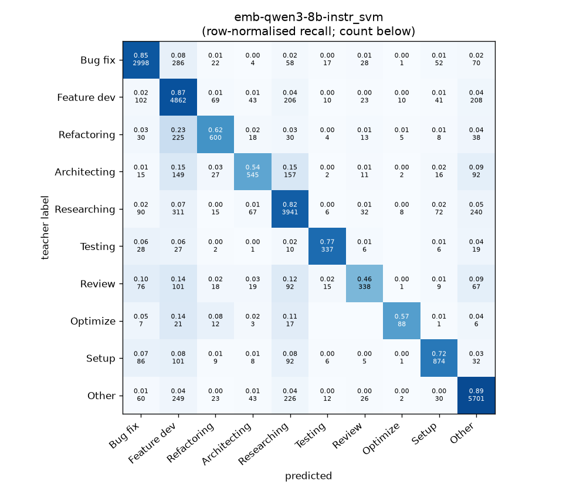
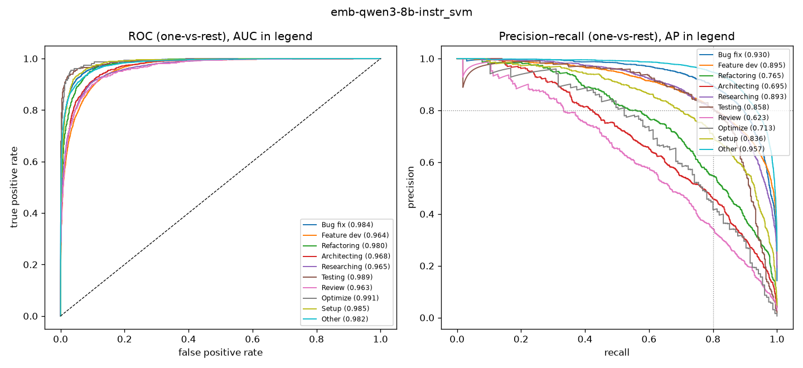

# emb-qwen3-8b-instr_svm

```
{
 "block": 2,
 "features": "emb-qwen3-8b-instr",
 "model": "svm",
 "selection": "fold-0 grid, min-F1 then macro-F1",
 "params": "{\"C\": 1.0, \"cw\": null}",
 "cv_seconds": 60.9,
 "full_fit_seconds": 40.3
}
```

### emb-qwen3-8b-instr_svm

**Threshold metrics (argmax prediction)**

|              |   support (OOF) |   precision |   recall |    F1 | P 95% CI    | R 95% CI    | F1 95% CI   |   p(F1≤0.8) |
|:-------------|----------------:|------------:|---------:|------:|:------------|:------------|:------------|------------:|
| Bug fix      |            3536 |       0.859 |    0.848 | 0.853 | 0.837–0.880 | 0.825–0.870 | 0.836–0.870 |       0.000 |
| Feature dev  |            5574 |       0.768 |    0.872 | 0.817 | 0.749–0.785 | 0.855–0.889 | 0.802–0.830 |       0.012 |
| Refactoring  |             971 |       0.753 |    0.618 | 0.679 | 0.699–0.809 | 0.556–0.679 | 0.629–0.727 |       1.000 |
| Architecting |            1016 |       0.726 |    0.536 | 0.617 | 0.670–0.787 | 0.476–0.602 | 0.566–0.671 |       1.000 |
| Researching  |            4782 |       0.816 |    0.824 | 0.820 | 0.798–0.835 | 0.802–0.844 | 0.804–0.836 |       0.007 |
| Testing      |             436 |       0.824 |    0.773 | 0.798 | 0.755–0.895 | 0.697–0.844 | 0.740–0.852 |       0.534 |
| Review       |             736 |       0.701 |    0.459 | 0.555 | 0.624–0.774 | 0.386–0.533 | 0.487–0.620 |       1.000 |
| Optimize     |             155 |       0.746 |    0.568 | 0.645 | 0.600–0.913 | 0.410–0.718 | 0.507–0.763 |       0.999 |
| Setup        |            1214 |       0.788 |    0.720 | 0.752 | 0.743–0.832 | 0.670–0.769 | 0.711–0.790 |       0.993 |
| Other        |            6372 |       0.881 |    0.895 | 0.888 | 0.866–0.896 | 0.880–0.909 | 0.876–0.899 |       0.000 |

**Ranking metrics (class scores, one-vs-rest)**

|              |   ROC-AUC | ROC-AUC 95% CI   |   p(AUC=0.5) |   PR-AUC (AP) | PR-AUC 95% CI   |   PR-AUC chance (=prevalence) |
|:-------------|----------:|:-----------------|-------------:|--------------:|:----------------|------------------------------:|
| Bug fix      |     0.984 | 0.981–0.987      |        0.000 |         0.930 | 0.918–0.940     |                         0.143 |
| Feature dev  |     0.964 | 0.960–0.968      |        0.000 |         0.895 | 0.881–0.904     |                         0.225 |
| Refactoring  |     0.980 | 0.974–0.984      |        0.000 |         0.765 | 0.719–0.802     |                         0.039 |
| Architecting |     0.968 | 0.959–0.976      |        0.000 |         0.695 | 0.655–0.745     |                         0.041 |
| Researching  |     0.965 | 0.961–0.970      |        0.000 |         0.893 | 0.879–0.907     |                         0.193 |
| Testing      |     0.989 | 0.978–0.997      |        0.000 |         0.858 | 0.791–0.906     |                         0.018 |
| Review       |     0.963 | 0.952–0.974      |        0.000 |         0.623 | 0.572–0.695     |                         0.030 |
| Optimize     |     0.991 | 0.975–0.998      |        0.000 |         0.713 | 0.576–0.831     |                         0.006 |
| Setup        |     0.985 | 0.979–0.989      |        0.000 |         0.836 | 0.805–0.865     |                         0.049 |
| Other        |     0.982 | 0.979–0.984      |        0.000 |         0.957 | 0.950–0.963     |                         0.257 |

**Overall**

|                       |   value |      lo |      hi |   p-value |
|:----------------------|--------:|--------:|--------:|----------:|
| accuracy              |   0.818 |   0.809 |   0.827 |   nan     |
| macro-F1              |   0.742 |   0.723 |   0.762 |     0.005 |
| min-F1 (bar)          |   0.555 |   0.480 |   0.610 |     1.000 |
| classes with F1 ≥ 0.8 |   4.000 | nan     | nan     |   nan     |
| macro ROC-AUC         |   0.977 | nan     | nan     |   nan     |
| macro PR-AUC          |   0.816 | nan     | nan     |   nan     |




