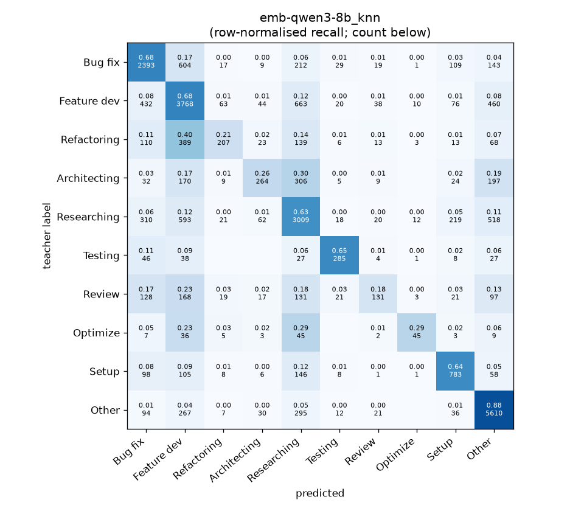
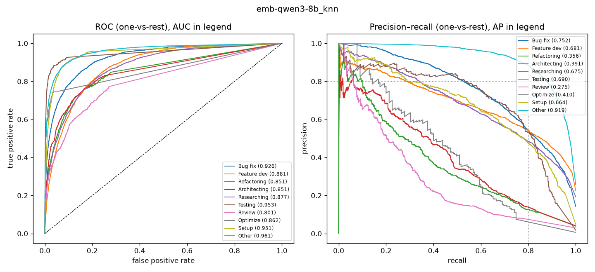

# emb-qwen3-8b_knn

```
{
 "block": 5,
 "features": "emb-qwen3-8b",
 "model": "knn",
 "selection": "fold-0 grid, min-F1 then macro-F1",
 "params": "{\"k\": 15}",
 "cv_seconds": 5.1,
 "full_fit_seconds": 2.0
}
```

### emb-qwen3-8b_knn

**Threshold metrics (argmax prediction)**

|              |   support (OOF) |   precision |   recall |    F1 | P 95% CI    | R 95% CI    | F1 95% CI   |   p(F1≤0.8) |
|:-------------|----------------:|------------:|---------:|------:|:------------|:------------|:------------|------------:|
| Bug fix      |            3536 |       0.656 |    0.677 | 0.666 | 0.630–0.683 | 0.645–0.712 | 0.641–0.692 |       1.000 |
| Feature dev  |            5574 |       0.614 |    0.676 | 0.643 | 0.594–0.634 | 0.651–0.701 | 0.624–0.662 |       1.000 |
| Refactoring  |             971 |       0.581 |    0.213 | 0.312 | 0.484–0.682 | 0.160–0.267 | 0.245–0.381 |       1.000 |
| Architecting |            1016 |       0.576 |    0.260 | 0.358 | 0.495–0.658 | 0.205–0.311 | 0.295–0.419 |       1.000 |
| Researching  |            4782 |       0.605 |    0.629 | 0.617 | 0.583–0.627 | 0.600–0.656 | 0.595–0.638 |       1.000 |
| Testing      |             436 |       0.705 |    0.654 | 0.679 | 0.627–0.788 | 0.569–0.743 | 0.606–0.751 |       1.000 |
| Review       |             736 |       0.508 |    0.178 | 0.264 | 0.394–0.632 | 0.125–0.234 | 0.190–0.336 |       1.000 |
| Optimize     |             155 |       0.592 |    0.290 | 0.390 | 0.381–0.800 | 0.154–0.436 | 0.229–0.542 |       1.000 |
| Setup        |            1214 |       0.606 |    0.645 | 0.625 | 0.559–0.648 | 0.587–0.693 | 0.583–0.662 |       1.000 |
| Other        |            6372 |       0.781 |    0.880 | 0.827 | 0.765–0.796 | 0.864–0.895 | 0.815–0.839 |       0.000 |

**Ranking metrics (class scores, one-vs-rest)**

|              |   ROC-AUC | ROC-AUC 95% CI   |   p(AUC=0.5) |   PR-AUC (AP) | PR-AUC 95% CI   |   PR-AUC chance (=prevalence) |
|:-------------|----------:|:-----------------|-------------:|--------------:|:----------------|------------------------------:|
| Bug fix      |     0.926 | 0.916–0.935      |        0.000 |         0.752 | 0.729–0.775     |                         0.143 |
| Feature dev  |     0.881 | 0.871–0.889      |        0.000 |         0.681 | 0.657–0.703     |                         0.225 |
| Refactoring  |     0.851 | 0.828–0.880      |        0.000 |         0.356 | 0.308–0.414     |                         0.039 |
| Architecting |     0.851 | 0.827–0.879      |        0.000 |         0.391 | 0.334–0.466     |                         0.041 |
| Researching  |     0.877 | 0.868–0.889      |        0.000 |         0.675 | 0.651–0.702     |                         0.193 |
| Testing      |     0.953 | 0.926–0.978      |        0.000 |         0.690 | 0.614–0.778     |                         0.018 |
| Review       |     0.801 | 0.766–0.833      |        0.000 |         0.275 | 0.214–0.346     |                         0.030 |
| Optimize     |     0.862 | 0.792–0.928      |        0.000 |         0.410 | 0.248–0.582     |                         0.006 |
| Setup        |     0.951 | 0.936–0.963      |        0.000 |         0.664 | 0.614–0.708     |                         0.049 |
| Other        |     0.961 | 0.956–0.966      |        0.000 |         0.919 | 0.910–0.927     |                         0.257 |

**Overall**

|                       |   value |      lo |      hi |   p-value |
|:----------------------|--------:|--------:|--------:|----------:|
| accuracy              |   0.665 |   0.654 |   0.675 |   nan     |
| macro-F1              |   0.538 |   0.515 |   0.559 |     0.005 |
| min-F1 (bar)          |   0.264 |   0.187 |   0.316 |     1.000 |
| classes with F1 ≥ 0.8 |   1.000 | nan     | nan     |   nan     |
| macro ROC-AUC         |   0.891 | nan     | nan     |   nan     |
| macro PR-AUC          |   0.581 | nan     | nan     |   nan     |




