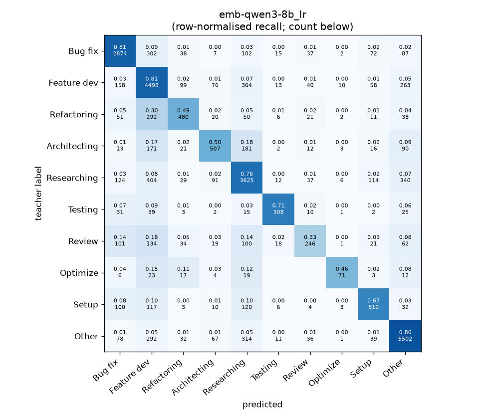
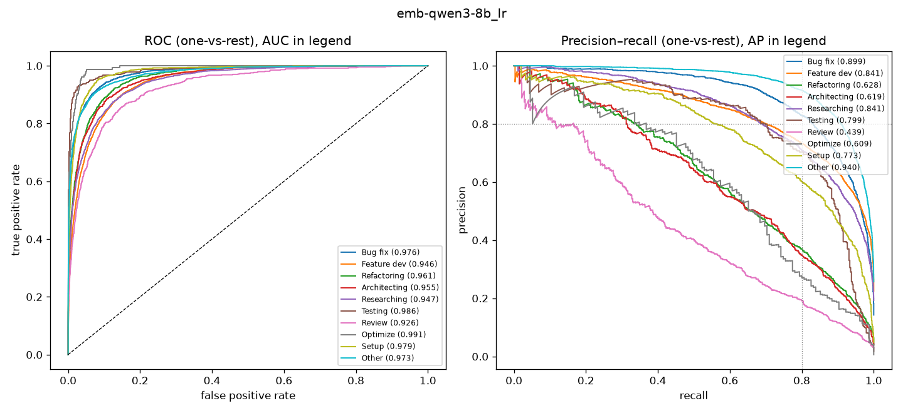

# emb-qwen3-8b_lr

```
{
 "block": 5,
 "features": "emb-qwen3-8b",
 "model": "lr",
 "selection": "fold-0 grid, min-F1 then macro-F1",
 "params": "{\"C\": 10.0, \"cw\": null}",
 "cv_seconds": 14.6,
 "full_fit_seconds": 5.7
}
```

### emb-qwen3-8b_lr

**Threshold metrics (argmax prediction)**

|              |   support (OOF) |   precision |   recall |    F1 | P 95% CI    | R 95% CI    | F1 95% CI   |   p(F1≤0.8) |
|:-------------|----------------:|------------:|---------:|------:|:------------|:------------|:------------|------------:|
| Bug fix      |            3536 |       0.813 |    0.813 | 0.813 | 0.789–0.833 | 0.787–0.837 | 0.793–0.830 |       0.081 |
| Feature dev  |            5574 |       0.717 |    0.806 | 0.759 | 0.698–0.736 | 0.784–0.828 | 0.742–0.775 |       1.000 |
| Refactoring  |             971 |       0.635 |    0.494 | 0.556 | 0.583–0.692 | 0.432–0.560 | 0.506–0.609 |       1.000 |
| Architecting |            1016 |       0.631 |    0.499 | 0.557 | 0.570–0.696 | 0.441–0.559 | 0.505–0.608 |       1.000 |
| Researching  |            4782 |       0.741 |    0.758 | 0.750 | 0.720–0.763 | 0.733–0.782 | 0.732–0.767 |       1.000 |
| Testing      |             436 |       0.788 |    0.706 | 0.745 | 0.714–0.859 | 0.624–0.789 | 0.680–0.806 |       0.964 |
| Review       |             736 |       0.555 |    0.334 | 0.417 | 0.471–0.640 | 0.272–0.402 | 0.353–0.485 |       1.000 |
| Optimize     |             155 |       0.710 |    0.458 | 0.557 | 0.548–0.880 | 0.308–0.615 | 0.407–0.697 |       1.000 |
| Setup        |            1214 |       0.709 |    0.675 | 0.691 | 0.662–0.757 | 0.624–0.726 | 0.650–0.730 |       1.000 |
| Other        |            6372 |       0.853 |    0.863 | 0.858 | 0.837–0.869 | 0.846–0.880 | 0.845–0.870 |       0.000 |

**Ranking metrics (class scores, one-vs-rest)**

|              |   ROC-AUC | ROC-AUC 95% CI   |   p(AUC=0.5) |   PR-AUC (AP) | PR-AUC 95% CI   |   PR-AUC chance (=prevalence) |
|:-------------|----------:|:-----------------|-------------:|--------------:|:----------------|------------------------------:|
| Bug fix      |     0.976 | 0.971–0.980      |        0.000 |         0.899 | 0.885–0.913     |                         0.143 |
| Feature dev  |     0.946 | 0.941–0.952      |        0.000 |         0.841 | 0.823–0.856     |                         0.225 |
| Refactoring  |     0.961 | 0.954–0.969      |        0.000 |         0.628 | 0.578–0.680     |                         0.039 |
| Architecting |     0.955 | 0.945–0.964      |        0.000 |         0.619 | 0.572–0.675     |                         0.041 |
| Researching  |     0.947 | 0.941–0.953      |        0.000 |         0.841 | 0.824–0.858     |                         0.193 |
| Testing      |     0.986 | 0.976–0.994      |        0.000 |         0.799 | 0.724–0.866     |                         0.018 |
| Review       |     0.926 | 0.905–0.946      |        0.000 |         0.439 | 0.374–0.517     |                         0.030 |
| Optimize     |     0.991 | 0.984–0.996      |        0.000 |         0.609 | 0.476–0.754     |                         0.006 |
| Setup        |     0.979 | 0.973–0.983      |        0.000 |         0.773 | 0.730–0.808     |                         0.049 |
| Other        |     0.973 | 0.969–0.976      |        0.000 |         0.940 | 0.932–0.947     |                         0.257 |

**Overall**

|                       |   value |      lo |      hi |   p-value |
|:----------------------|--------:|--------:|--------:|----------:|
| accuracy              |   0.763 |   0.752 |   0.774 |   nan     |
| macro-F1              |   0.670 |   0.649 |   0.690 |     0.005 |
| min-F1 (bar)          |   0.417 |   0.351 |   0.484 |     1.000 |
| classes with F1 ≥ 0.8 |   2.000 | nan     | nan     |   nan     |
| macro ROC-AUC         |   0.964 | nan     | nan     |   nan     |
| macro PR-AUC          |   0.739 | nan     | nan     |   nan     |




