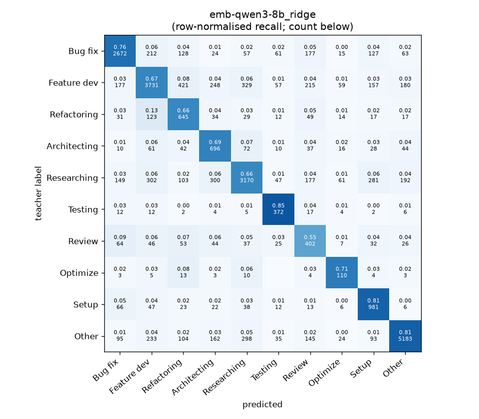
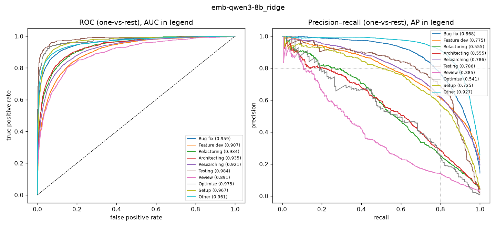

# emb-qwen3-8b_ridge

```
{
 "block": 5,
 "features": "emb-qwen3-8b",
 "model": "ridge",
 "selection": "fold-0 grid, min-F1 then macro-F1",
 "params": "{\"alpha\": 0.1, \"cw\": \"balanced\"}",
 "cv_seconds": 2.3,
 "full_fit_seconds": 0.7
}
```

### emb-qwen3-8b_ridge

**Threshold metrics (argmax prediction)**

|              |   support (OOF) |   precision |   recall |    F1 | P 95% CI    | R 95% CI    | F1 95% CI   |   p(F1≤0.8) |
|:-------------|----------------:|------------:|---------:|------:|:------------|:------------|:------------|------------:|
| Bug fix      |            3536 |       0.815 |    0.756 | 0.784 | 0.790–0.839 | 0.725–0.782 | 0.763–0.805 |       0.930 |
| Feature dev  |            5574 |       0.782 |    0.669 | 0.721 | 0.760–0.804 | 0.643–0.692 | 0.701–0.740 |       1.000 |
| Refactoring  |             971 |       0.420 |    0.664 | 0.515 | 0.382–0.460 | 0.601–0.724 | 0.473–0.555 |       1.000 |
| Architecting |            1016 |       0.453 |    0.685 | 0.545 | 0.415–0.493 | 0.630–0.744 | 0.504–0.588 |       1.000 |
| Researching  |            4782 |       0.784 |    0.663 | 0.718 | 0.761–0.806 | 0.634–0.689 | 0.697–0.738 |       1.000 |
| Testing      |             436 |       0.590 |    0.853 | 0.697 | 0.530–0.651 | 0.789–0.917 | 0.642–0.752 |       1.000 |
| Review       |             736 |       0.325 |    0.546 | 0.408 | 0.287–0.371 | 0.478–0.620 | 0.362–0.459 |       1.000 |
| Optimize     |             155 |       0.348 |    0.710 | 0.467 | 0.284–0.429 | 0.564–0.846 | 0.387–0.561 |       1.000 |
| Setup        |            1214 |       0.570 |    0.808 | 0.668 | 0.532–0.608 | 0.766–0.848 | 0.635–0.699 |       1.000 |
| Other        |            6372 |       0.906 |    0.813 | 0.857 | 0.890–0.921 | 0.794–0.831 | 0.844–0.870 |       0.000 |

**Ranking metrics (class scores, one-vs-rest)**

|              |   ROC-AUC | ROC-AUC 95% CI   |   p(AUC=0.5) |   PR-AUC (AP) | PR-AUC 95% CI   |   PR-AUC chance (=prevalence) |
|:-------------|----------:|:-----------------|-------------:|--------------:|:----------------|------------------------------:|
| Bug fix      |     0.959 | 0.953–0.965      |        0.000 |         0.868 | 0.852–0.883     |                         0.143 |
| Feature dev  |     0.907 | 0.899–0.914      |        0.000 |         0.775 | 0.754–0.792     |                         0.225 |
| Refactoring  |     0.934 | 0.920–0.947      |        0.000 |         0.555 | 0.499–0.611     |                         0.039 |
| Architecting |     0.935 | 0.920–0.949      |        0.000 |         0.555 | 0.498–0.613     |                         0.041 |
| Researching  |     0.921 | 0.912–0.929      |        0.000 |         0.786 | 0.767–0.805     |                         0.193 |
| Testing      |     0.984 | 0.970–0.994      |        0.000 |         0.786 | 0.712–0.853     |                         0.018 |
| Review       |     0.891 | 0.860–0.915      |        0.000 |         0.385 | 0.320–0.454     |                         0.030 |
| Optimize     |     0.975 | 0.939–0.994      |        0.000 |         0.541 | 0.408–0.680     |                         0.006 |
| Setup        |     0.967 | 0.957–0.976      |        0.000 |         0.735 | 0.690–0.771     |                         0.049 |
| Other        |     0.961 | 0.956–0.966      |        0.000 |         0.927 | 0.917–0.935     |                         0.257 |

**Overall**

|                       |   value |      lo |      hi |   p-value |
|:----------------------|--------:|--------:|--------:|----------:|
| accuracy              |   0.725 |   0.714 |   0.735 |   nan     |
| macro-F1              |   0.638 |   0.623 |   0.654 |     0.005 |
| min-F1 (bar)          |   0.408 |   0.359 |   0.454 |     1.000 |
| classes with F1 ≥ 0.8 |   1.000 | nan     | nan     |   nan     |
| macro ROC-AUC         |   0.943 | nan     | nan     |   nan     |
| macro PR-AUC          |   0.691 | nan     | nan     |   nan     |




