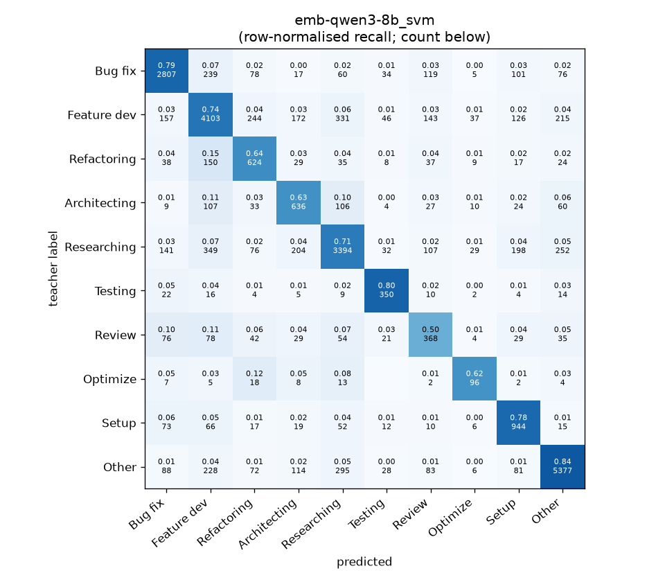
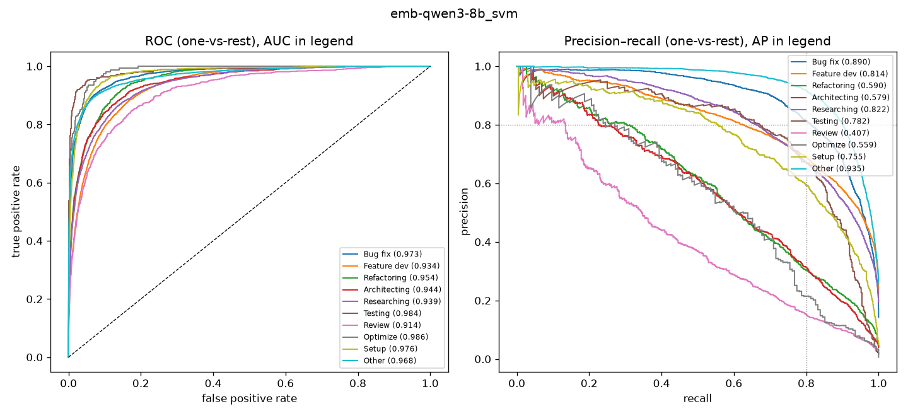

# emb-qwen3-8b_svm

```
{
 "block": 5,
 "features": "emb-qwen3-8b",
 "model": "svm",
 "selection": "fold-0 grid, min-F1 then macro-F1",
 "params": "{\"C\": 1.0, \"cw\": \"balanced\"}",
 "cv_seconds": 105.6,
 "full_fit_seconds": 45.5
}
```

### emb-qwen3-8b_svm

**Threshold metrics (argmax prediction)**

|              |   support (OOF) |   precision |   recall |    F1 | P 95% CI    | R 95% CI    | F1 95% CI   |   p(F1≤0.8) |
|:-------------|----------------:|------------:|---------:|------:|:------------|:------------|:------------|------------:|
| Bug fix      |            3536 |       0.821 |    0.794 | 0.807 | 0.798–0.844 | 0.768–0.819 | 0.789–0.826 |       0.226 |
| Feature dev  |            5574 |       0.768 |    0.736 | 0.752 | 0.749–0.789 | 0.711–0.760 | 0.734–0.769 |       1.000 |
| Refactoring  |             971 |       0.517 |    0.643 | 0.573 | 0.477–0.564 | 0.584–0.704 | 0.531–0.615 |       1.000 |
| Architecting |            1016 |       0.516 |    0.626 | 0.566 | 0.472–0.563 | 0.567–0.685 | 0.520–0.613 |       1.000 |
| Researching  |            4782 |       0.780 |    0.710 | 0.743 | 0.760–0.803 | 0.683–0.735 | 0.723–0.763 |       1.000 |
| Testing      |             436 |       0.654 |    0.803 | 0.721 | 0.588–0.722 | 0.725–0.872 | 0.659–0.774 |       0.999 |
| Review       |             736 |       0.406 |    0.500 | 0.448 | 0.354–0.464 | 0.429–0.571 | 0.393–0.507 |       1.000 |
| Optimize     |             155 |       0.471 |    0.619 | 0.535 | 0.373–0.590 | 0.462–0.769 | 0.427–0.644 |       1.000 |
| Setup        |            1214 |       0.619 |    0.778 | 0.689 | 0.577–0.661 | 0.733–0.822 | 0.652–0.724 |       1.000 |
| Other        |            6372 |       0.886 |    0.844 | 0.864 | 0.870–0.900 | 0.826–0.860 | 0.850–0.876 |       0.000 |

**Ranking metrics (class scores, one-vs-rest)**

|              |   ROC-AUC | ROC-AUC 95% CI   |   p(AUC=0.5) |   PR-AUC (AP) | PR-AUC 95% CI   |   PR-AUC chance (=prevalence) |
|:-------------|----------:|:-----------------|-------------:|--------------:|:----------------|------------------------------:|
| Bug fix      |     0.973 | 0.968–0.977      |        0.000 |         0.890 | 0.873–0.905     |                         0.143 |
| Feature dev  |     0.934 | 0.927–0.939      |        0.000 |         0.814 | 0.794–0.829     |                         0.225 |
| Refactoring  |     0.954 | 0.945–0.964      |        0.000 |         0.590 | 0.536–0.644     |                         0.039 |
| Architecting |     0.944 | 0.930–0.955      |        0.000 |         0.579 | 0.529–0.636     |                         0.041 |
| Researching  |     0.939 | 0.932–0.945      |        0.000 |         0.822 | 0.804–0.841     |                         0.193 |
| Testing      |     0.984 | 0.969–0.993      |        0.000 |         0.782 | 0.710–0.844     |                         0.018 |
| Review       |     0.914 | 0.892–0.934      |        0.000 |         0.407 | 0.343–0.487     |                         0.030 |
| Optimize     |     0.986 | 0.974–0.993      |        0.000 |         0.559 | 0.410–0.704     |                         0.006 |
| Setup        |     0.976 | 0.968–0.981      |        0.000 |         0.755 | 0.709–0.793     |                         0.049 |
| Other        |     0.968 | 0.962–0.971      |        0.000 |         0.935 | 0.926–0.943     |                         0.257 |

**Overall**

|                       |   value |      lo |      hi |   p-value |
|:----------------------|--------:|--------:|--------:|----------:|
| accuracy              |   0.754 |   0.743 |   0.764 |   nan     |
| macro-F1              |   0.670 |   0.652 |   0.687 |     0.005 |
| min-F1 (bar)          |   0.448 |   0.392 |   0.503 |     1.000 |
| classes with F1 ≥ 0.8 |   2.000 | nan     | nan     |   nan     |
| macro ROC-AUC         |   0.957 | nan     | nan     |   nan     |
| macro PR-AUC          |   0.713 | nan     | nan     |   nan     |




