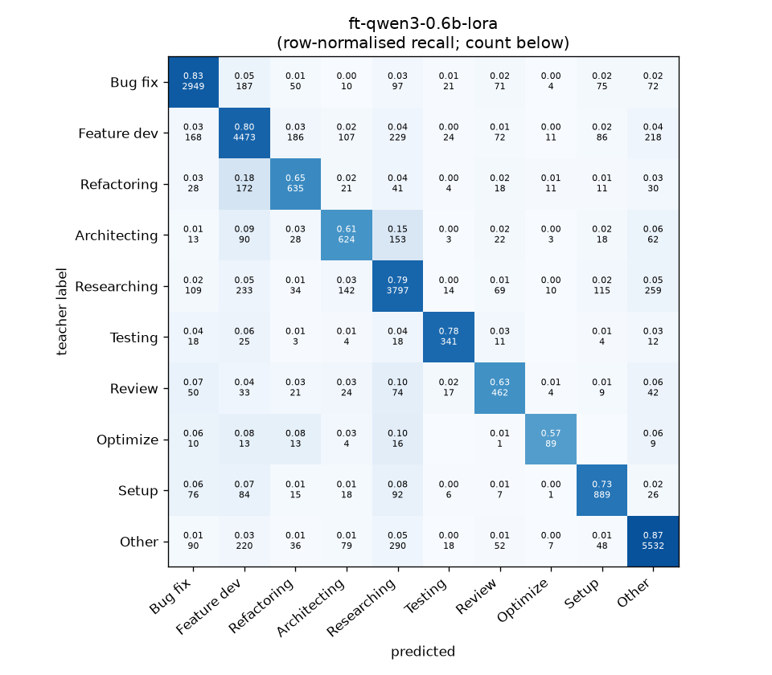
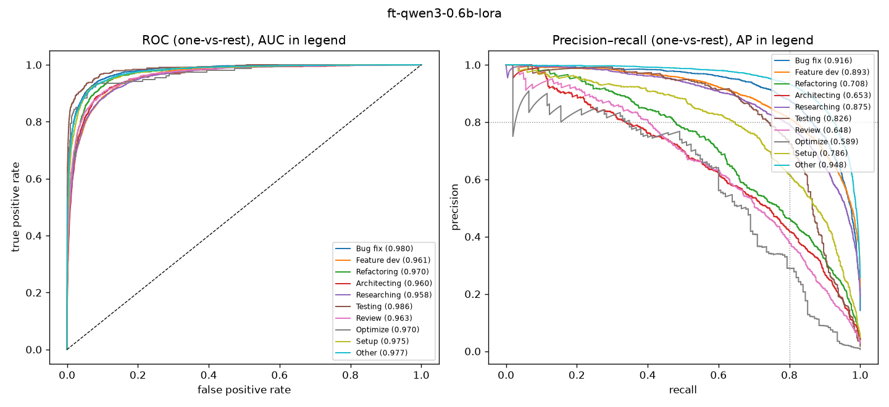

# ft-qwen3-0.6b-lora

```
{
 "block": 6,
 "features": "fine-tuned (Colab)",
 "model": "Qwen/Qwen3-0.6B LoRA=True",
 "params": "{\"max_len\": 512, \"epochs\": 3.0, \"lr\": 0.0001, \"batch\": 16, \"class_weight\": \"inv\", \"truncation\": \"head+tail128\"}",
 "cv_seconds": 9538.7,
 "selection": "fixed hyper-parameters (no tuning on folds)"
}
```

### ft-qwen3-0.6b-lora

**Threshold metrics (argmax prediction)**

|              |   support (OOF) |   precision |   recall |    F1 | P 95% CI    | R 95% CI    | F1 95% CI   |   p(F1≤0.8) |
|:-------------|----------------:|------------:|---------:|------:|:------------|:------------|:------------|------------:|
| Bug fix      |            3536 |       0.840 |    0.834 | 0.837 | 0.817–0.861 | 0.810–0.857 | 0.820–0.853 |       0.000 |
| Feature dev  |            5574 |       0.809 |    0.802 | 0.806 | 0.791–0.828 | 0.782–0.822 | 0.790–0.821 |       0.253 |
| Refactoring  |             971 |       0.622 |    0.654 | 0.638 | 0.574–0.678 | 0.593–0.712 | 0.593–0.683 |       1.000 |
| Architecting |            1016 |       0.604 |    0.614 | 0.609 | 0.556–0.658 | 0.551–0.677 | 0.562–0.658 |       1.000 |
| Researching  |            4782 |       0.790 |    0.794 | 0.792 | 0.771–0.810 | 0.772–0.816 | 0.775–0.808 |       0.830 |
| Testing      |             436 |       0.761 |    0.782 | 0.771 | 0.690–0.829 | 0.697–0.853 | 0.708–0.825 |       0.851 |
| Review       |             736 |       0.589 |    0.628 | 0.607 | 0.528–0.648 | 0.554–0.696 | 0.549–0.661 |       1.000 |
| Optimize     |             155 |       0.636 |    0.574 | 0.603 | 0.488–0.793 | 0.410–0.718 | 0.472–0.734 |       0.999 |
| Setup        |            1214 |       0.708 |    0.732 | 0.720 | 0.667–0.754 | 0.683–0.779 | 0.679–0.754 |       1.000 |
| Other        |            6372 |       0.883 |    0.868 | 0.876 | 0.868–0.898 | 0.852–0.885 | 0.863–0.887 |       0.000 |

**Ranking metrics (class scores, one-vs-rest)**

|              |   ROC-AUC | ROC-AUC 95% CI   |   p(AUC=0.5) |   PR-AUC (AP) | PR-AUC 95% CI   |   PR-AUC chance (=prevalence) |
|:-------------|----------:|:-----------------|-------------:|--------------:|:----------------|------------------------------:|
| Bug fix      |     0.980 | 0.976–0.984      |        0.000 |         0.916 | 0.903–0.929     |                         0.143 |
| Feature dev  |     0.961 | 0.956–0.966      |        0.000 |         0.893 | 0.878–0.904     |                         0.225 |
| Refactoring  |     0.970 | 0.959–0.978      |        0.000 |         0.708 | 0.655–0.763     |                         0.039 |
| Architecting |     0.960 | 0.948–0.970      |        0.000 |         0.653 | 0.600–0.709     |                         0.041 |
| Researching  |     0.958 | 0.953–0.964      |        0.000 |         0.875 | 0.861–0.890     |                         0.193 |
| Testing      |     0.986 | 0.974–0.993      |        0.000 |         0.826 | 0.768–0.881     |                         0.018 |
| Review       |     0.963 | 0.948–0.976      |        0.000 |         0.648 | 0.576–0.713     |                         0.030 |
| Optimize     |     0.970 | 0.933–0.993      |        0.000 |         0.589 | 0.450–0.732     |                         0.006 |
| Setup        |     0.975 | 0.966–0.982      |        0.000 |         0.786 | 0.746–0.820     |                         0.049 |
| Other        |     0.977 | 0.973–0.980      |        0.000 |         0.948 | 0.939–0.956     |                         0.257 |

**Overall**

|                       |   value |      lo |      hi |   p-value |
|:----------------------|--------:|--------:|--------:|----------:|
| accuracy              |   0.798 |   0.789 |   0.808 |   nan     |
| macro-F1              |   0.726 |   0.707 |   0.745 |     0.005 |
| min-F1 (bar)          |   0.603 |   0.472 |   0.624 |     1.000 |
| classes with F1 ≥ 0.8 |   3.000 | nan     | nan     |   nan     |
| macro ROC-AUC         |   0.970 | nan     | nan     |   nan     |
| macro PR-AUC          |   0.784 | nan     | nan     |   nan     |




