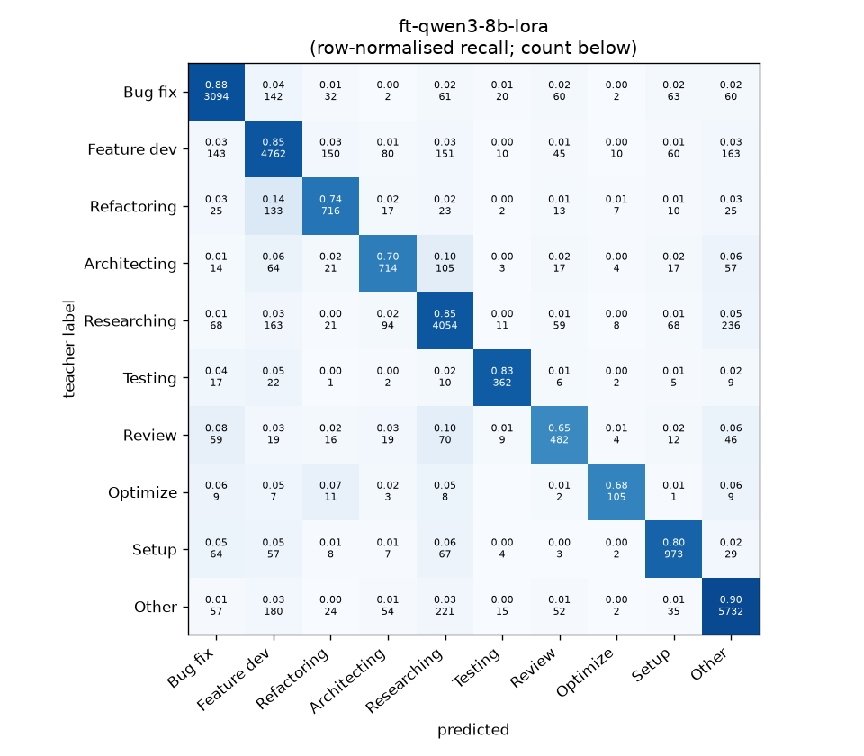
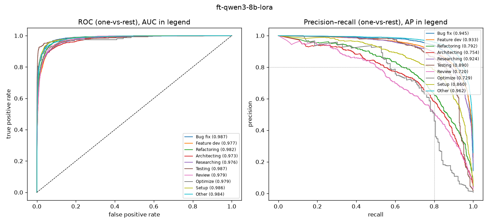

# ft-qwen3-8b-lora

```
{
 "block": 6,
 "features": "fine-tuned (Colab)",
 "model": "Qwen/Qwen3-8B LoRA=True",
 "params": "{\"max_len\": 512, \"epochs\": 3.0, \"lr\": 5e-05, \"batch\": 16, \"class_weight\": \"inv\", \"truncation\": \"head+tail128\"}",
 "cv_seconds": 27684.0,
 "selection": "fixed hyper-parameters (no tuning on folds)"
}
```

### ft-qwen3-8b-lora

**Threshold metrics (argmax prediction)**

|              |   support (OOF) |   precision |   recall |    F1 | P 95% CI    | R 95% CI    | F1 95% CI   |   p(F1≤0.8) |
|:-------------|----------------:|------------:|---------:|------:|:------------|:------------|:------------|------------:|
| Bug fix      |            3536 |       0.872 |    0.875 | 0.873 | 0.851–0.892 | 0.853–0.897 | 0.856–0.888 |       0.000 |
| Feature dev  |            5574 |       0.858 |    0.854 | 0.856 | 0.842–0.877 | 0.836–0.872 | 0.842–0.869 |       0.000 |
| Refactoring  |             971 |       0.716 |    0.737 | 0.727 | 0.669–0.766 | 0.679–0.794 | 0.685–0.770 |       1.000 |
| Architecting |            1016 |       0.720 |    0.703 | 0.711 | 0.672–0.770 | 0.642–0.756 | 0.667–0.755 |       1.000 |
| Researching  |            4782 |       0.850 |    0.848 | 0.849 | 0.832–0.868 | 0.827–0.868 | 0.834–0.864 |       0.000 |
| Testing      |             436 |       0.830 |    0.830 | 0.830 | 0.762–0.896 | 0.761–0.899 | 0.778–0.880 |       0.150 |
| Review       |             736 |       0.652 |    0.655 | 0.654 | 0.597–0.715 | 0.587–0.723 | 0.603–0.707 |       1.000 |
| Optimize     |             155 |       0.719 |    0.677 | 0.698 | 0.591–0.871 | 0.538–0.821 | 0.582–0.805 |       0.973 |
| Setup        |            1214 |       0.782 |    0.801 | 0.792 | 0.739–0.825 | 0.759–0.842 | 0.757–0.825 |       0.691 |
| Other        |            6372 |       0.900 |    0.900 | 0.900 | 0.886–0.914 | 0.884–0.915 | 0.889–0.910 |       0.000 |

**Ranking metrics (class scores, one-vs-rest)**

|              |   ROC-AUC | ROC-AUC 95% CI   |   p(AUC=0.5) |   PR-AUC (AP) | PR-AUC 95% CI   |   PR-AUC chance (=prevalence) |
|:-------------|----------:|:-----------------|-------------:|--------------:|:----------------|------------------------------:|
| Bug fix      |     0.987 | 0.984–0.990      |        0.000 |         0.945 | 0.936–0.954     |                         0.143 |
| Feature dev  |     0.977 | 0.973–0.980      |        0.000 |         0.933 | 0.922–0.942     |                         0.225 |
| Refactoring  |     0.982 | 0.975–0.987      |        0.000 |         0.792 | 0.750–0.831     |                         0.039 |
| Architecting |     0.973 | 0.962–0.981      |        0.000 |         0.754 | 0.708–0.801     |                         0.041 |
| Researching  |     0.976 | 0.972–0.980      |        0.000 |         0.924 | 0.911–0.935     |                         0.193 |
| Testing      |     0.987 | 0.973–0.997      |        0.000 |         0.890 | 0.846–0.931     |                         0.018 |
| Review       |     0.979 | 0.970–0.986      |        0.000 |         0.720 | 0.656–0.780     |                         0.030 |
| Optimize     |     0.979 | 0.953–0.997      |        0.000 |         0.729 | 0.600–0.859     |                         0.006 |
| Setup        |     0.986 | 0.980–0.990      |        0.000 |         0.860 | 0.827–0.889     |                         0.049 |
| Other        |     0.984 | 0.982–0.987      |        0.000 |         0.962 | 0.955–0.968     |                         0.257 |

**Overall**

|                       |   value |      lo |      hi |   p-value |
|:----------------------|--------:|--------:|--------:|----------:|
| accuracy              |   0.847 |   0.838 |   0.855 |   nan     |
| macro-F1              |   0.789 |   0.771 |   0.806 |     0.005 |
| min-F1 (bar)          |   0.654 |   0.575 |   0.699 |     1.000 |
| classes with F1 ≥ 0.8 |   5.000 | nan     | nan     |   nan     |
| macro ROC-AUC         |   0.981 | nan     | nan     |   nan     |
| macro PR-AUC          |   0.851 | nan     | nan     |   nan     |




