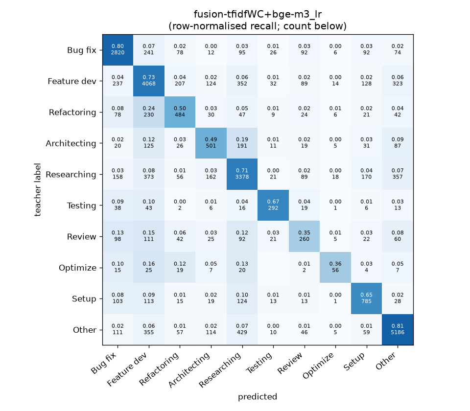
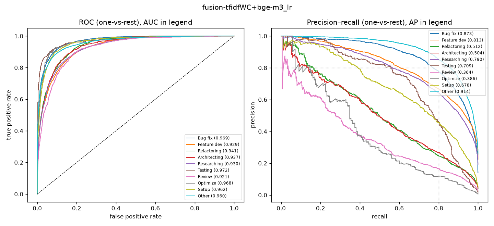

# fusion-tfidfWC+bge-m3_lr

```
{
 "block": 2,
 "features": "tfidf-WC + emb-bge-m3 (early fusion)",
 "model": "lr",
 "selection": "fold-0 grid, min-F1 then macro-F1",
 "params": "{\"C\": 10.0, \"alpha_emb\": 1.0, \"cw\": \"balanced\"}",
 "cv_seconds": 146.2,
 "full_fit_seconds": 116.0
}
```

### fusion-tfidfWC+bge-m3_lr

**Threshold metrics (argmax prediction)**

|              |   support (OOF) |   precision |   recall |    F1 | P 95% CI    | R 95% CI    | F1 95% CI   |   p(F1≤0.8) |
|:-------------|----------------:|------------:|---------:|------:|:------------|:------------|:------------|------------:|
| Bug fix      |            3536 |       0.767 |    0.798 | 0.782 | 0.744–0.790 | 0.771–0.825 | 0.762–0.802 |       0.965 |
| Feature dev  |            5574 |       0.716 |    0.730 | 0.723 | 0.695–0.736 | 0.704–0.753 | 0.704–0.739 |       1.000 |
| Refactoring  |             971 |       0.491 |    0.498 | 0.495 | 0.436–0.549 | 0.436–0.564 | 0.441–0.548 |       1.000 |
| Architecting |            1016 |       0.501 |    0.493 | 0.497 | 0.449–0.555 | 0.433–0.547 | 0.447–0.544 |       1.000 |
| Researching  |            4782 |       0.712 |    0.706 | 0.709 | 0.691–0.733 | 0.681–0.732 | 0.690–0.728 |       1.000 |
| Testing      |             436 |       0.671 |    0.670 | 0.670 | 0.594–0.752 | 0.578–0.752 | 0.597–0.732 |       1.000 |
| Review       |             736 |       0.398 |    0.353 | 0.374 | 0.333–0.466 | 0.288–0.429 | 0.309–0.440 |       1.000 |
| Optimize     |             155 |       0.479 |    0.361 | 0.412 | 0.323–0.654 | 0.205–0.513 | 0.258–0.548 |       1.000 |
| Setup        |            1214 |       0.596 |    0.647 | 0.620 | 0.549–0.641 | 0.591–0.700 | 0.576–0.662 |       1.000 |
| Other        |            6372 |       0.840 |    0.814 | 0.827 | 0.823–0.856 | 0.794–0.832 | 0.812–0.840 |       0.000 |

**Ranking metrics (class scores, one-vs-rest)**

|              |   ROC-AUC | ROC-AUC 95% CI   |   p(AUC=0.5) |   PR-AUC (AP) | PR-AUC 95% CI   |   PR-AUC chance (=prevalence) |
|:-------------|----------:|:-----------------|-------------:|--------------:|:----------------|------------------------------:|
| Bug fix      |     0.969 | 0.965–0.973      |        0.000 |         0.873 | 0.857–0.887     |                         0.143 |
| Feature dev  |     0.929 | 0.921–0.936      |        0.000 |         0.813 | 0.794–0.830     |                         0.225 |
| Refactoring  |     0.941 | 0.929–0.951      |        0.000 |         0.512 | 0.449–0.571     |                         0.039 |
| Architecting |     0.937 | 0.924–0.950      |        0.000 |         0.504 | 0.457–0.565     |                         0.041 |
| Researching  |     0.930 | 0.923–0.937      |        0.000 |         0.790 | 0.773–0.809     |                         0.193 |
| Testing      |     0.972 | 0.959–0.987      |        0.000 |         0.709 | 0.635–0.781     |                         0.018 |
| Review       |     0.921 | 0.906–0.939      |        0.000 |         0.364 | 0.306–0.453     |                         0.030 |
| Optimize     |     0.968 | 0.945–0.986      |        0.000 |         0.386 | 0.252–0.542     |                         0.006 |
| Setup        |     0.962 | 0.952–0.970      |        0.000 |         0.678 | 0.632–0.722     |                         0.049 |
| Other        |     0.960 | 0.955–0.964      |        0.000 |         0.914 | 0.905–0.922     |                         0.257 |

**Overall**

|                       |   value |      lo |      hi |   p-value |
|:----------------------|--------:|--------:|--------:|----------:|
| accuracy              |   0.719 |   0.708 |   0.730 |   nan     |
| macro-F1              |   0.611 |   0.590 |   0.630 |     0.005 |
| min-F1 (bar)          |   0.374 |   0.258 |   0.426 |     1.000 |
| classes with F1 ≥ 0.8 |   1.000 | nan     | nan     |   nan     |
| macro ROC-AUC         |   0.949 | nan     | nan     |   nan     |
| macro PR-AUC          |   0.654 | nan     | nan     |   nan     |




