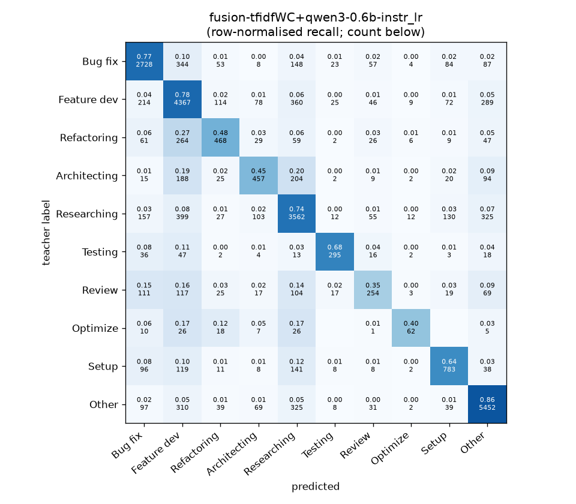
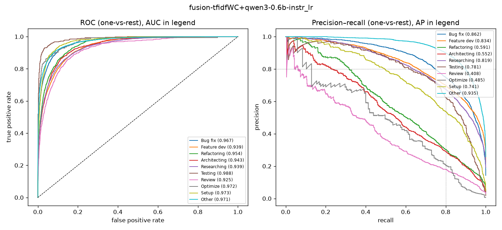

# fusion-tfidfWC+qwen3-0.6b-instr_lr

```
{
 "block": 2,
 "features": "tfidf-WC + emb-qwen3-0.6b-instr (early fusion)",
 "model": "lr",
 "selection": "fold-0 grid, min-F1 then macro-F1",
 "params": "{\"C\": 10.0, \"alpha_emb\": 3.0, \"cw\": null}",
 "cv_seconds": 5396.7,
 "full_fit_seconds": 232.1
}
```

### fusion-tfidfWC+qwen3-0.6b-instr_lr

**Threshold metrics (argmax prediction)**

|              |   support (OOF) |   precision |   recall |    F1 | P 95% CI    | R 95% CI    | F1 95% CI   |   p(F1≤0.8) |
|:-------------|----------------:|------------:|---------:|------:|:------------|:------------|:------------|------------:|
| Bug fix      |            3536 |       0.774 |    0.771 | 0.773 | 0.750–0.799 | 0.743–0.800 | 0.752–0.794 |       0.993 |
| Feature dev  |            5574 |       0.707 |    0.783 | 0.743 | 0.688–0.725 | 0.763–0.805 | 0.728–0.758 |       1.000 |
| Refactoring  |             971 |       0.598 |    0.482 | 0.534 | 0.539–0.661 | 0.420–0.547 | 0.477–0.589 |       1.000 |
| Architecting |            1016 |       0.586 |    0.450 | 0.509 | 0.523–0.648 | 0.390–0.508 | 0.455–0.562 |       1.000 |
| Researching  |            4782 |       0.721 |    0.745 | 0.733 | 0.700–0.744 | 0.721–0.770 | 0.715–0.752 |       1.000 |
| Testing      |             436 |       0.753 |    0.677 | 0.713 | 0.677–0.830 | 0.587–0.761 | 0.647–0.774 |       0.995 |
| Review       |             736 |       0.505 |    0.345 | 0.410 | 0.427–0.588 | 0.277–0.413 | 0.339–0.480 |       1.000 |
| Optimize     |             155 |       0.596 |    0.400 | 0.479 | 0.429–0.789 | 0.256–0.564 | 0.328–0.620 |       1.000 |
| Setup        |            1214 |       0.676 |    0.645 | 0.660 | 0.630–0.726 | 0.591–0.696 | 0.617–0.702 |       1.000 |
| Other        |            6372 |       0.849 |    0.856 | 0.852 | 0.833–0.866 | 0.837–0.872 | 0.840–0.864 |       0.000 |

**Ranking metrics (class scores, one-vs-rest)**

|              |   ROC-AUC | ROC-AUC 95% CI   |   p(AUC=0.5) |   PR-AUC (AP) | PR-AUC 95% CI   |   PR-AUC chance (=prevalence) |
|:-------------|----------:|:-----------------|-------------:|--------------:|:----------------|------------------------------:|
| Bug fix      |     0.967 | 0.962–0.972      |        0.000 |         0.862 | 0.844–0.878     |                         0.143 |
| Feature dev  |     0.939 | 0.933–0.945      |        0.000 |         0.834 | 0.819–0.848     |                         0.225 |
| Refactoring  |     0.954 | 0.945–0.963      |        0.000 |         0.591 | 0.546–0.652     |                         0.039 |
| Architecting |     0.943 | 0.933–0.954      |        0.000 |         0.552 | 0.500–0.610     |                         0.041 |
| Researching  |     0.939 | 0.932–0.946      |        0.000 |         0.819 | 0.802–0.838     |                         0.193 |
| Testing      |     0.988 | 0.978–0.994      |        0.000 |         0.781 | 0.710–0.850     |                         0.018 |
| Review       |     0.925 | 0.908–0.943      |        0.000 |         0.408 | 0.338–0.499     |                         0.030 |
| Optimize     |     0.972 | 0.931–0.991      |        0.000 |         0.485 | 0.362–0.662     |                         0.006 |
| Setup        |     0.973 | 0.965–0.979      |        0.000 |         0.741 | 0.704–0.774     |                         0.049 |
| Other        |     0.971 | 0.966–0.974      |        0.000 |         0.935 | 0.927–0.942     |                         0.257 |

**Overall**

|                       |   value |      lo |      hi |   p-value |
|:----------------------|--------:|--------:|--------:|----------:|
| accuracy              |   0.743 |   0.733 |   0.754 |   nan     |
| macro-F1              |   0.640 |   0.618 |   0.662 |     0.005 |
| min-F1 (bar)          |   0.410 |   0.317 |   0.472 |     1.000 |
| classes with F1 ≥ 0.8 |   1.000 | nan     | nan     |   nan     |
| macro ROC-AUC         |   0.957 | nan     | nan     |   nan     |
| macro PR-AUC          |   0.701 | nan     | nan     |   nan     |




