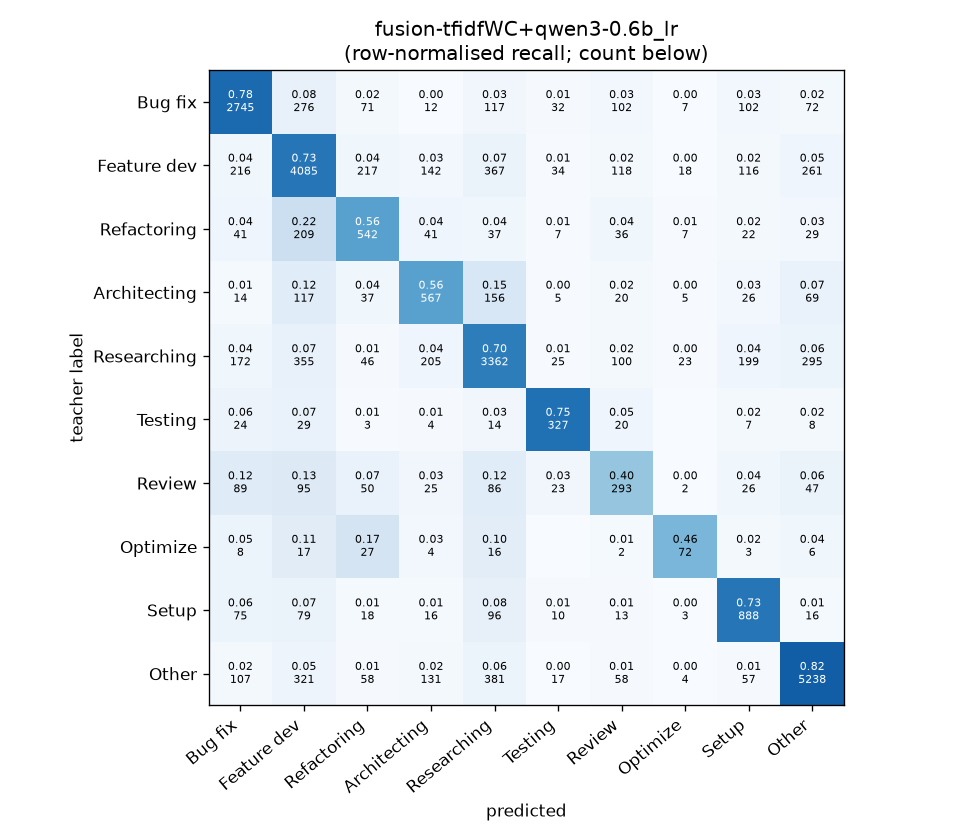
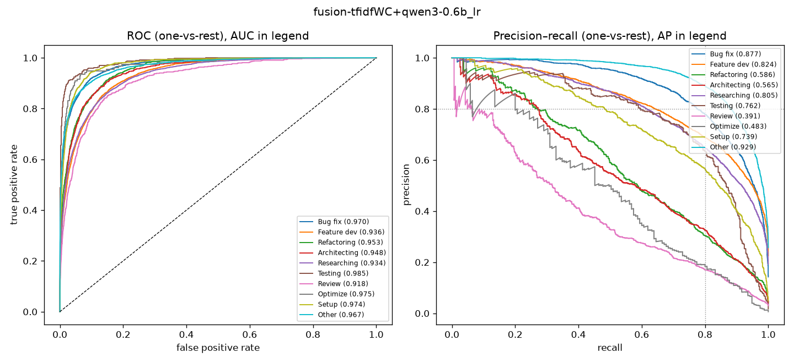

# fusion-tfidfWC+qwen3-0.6b_lr

```
{
 "block": 2,
 "features": "tfidf-WC + emb-qwen3-0.6b (early fusion)",
 "model": "lr",
 "selection": "fold-0 grid, min-F1 then macro-F1",
 "params": "{\"C\": 3.0, \"alpha_emb\": 1.0, \"cw\": \"balanced\"}",
 "cv_seconds": 1343.5,
 "full_fit_seconds": 98.0
}
```

### fusion-tfidfWC+qwen3-0.6b_lr

**Threshold metrics (argmax prediction)**

|              |   support (OOF) |   precision |   recall |    F1 | P 95% CI    | R 95% CI    | F1 95% CI   |   p(F1≤0.8) |
|:-------------|----------------:|------------:|---------:|------:|:------------|:------------|:------------|------------:|
| Bug fix      |            3536 |       0.786 |    0.776 | 0.781 | 0.762–0.810 | 0.750–0.802 | 0.761–0.800 |       0.975 |
| Feature dev  |            5574 |       0.732 |    0.733 | 0.732 | 0.710–0.751 | 0.709–0.755 | 0.713–0.749 |       1.000 |
| Refactoring  |             971 |       0.507 |    0.558 | 0.531 | 0.457–0.560 | 0.494–0.621 | 0.478–0.581 |       1.000 |
| Architecting |            1016 |       0.494 |    0.558 | 0.524 | 0.447–0.544 | 0.496–0.614 | 0.474–0.568 |       1.000 |
| Researching  |            4782 |       0.726 |    0.703 | 0.714 | 0.705–0.749 | 0.678–0.727 | 0.695–0.734 |       1.000 |
| Testing      |             436 |       0.681 |    0.750 | 0.714 | 0.606–0.752 | 0.661–0.826 | 0.648–0.769 |       0.998 |
| Review       |             736 |       0.385 |    0.398 | 0.391 | 0.328–0.445 | 0.331–0.473 | 0.331–0.451 |       1.000 |
| Optimize     |             155 |       0.511 |    0.465 | 0.486 | 0.371–0.686 | 0.308–0.615 | 0.349–0.623 |       1.000 |
| Setup        |            1214 |       0.614 |    0.731 | 0.668 | 0.574–0.657 | 0.683–0.779 | 0.633–0.705 |       1.000 |
| Other        |            6372 |       0.867 |    0.822 | 0.844 | 0.850–0.883 | 0.800–0.840 | 0.829–0.857 |       0.000 |

**Ranking metrics (class scores, one-vs-rest)**

|              |   ROC-AUC | ROC-AUC 95% CI   |   p(AUC=0.5) |   PR-AUC (AP) | PR-AUC 95% CI   |   PR-AUC chance (=prevalence) |
|:-------------|----------:|:-----------------|-------------:|--------------:|:----------------|------------------------------:|
| Bug fix      |     0.970 | 0.965–0.975      |        0.000 |         0.877 | 0.861–0.893     |                         0.143 |
| Feature dev  |     0.936 | 0.928–0.941      |        0.000 |         0.824 | 0.806–0.839     |                         0.225 |
| Refactoring  |     0.953 | 0.942–0.962      |        0.000 |         0.586 | 0.534–0.645     |                         0.039 |
| Architecting |     0.948 | 0.937–0.960      |        0.000 |         0.565 | 0.517–0.621     |                         0.041 |
| Researching  |     0.934 | 0.927–0.941      |        0.000 |         0.805 | 0.786–0.825     |                         0.193 |
| Testing      |     0.985 | 0.976–0.992      |        0.000 |         0.762 | 0.683–0.834     |                         0.018 |
| Review       |     0.918 | 0.899–0.937      |        0.000 |         0.391 | 0.314–0.475     |                         0.030 |
| Optimize     |     0.975 | 0.944–0.993      |        0.000 |         0.483 | 0.343–0.648     |                         0.006 |
| Setup        |     0.974 | 0.966–0.980      |        0.000 |         0.739 | 0.695–0.777     |                         0.049 |
| Other        |     0.967 | 0.963–0.971      |        0.000 |         0.929 | 0.920–0.935     |                         0.257 |

**Overall**

|                       |   value |      lo |      hi |   p-value |
|:----------------------|--------:|--------:|--------:|----------:|
| accuracy              |   0.731 |   0.720 |   0.741 |   nan     |
| macro-F1              |   0.639 |   0.619 |   0.658 |     0.005 |
| min-F1 (bar)          |   0.391 |   0.327 |   0.444 |     1.000 |
| classes with F1 ≥ 0.8 |   1.000 | nan     | nan     |   nan     |
| macro ROC-AUC         |   0.956 | nan     | nan     |   nan     |
| macro PR-AUC          |   0.696 | nan     | nan     |   nan     |




