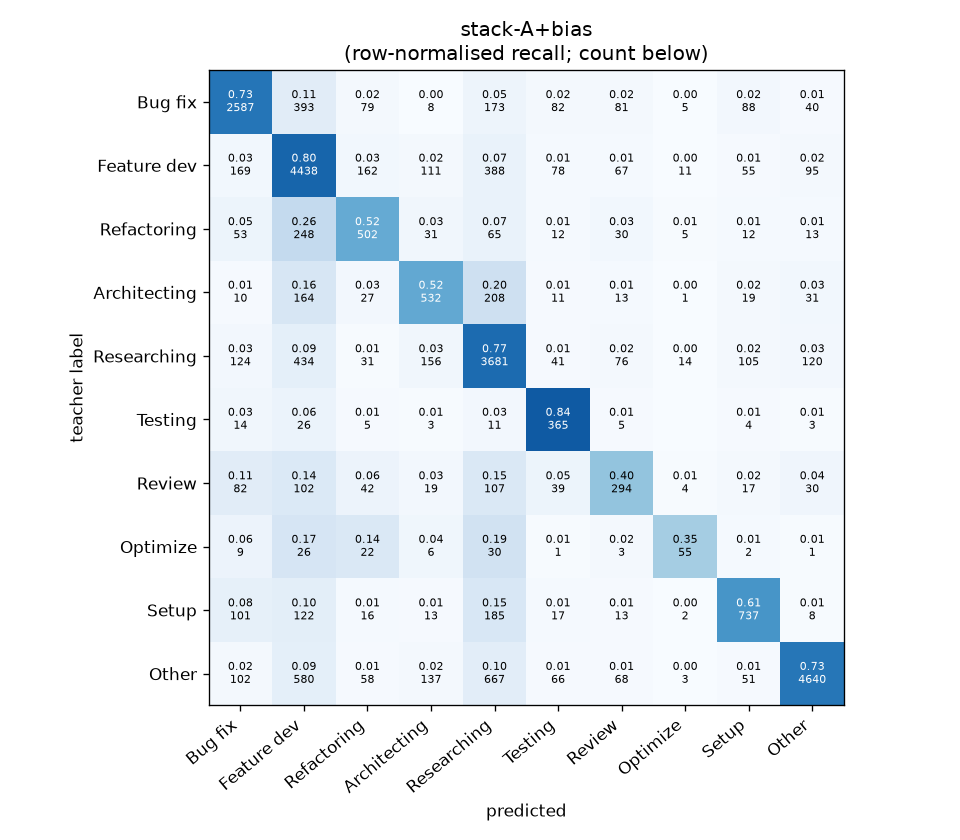
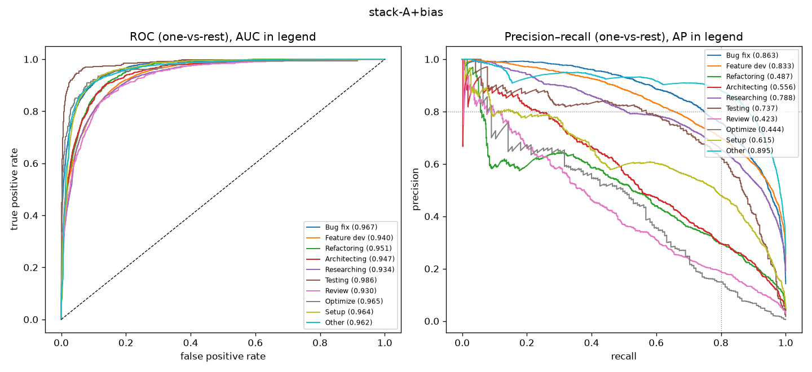

# stack-A+bias

```
{
 "block": 7,
 "features": "stack of tfidf-WC_lr, emb-qwen3-0.6b-instr_lr",
 "model": "meta-LR + cross-fitted class bias",
 "params": "{\"C\": 1.0, \"cw\": null, \"bias_all\": [-0.5, -0.25, -0.5, 0.0, -0.25, 1.5, 0.0, -0.5, 0.5, -2.0], \"bias_per_fold\": [[-0.5, -0.25, -0.5, 0.0, -0.75, 1.25, 0.0, -0.5, 0.0, -1.5], [-0.5, -0.25, -0.5, 0.0, -0.25, 1.5, 0.0, 0.0, -1.5, -1.0], [-0.5, -0.25, -0.5, 0.0, 0.0, 1.75, 0.0, -0.5, -1.5, -1.75], [-0.5, -0.25, 1.0, 0.25, 0.0, 1.25, 0.0, 0.0, -0.25, -1.5], [-0.5, -0.25, 0.0, 0.0, 0.0, 1.5, 0.0, -0.5, 0.5, -2.0]]}"
}
```

### stack-A+bias

**Threshold metrics (argmax prediction)**

|              |   support (OOF) |   precision |   recall |    F1 | P 95% CI    | R 95% CI    | F1 95% CI   |   p(F1≤0.8) |
|:-------------|----------------:|------------:|---------:|------:|:------------|:------------|:------------|------------:|
| Bug fix      |            3536 |       0.796 |    0.732 | 0.762 | 0.771–0.821 | 0.701–0.760 | 0.738–0.783 |       1.000 |
| Feature dev  |            5574 |       0.679 |    0.796 | 0.733 | 0.659–0.698 | 0.775–0.817 | 0.717–0.749 |       1.000 |
| Refactoring  |             971 |       0.532 |    0.517 | 0.524 | 0.481–0.588 | 0.453–0.580 | 0.473–0.577 |       1.000 |
| Architecting |            1016 |       0.524 |    0.524 | 0.524 | 0.475–0.580 | 0.461–0.583 | 0.472–0.574 |       1.000 |
| Researching  |            4782 |       0.667 |    0.770 | 0.715 | 0.649–0.689 | 0.747–0.795 | 0.698–0.733 |       1.000 |
| Testing      |             436 |       0.513 |    0.837 | 0.636 | 0.459–0.571 | 0.761–0.899 | 0.583–0.688 |       1.000 |
| Review       |             736 |       0.452 |    0.399 | 0.424 | 0.387–0.525 | 0.332–0.473 | 0.360–0.489 |       1.000 |
| Optimize     |             155 |       0.550 |    0.355 | 0.431 | 0.389–0.750 | 0.205–0.513 | 0.277–0.585 |       1.000 |
| Setup        |            1214 |       0.676 |    0.607 | 0.640 | 0.625–0.731 | 0.551–0.657 | 0.594–0.681 |       1.000 |
| Other        |            6372 |       0.932 |    0.728 | 0.817 | 0.918–0.945 | 0.704–0.749 | 0.801–0.832 |       0.020 |

**Ranking metrics (class scores, one-vs-rest)**

|              |   ROC-AUC | ROC-AUC 95% CI   |   p(AUC=0.5) |   PR-AUC (AP) | PR-AUC 95% CI   |   PR-AUC chance (=prevalence) |
|:-------------|----------:|:-----------------|-------------:|--------------:|:----------------|------------------------------:|
| Bug fix      |     0.967 | 0.962–0.972      |        0.000 |         0.863 | 0.845–0.878     |                         0.143 |
| Feature dev  |     0.940 | 0.933–0.944      |        0.000 |         0.833 | 0.817–0.847     |                         0.225 |
| Refactoring  |     0.951 | 0.941–0.960      |        0.000 |         0.487 | 0.427–0.548     |                         0.039 |
| Architecting |     0.947 | 0.935–0.958      |        0.000 |         0.556 | 0.509–0.612     |                         0.041 |
| Researching  |     0.934 | 0.927–0.940      |        0.000 |         0.788 | 0.769–0.809     |                         0.193 |
| Testing      |     0.986 | 0.973–0.993      |        0.000 |         0.737 | 0.670–0.815     |                         0.018 |
| Review       |     0.930 | 0.913–0.947      |        0.000 |         0.423 | 0.351–0.513     |                         0.030 |
| Optimize     |     0.965 | 0.921–0.989      |        0.000 |         0.444 | 0.322–0.621     |                         0.006 |
| Setup        |     0.964 | 0.955–0.971      |        0.000 |         0.615 | 0.567–0.668     |                         0.049 |
| Other        |     0.962 | 0.957–0.966      |        0.000 |         0.895 | 0.878–0.908     |                         0.257 |

**Overall**

|                       |   value |      lo |      hi |   p-value |
|:----------------------|--------:|--------:|--------:|----------:|
| accuracy              |   0.719 |   0.708 |   0.730 |   nan     |
| macro-F1              |   0.621 |   0.600 |   0.642 |     0.005 |
| min-F1 (bar)          |   0.424 |   0.277 |   0.473 |     1.000 |
| classes with F1 ≥ 0.8 |   1.000 | nan     | nan     |   nan     |
| macro ROC-AUC         |   0.954 | nan     | nan     |   nan     |
| macro PR-AUC          |   0.664 | nan     | nan     |   nan     |




