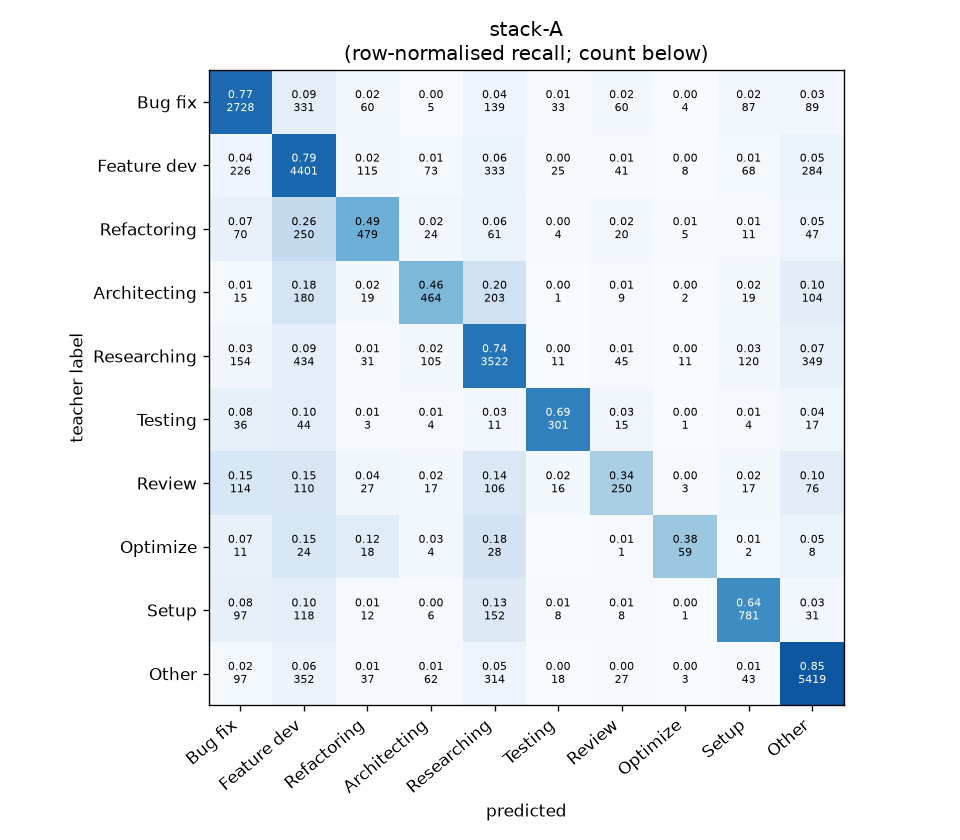
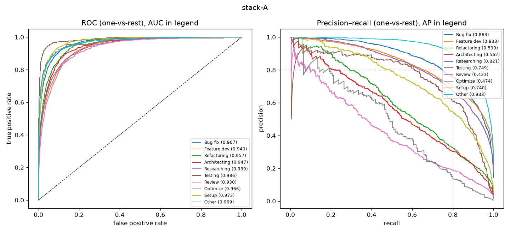

# stack-A

```
{
 "block": 7,
 "features": "stack of tfidf-WC_lr, emb-qwen3-0.6b-instr_lr",
 "model": "meta-LR",
 "params": "{\"C\": 1.0, \"cw\": null}"
}
```

### stack-A

**Threshold metrics (argmax prediction)**

|              |   support (OOF) |   precision |   recall |    F1 | P 95% CI    | R 95% CI    | F1 95% CI   |   p(F1≤0.8) |
|:-------------|----------------:|------------:|---------:|------:|:------------|:------------|:------------|------------:|
| Bug fix      |            3536 |       0.769 |    0.771 | 0.770 | 0.745–0.794 | 0.742–0.799 | 0.749–0.789 |       0.999 |
| Feature dev  |            5574 |       0.705 |    0.790 | 0.745 | 0.686–0.723 | 0.769–0.811 | 0.729–0.760 |       1.000 |
| Refactoring  |             971 |       0.598 |    0.493 | 0.541 | 0.539–0.660 | 0.428–0.564 | 0.485–0.596 |       1.000 |
| Architecting |            1016 |       0.607 |    0.457 | 0.521 | 0.545–0.669 | 0.394–0.516 | 0.463–0.572 |       1.000 |
| Researching  |            4782 |       0.723 |    0.737 | 0.730 | 0.703–0.744 | 0.712–0.763 | 0.712–0.750 |       1.000 |
| Testing      |             436 |       0.722 |    0.690 | 0.706 | 0.649–0.800 | 0.596–0.771 | 0.628–0.770 |       0.997 |
| Review       |             736 |       0.525 |    0.340 | 0.413 | 0.446–0.608 | 0.277–0.408 | 0.348–0.483 |       1.000 |
| Optimize     |             155 |       0.608 |    0.381 | 0.468 | 0.435–0.800 | 0.231–0.564 | 0.314–0.625 |       1.000 |
| Setup        |            1214 |       0.678 |    0.643 | 0.660 | 0.632–0.727 | 0.587–0.693 | 0.615–0.700 |       1.000 |
| Other        |            6372 |       0.844 |    0.850 | 0.847 | 0.828–0.859 | 0.832–0.868 | 0.834–0.859 |       0.000 |

**Ranking metrics (class scores, one-vs-rest)**

|              |   ROC-AUC | ROC-AUC 95% CI   |   p(AUC=0.5) |   PR-AUC (AP) | PR-AUC 95% CI   |   PR-AUC chance (=prevalence) |
|:-------------|----------:|:-----------------|-------------:|--------------:|:----------------|------------------------------:|
| Bug fix      |     0.967 | 0.962–0.972      |        0.000 |         0.863 | 0.845–0.878     |                         0.143 |
| Feature dev  |     0.940 | 0.933–0.944      |        0.000 |         0.833 | 0.817–0.847     |                         0.225 |
| Refactoring  |     0.957 | 0.947–0.966      |        0.000 |         0.599 | 0.547–0.659     |                         0.039 |
| Architecting |     0.947 | 0.935–0.958      |        0.000 |         0.562 | 0.516–0.617     |                         0.041 |
| Researching  |     0.939 | 0.933–0.947      |        0.000 |         0.821 | 0.804–0.840     |                         0.193 |
| Testing      |     0.986 | 0.974–0.993      |        0.000 |         0.749 | 0.672–0.838     |                         0.018 |
| Review       |     0.930 | 0.913–0.947      |        0.000 |         0.423 | 0.351–0.513     |                         0.030 |
| Optimize     |     0.966 | 0.923–0.988      |        0.000 |         0.474 | 0.333–0.644     |                         0.006 |
| Setup        |     0.973 | 0.964–0.979      |        0.000 |         0.740 | 0.696–0.776     |                         0.049 |
| Other        |     0.969 | 0.965–0.972      |        0.000 |         0.933 | 0.925–0.939     |                         0.257 |

**Overall**

|                       |   value |      lo |      hi |   p-value |
|:----------------------|--------:|--------:|--------:|----------:|
| accuracy              |   0.742 |   0.732 |   0.753 |   nan     |
| macro-F1              |   0.640 |   0.617 |   0.661 |     0.005 |
| min-F1 (bar)          |   0.413 |   0.312 |   0.472 |     1.000 |
| classes with F1 ≥ 0.8 |   1.000 | nan     | nan     |   nan     |
| macro ROC-AUC         |   0.957 | nan     | nan     |   nan     |
| macro PR-AUC          |   0.700 | nan     | nan     |   nan     |




