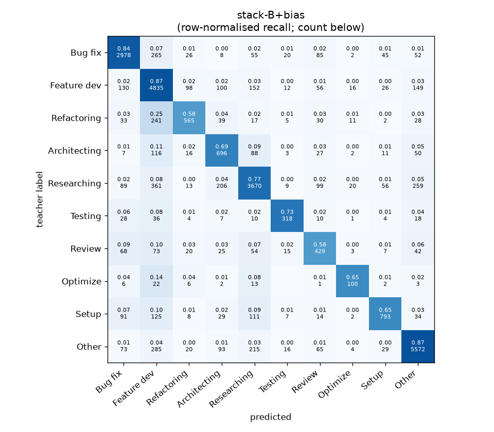
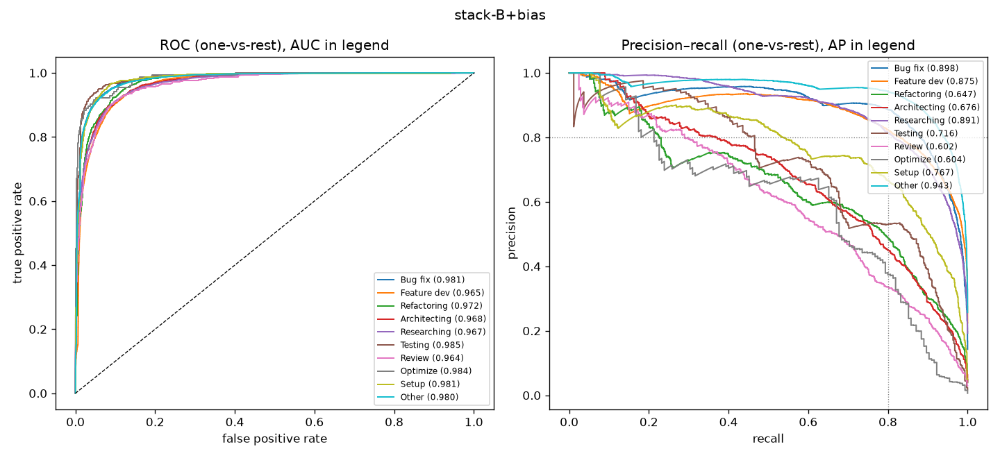

# stack-B+bias

```
{
 "block": 7,
 "features": "stack of emb-qwen3-8b-instr_lr, tfidf-WC_lr",
 "model": "meta-LR + cross-fitted class bias",
 "params": "{\"C\": 1.0, \"cw\": null, \"bias_all\": [-0.5, -0.5, -1.0, 0.0, -0.75, 0.25, 0.0, -0.25, -1.0, -0.75], \"bias_per_fold\": [[-0.5, -0.5, -2.0, 0.25, -0.75, 0.25, 0.0, -0.5, -2.0, -1.0], [-1.0, -0.5, -1.0, 0.0, -0.75, 0.25, 0.0, -0.25, -0.5, -0.75], [-0.5, -0.5, 0.25, 0.25, -0.75, -3.0, 0.0, 1.0, -1.0, -0.75], [-0.5, -0.5, -0.25, -0.25, -0.75, 0.25, 0.0, 1.0, -1.0, -0.5], [0.0, 0.0, -1.0, 0.25, -1.0, -1.25, 0.0, -1.0, -1.0, -0.75]]}"
}
```

### stack-B+bias

**Threshold metrics (argmax prediction)**

|              |   support (OOF) |   precision |   recall |    F1 | P 95% CI    | R 95% CI    | F1 95% CI   |   p(F1≤0.8) |
|:-------------|----------------:|------------:|---------:|------:|:------------|:------------|:------------|------------:|
| Bug fix      |            3536 |       0.850 |    0.842 | 0.846 | 0.828–0.872 | 0.819–0.865 | 0.827–0.864 |       0.000 |
| Feature dev  |            5574 |       0.760 |    0.867 | 0.810 | 0.743–0.779 | 0.849–0.885 | 0.796–0.824 |       0.078 |
| Refactoring  |             971 |       0.728 |    0.582 | 0.647 | 0.674–0.783 | 0.523–0.646 | 0.597–0.697 |       1.000 |
| Architecting |            1016 |       0.578 |    0.685 | 0.627 | 0.534–0.625 | 0.626–0.744 | 0.584–0.668 |       1.000 |
| Researching  |            4782 |       0.837 |    0.767 | 0.801 | 0.818–0.858 | 0.744–0.793 | 0.784–0.819 |       0.443 |
| Testing      |             436 |       0.785 |    0.729 | 0.756 | 0.715–0.858 | 0.642–0.807 | 0.692–0.817 |       0.935 |
| Review       |             736 |       0.526 |    0.583 | 0.553 | 0.473–0.591 | 0.516–0.652 | 0.499–0.610 |       1.000 |
| Optimize     |             155 |       0.621 |    0.645 | 0.633 | 0.500–0.774 | 0.513–0.795 | 0.524–0.759 |       0.999 |
| Setup        |            1214 |       0.813 |    0.653 | 0.725 | 0.768–0.857 | 0.594–0.706 | 0.679–0.765 |       1.000 |
| Other        |            6372 |       0.898 |    0.874 | 0.886 | 0.884–0.912 | 0.858–0.889 | 0.874–0.897 |       0.000 |

**Ranking metrics (class scores, one-vs-rest)**

|              |   ROC-AUC | ROC-AUC 95% CI   |   p(AUC=0.5) |   PR-AUC (AP) | PR-AUC 95% CI   |   PR-AUC chance (=prevalence) |
|:-------------|----------:|:-----------------|-------------:|--------------:|:----------------|------------------------------:|
| Bug fix      |     0.981 | 0.977–0.984      |        0.000 |         0.898 | 0.876–0.916     |                         0.143 |
| Feature dev  |     0.965 | 0.960–0.969      |        0.000 |         0.875 | 0.859–0.890     |                         0.225 |
| Refactoring  |     0.972 | 0.965–0.977      |        0.000 |         0.647 | 0.607–0.696     |                         0.039 |
| Architecting |     0.968 | 0.961–0.976      |        0.000 |         0.676 | 0.633–0.720     |                         0.041 |
| Researching  |     0.967 | 0.963–0.971      |        0.000 |         0.891 | 0.880–0.905     |                         0.193 |
| Testing      |     0.985 | 0.974–0.992      |        0.000 |         0.716 | 0.639–0.787     |                         0.018 |
| Review       |     0.964 | 0.950–0.974      |        0.000 |         0.602 | 0.546–0.681     |                         0.030 |
| Optimize     |     0.984 | 0.967–0.996      |        0.000 |         0.604 | 0.475–0.750     |                         0.006 |
| Setup        |     0.981 | 0.975–0.986      |        0.000 |         0.767 | 0.721–0.807     |                         0.049 |
| Other        |     0.980 | 0.977–0.983      |        0.000 |         0.943 | 0.931–0.951     |                         0.257 |

**Overall**

|                       |   value |      lo |      hi |   p-value |
|:----------------------|--------:|--------:|--------:|----------:|
| accuracy              |   0.805 |   0.795 |   0.815 |   nan     |
| macro-F1              |   0.728 |   0.709 |   0.747 |     0.005 |
| min-F1 (bar)          |   0.553 |   0.493 |   0.605 |     1.000 |
| classes with F1 ≥ 0.8 |   4.000 | nan     | nan     |   nan     |
| macro ROC-AUC         |   0.975 | nan     | nan     |   nan     |
| macro PR-AUC          |   0.762 | nan     | nan     |   nan     |




