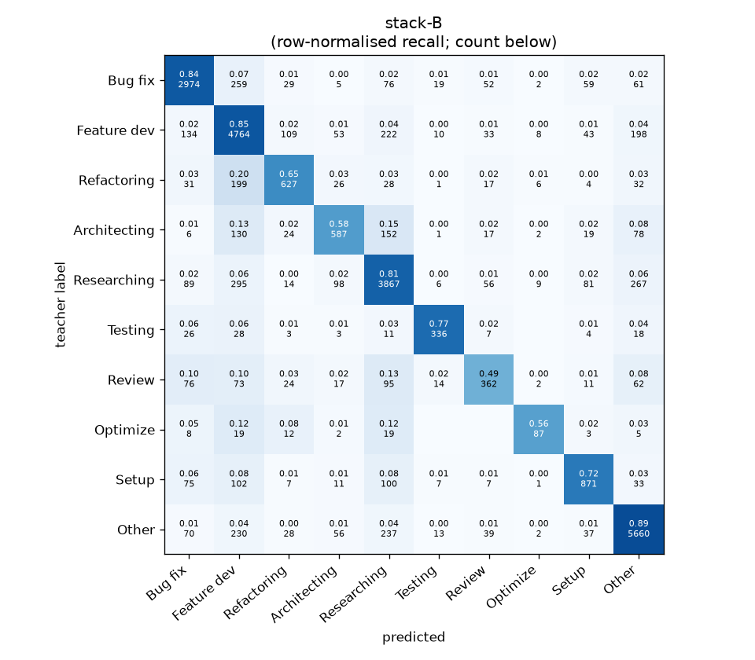
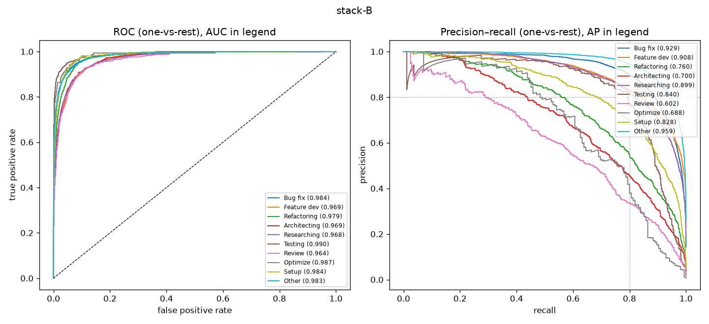

# stack-B

```
{
 "block": 7,
 "features": "stack of emb-qwen3-8b-instr_lr, tfidf-WC_lr",
 "model": "meta-LR",
 "params": "{\"C\": 1.0, \"cw\": null}"
}
```

### stack-B

**Threshold metrics (argmax prediction)**

|              |   support (OOF) |   precision |   recall |    F1 | P 95% CI    | R 95% CI    | F1 95% CI   |   p(F1≤0.8) |
|:-------------|----------------:|------------:|---------:|------:|:------------|:------------|:------------|------------:|
| Bug fix      |            3536 |       0.852 |    0.841 | 0.847 | 0.830–0.873 | 0.817–0.865 | 0.828–0.863 |       0.000 |
| Feature dev  |            5574 |       0.781 |    0.855 | 0.816 | 0.763–0.799 | 0.835–0.872 | 0.801–0.830 |       0.017 |
| Refactoring  |             971 |       0.715 |    0.646 | 0.679 | 0.665–0.769 | 0.584–0.708 | 0.634–0.725 |       1.000 |
| Architecting |            1016 |       0.684 |    0.578 | 0.626 | 0.631–0.741 | 0.520–0.642 | 0.576–0.679 |       1.000 |
| Researching  |            4782 |       0.804 |    0.809 | 0.807 | 0.784–0.825 | 0.786–0.830 | 0.789–0.824 |       0.201 |
| Testing      |             436 |       0.826 |    0.771 | 0.797 | 0.757–0.891 | 0.688–0.844 | 0.735–0.851 |       0.569 |
| Review       |             736 |       0.614 |    0.492 | 0.546 | 0.548–0.685 | 0.424–0.565 | 0.483–0.609 |       1.000 |
| Optimize     |             155 |       0.731 |    0.561 | 0.635 | 0.594–0.880 | 0.410–0.693 | 0.507–0.750 |       0.996 |
| Setup        |            1214 |       0.769 |    0.717 | 0.743 | 0.725–0.811 | 0.663–0.772 | 0.700–0.780 |       0.999 |
| Other        |            6372 |       0.882 |    0.888 | 0.885 | 0.868–0.897 | 0.873–0.901 | 0.874–0.896 |       0.000 |

**Ranking metrics (class scores, one-vs-rest)**

|              |   ROC-AUC | ROC-AUC 95% CI   |   p(AUC=0.5) |   PR-AUC (AP) | PR-AUC 95% CI   |   PR-AUC chance (=prevalence) |
|:-------------|----------:|:-----------------|-------------:|--------------:|:----------------|------------------------------:|
| Bug fix      |     0.984 | 0.980–0.987      |        0.000 |         0.929 | 0.916–0.939     |                         0.143 |
| Feature dev  |     0.969 | 0.965–0.972      |        0.000 |         0.908 | 0.895–0.917     |                         0.225 |
| Refactoring  |     0.979 | 0.972–0.984      |        0.000 |         0.760 | 0.717–0.800     |                         0.039 |
| Architecting |     0.969 | 0.962–0.977      |        0.000 |         0.700 | 0.658–0.745     |                         0.041 |
| Researching  |     0.968 | 0.964–0.972      |        0.000 |         0.899 | 0.887–0.912     |                         0.193 |
| Testing      |     0.990 | 0.984–0.995      |        0.000 |         0.840 | 0.770–0.901     |                         0.018 |
| Review       |     0.964 | 0.950–0.974      |        0.000 |         0.602 | 0.546–0.681     |                         0.030 |
| Optimize     |     0.987 | 0.962–0.996      |        0.000 |         0.688 | 0.559–0.822     |                         0.006 |
| Setup        |     0.984 | 0.978–0.988      |        0.000 |         0.828 | 0.793–0.858     |                         0.049 |
| Other        |     0.983 | 0.980–0.985      |        0.000 |         0.959 | 0.952–0.964     |                         0.257 |

**Overall**

|                       |   value |      lo |      hi |   p-value |
|:----------------------|--------:|--------:|--------:|----------:|
| accuracy              |   0.812 |   0.802 |   0.822 |   nan     |
| macro-F1              |   0.738 |   0.719 |   0.758 |     0.005 |
| min-F1 (bar)          |   0.546 |   0.479 |   0.604 |     1.000 |
| classes with F1 ≥ 0.8 |   4.000 | nan     | nan     |   nan     |
| macro ROC-AUC         |   0.978 | nan     | nan     |   nan     |
| macro PR-AUC          |   0.811 | nan     | nan     |   nan     |




