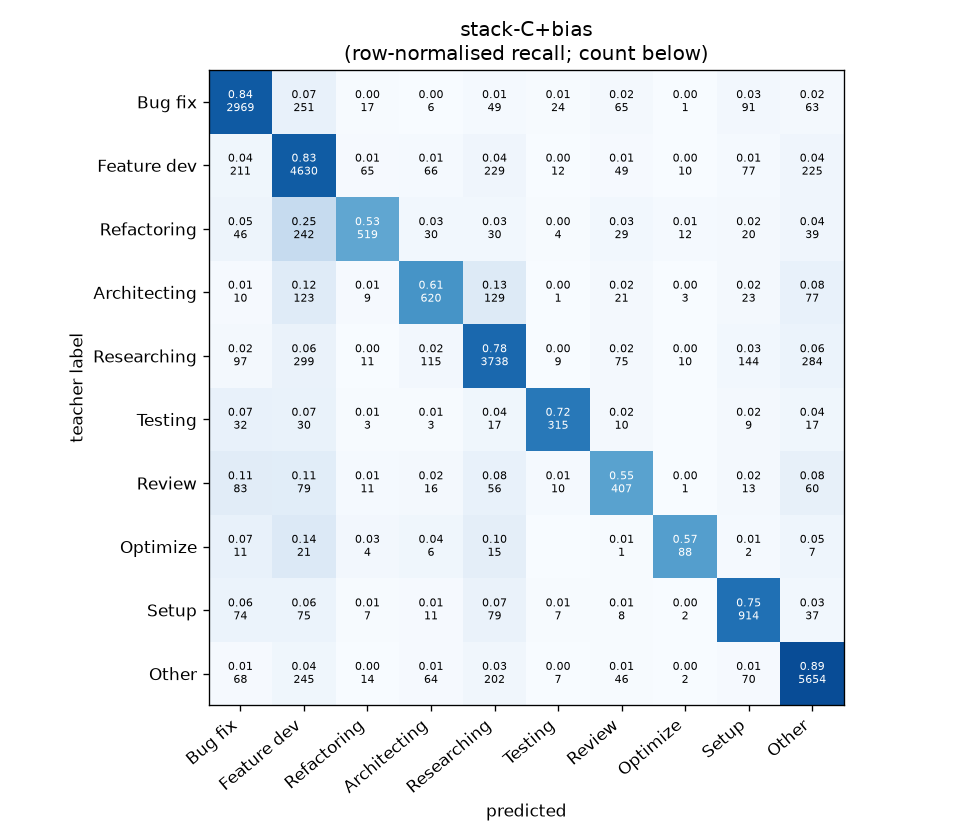
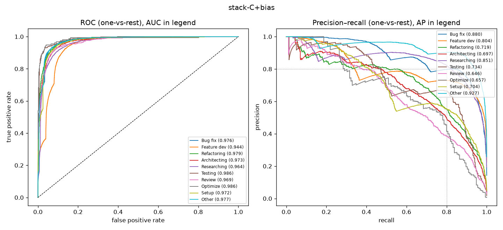

# stack-C+bias

```
{
 "block": 7,
 "features": "stack of emb-qwen3-8b-instr_lr, emb-qwen3-8b-instr_svm, tfidf-WC_lr, emb-qwen3-0.6b-instr_lr",
 "model": "meta-LR + cross-fitted class bias",
 "params": "{\"C\": 1.0, \"cw\": null, \"bias_all\": [0.25, -0.75, -1.5, -0.25, -0.75, 0.0, 0.0, 0.0, 1.0, -1.25], \"bias_per_fold\": [[0.25, -0.75, -1.5, -0.25, 0.25, -2.25, 0.0, 0.0, -1.5, -0.25], [-1.5, 0.5, -1.25, -0.25, -0.75, 0.0, 0.0, -1.0, 1.0, -0.25], [0.25, -1.5, -0.5, -0.5, -0.75, 0.0, 0.0, -1.0, -1.5, 0.25], [0.25, -0.75, -1.5, -0.25, -0.75, 0.0, 0.0, 0.0, 1.0, -1.0], [-0.75, 0.5, -1.0, 0.0, -0.5, -2.5, 0.0, 0.0, 1.0, -0.25]]}"
}
```

### stack-C+bias

**Threshold metrics (argmax prediction)**

|              |   support (OOF) |   precision |   recall |    F1 | P 95% CI    | R 95% CI    | F1 95% CI   |   p(F1≤0.8) |
|:-------------|----------------:|------------:|---------:|------:|:------------|:------------|:------------|------------:|
| Bug fix      |            3536 |       0.824 |    0.840 | 0.832 | 0.802–0.848 | 0.816–0.863 | 0.815–0.850 |       0.002 |
| Feature dev  |            5574 |       0.772 |    0.831 | 0.800 | 0.754–0.792 | 0.811–0.850 | 0.786–0.816 |       0.494 |
| Refactoring  |             971 |       0.786 |    0.535 | 0.636 | 0.728–0.846 | 0.469–0.601 | 0.581–0.688 |       1.000 |
| Architecting |            1016 |       0.662 |    0.610 | 0.635 | 0.613–0.718 | 0.551–0.673 | 0.587–0.687 |       1.000 |
| Researching  |            4782 |       0.823 |    0.782 | 0.802 | 0.805–0.844 | 0.757–0.805 | 0.784–0.819 |       0.401 |
| Testing      |             436 |       0.810 |    0.722 | 0.764 | 0.738–0.880 | 0.624–0.798 | 0.694–0.823 |       0.885 |
| Review       |             736 |       0.572 |    0.553 | 0.563 | 0.514–0.637 | 0.484–0.625 | 0.503–0.621 |       1.000 |
| Optimize     |             155 |       0.682 |    0.568 | 0.620 | 0.548–0.839 | 0.410–0.718 | 0.486–0.747 |       0.998 |
| Setup        |            1214 |       0.671 |    0.753 | 0.709 | 0.627–0.715 | 0.706–0.799 | 0.674–0.745 |       1.000 |
| Other        |            6372 |       0.875 |    0.887 | 0.881 | 0.860–0.890 | 0.873–0.902 | 0.870–0.893 |       0.000 |

**Ranking metrics (class scores, one-vs-rest)**

|              |   ROC-AUC | ROC-AUC 95% CI   |   p(AUC=0.5) |   PR-AUC (AP) | PR-AUC 95% CI   |   PR-AUC chance (=prevalence) |
|:-------------|----------:|:-----------------|-------------:|--------------:|:----------------|------------------------------:|
| Bug fix      |     0.976 | 0.972–0.980      |        0.000 |         0.880 | 0.860–0.897     |                         0.143 |
| Feature dev  |     0.944 | 0.939–0.950      |        0.000 |         0.804 | 0.782–0.819     |                         0.225 |
| Refactoring  |     0.979 | 0.973–0.984      |        0.000 |         0.719 | 0.674–0.764     |                         0.039 |
| Architecting |     0.973 | 0.967–0.980      |        0.000 |         0.697 | 0.650–0.740     |                         0.041 |
| Researching  |     0.964 | 0.959–0.969      |        0.000 |         0.851 | 0.833–0.871     |                         0.193 |
| Testing      |     0.986 | 0.979–0.992      |        0.000 |         0.734 | 0.653–0.801     |                         0.018 |
| Review       |     0.969 | 0.958–0.978      |        0.000 |         0.646 | 0.592–0.717     |                         0.030 |
| Optimize     |     0.986 | 0.951–0.997      |        0.000 |         0.657 | 0.515–0.770     |                         0.006 |
| Setup        |     0.972 | 0.964–0.978      |        0.000 |         0.704 | 0.666–0.745     |                         0.049 |
| Other        |     0.977 | 0.974–0.980      |        0.000 |         0.927 | 0.915–0.937     |                         0.257 |

**Overall**

|                       |   value |      lo |      hi |   p-value |
|:----------------------|--------:|--------:|--------:|----------:|
| accuracy              |   0.801 |   0.791 |   0.811 |   nan     |
| macro-F1              |   0.724 |   0.707 |   0.744 |     0.005 |
| min-F1 (bar)          |   0.563 |   0.486 |   0.614 |     1.000 |
| classes with F1 ≥ 0.8 |   4.000 | nan     | nan     |   nan     |
| macro ROC-AUC         |   0.973 | nan     | nan     |   nan     |
| macro PR-AUC          |   0.762 | nan     | nan     |   nan     |




