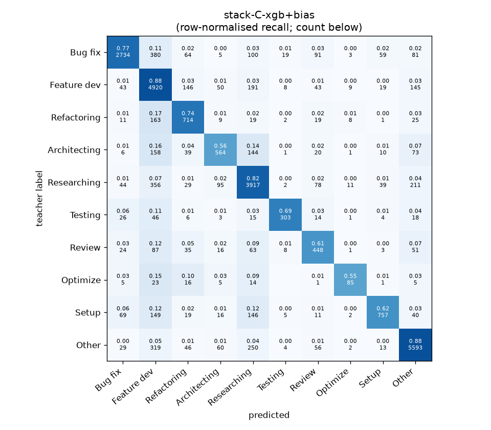
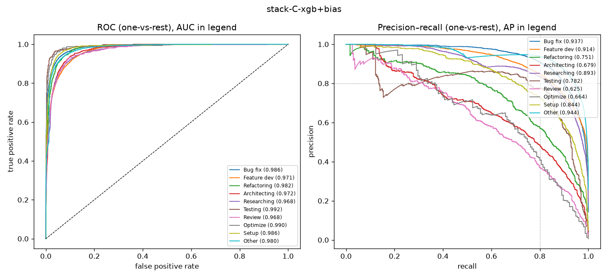

# stack-C-xgb+bias

```
{
 "block": 7,
 "features": "stack of emb-qwen3-8b-instr_lr, emb-qwen3-8b-instr_svm, tfidf-WC_lr, emb-qwen3-0.6b-instr_lr",
 "model": "meta-XGBoost + cross-fitted class bias",
 "params": "{\"max_depth\": 3, \"learning_rate\": 0.05, \"subsample\": 0.8, \"colsample_bytree\": 0.8, \"min_child_weight\": 5, \"reg_lambda\": 1.0, \"tree_method\": \"hist\", \"n_jobs\": 8, \"eval_metric\": \"mlogloss\", \"best_iterations_per_fold\": [183, 172, 178, 177, 175], \"n_estimators_final\": 178, \"bias_all\": [-1.25, 0.0, 0.25, -0.5, -0.25, -1.5, 0.0, -0.25, -1.25, -0.25], \"bias_per_fold\": [[-1.25, 0.0, 0.5, -0.25, -0.25, -1.75, 0.0, -1.0, -1.25, -0.25], [-1.25, 0.0, 0.25, -0.5, -0.25, -0.75, 0.0, -0.25, -1.25, -0.25], [-1.25, 0.0, 0.5, -0.25, -0.25, -1.75, 0.0, -0.25, -1.25, -0.25], [-1.25, 0.0, 0.25, -1.0, -0.75, -1.75, 0.0, -0.5, -1.25, -0.75], [-1.25, 0.0, 0.0, -0.25, -0.25, -1.5, 0.0, 0.0, -1.25, -0.75]]}"
}
```

### stack-C-xgb+bias

**Threshold metrics (argmax prediction)**

|              |   support (OOF) |   precision |   recall |    F1 | P 95% CI    | R 95% CI    | F1 95% CI   |   p(F1≤0.8) |
|:-------------|----------------:|------------:|---------:|------:|:------------|:------------|:------------|------------:|
| Bug fix      |            3536 |       0.914 |    0.773 | 0.838 | 0.895–0.933 | 0.743–0.800 | 0.817–0.855 |       0.000 |
| Feature dev  |            5574 |       0.745 |    0.883 | 0.808 | 0.728–0.765 | 0.864–0.899 | 0.792–0.822 |       0.123 |
| Refactoring  |             971 |       0.641 |    0.735 | 0.685 | 0.596–0.691 | 0.683–0.794 | 0.644–0.726 |       1.000 |
| Architecting |            1016 |       0.685 |    0.555 | 0.613 | 0.628–0.741 | 0.496–0.618 | 0.563–0.665 |       1.000 |
| Researching  |            4782 |       0.806 |    0.819 | 0.813 | 0.788–0.826 | 0.798–0.841 | 0.796–0.829 |       0.060 |
| Testing      |             436 |       0.861 |    0.695 | 0.769 | 0.793–0.924 | 0.606–0.780 | 0.705–0.827 |       0.855 |
| Review       |             736 |       0.574 |    0.609 | 0.591 | 0.518–0.636 | 0.538–0.679 | 0.536–0.646 |       1.000 |
| Optimize     |             155 |       0.691 |    0.548 | 0.612 | 0.548–0.844 | 0.410–0.692 | 0.481–0.734 |       1.000 |
| Setup        |            1214 |       0.836 |    0.624 | 0.714 | 0.789–0.880 | 0.564–0.677 | 0.669–0.756 |       1.000 |
| Other        |            6372 |       0.896 |    0.878 | 0.887 | 0.881–0.911 | 0.861–0.892 | 0.875–0.897 |       0.000 |

**Ranking metrics (class scores, one-vs-rest)**

|              |   ROC-AUC | ROC-AUC 95% CI   |   p(AUC=0.5) |   PR-AUC (AP) | PR-AUC 95% CI   |   PR-AUC chance (=prevalence) |
|:-------------|----------:|:-----------------|-------------:|--------------:|:----------------|------------------------------:|
| Bug fix      |     0.986 | 0.983–0.989      |        0.000 |         0.937 | 0.925–0.947     |                         0.143 |
| Feature dev  |     0.971 | 0.966–0.974      |        0.000 |         0.914 | 0.900–0.923     |                         0.225 |
| Refactoring  |     0.982 | 0.975–0.986      |        0.000 |         0.751 | 0.703–0.794     |                         0.039 |
| Architecting |     0.972 | 0.964–0.979      |        0.000 |         0.679 | 0.637–0.727     |                         0.041 |
| Researching  |     0.968 | 0.964–0.972      |        0.000 |         0.893 | 0.880–0.906     |                         0.193 |
| Testing      |     0.992 | 0.986–0.996      |        0.000 |         0.782 | 0.717–0.847     |                         0.018 |
| Review       |     0.968 | 0.956–0.978      |        0.000 |         0.625 | 0.567–0.697     |                         0.030 |
| Optimize     |     0.990 | 0.970–0.997      |        0.000 |         0.664 | 0.546–0.782     |                         0.006 |
| Setup        |     0.986 | 0.979–0.990      |        0.000 |         0.844 | 0.811–0.873     |                         0.049 |
| Other        |     0.980 | 0.977–0.983      |        0.000 |         0.944 | 0.937–0.951     |                         0.257 |

**Overall**

|                       |   value |      lo |      hi |   p-value |
|:----------------------|--------:|--------:|--------:|----------:|
| accuracy              |   0.808 |   0.799 |   0.818 |   nan     |
| macro-F1              |   0.733 |   0.714 |   0.752 |     0.005 |
| min-F1 (bar)          |   0.591 |   0.481 |   0.622 |     1.000 |
| classes with F1 ≥ 0.8 |   4.000 | nan     | nan     |   nan     |
| macro ROC-AUC         |   0.979 | nan     | nan     |   nan     |
| macro PR-AUC          |   0.803 | nan     | nan     |   nan     |




