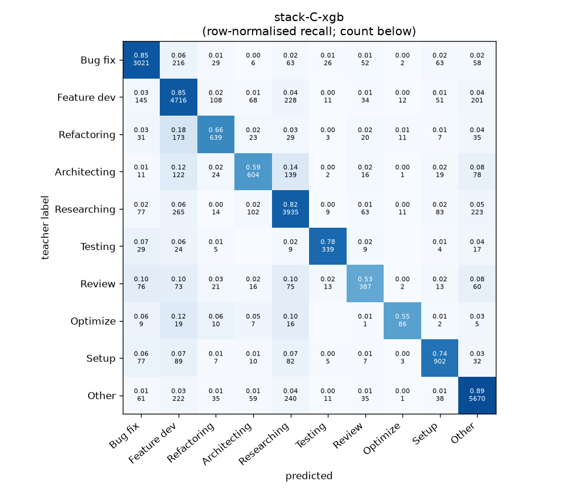
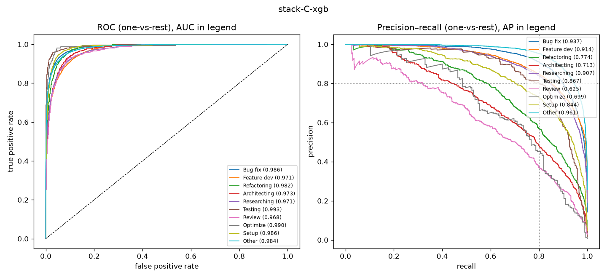

# stack-C-xgb

```
{
 "block": 7,
 "features": "stack of emb-qwen3-8b-instr_lr, emb-qwen3-8b-instr_svm, tfidf-WC_lr, emb-qwen3-0.6b-instr_lr",
 "model": "meta-XGBoost",
 "params": "{\"max_depth\": 3, \"learning_rate\": 0.05, \"subsample\": 0.8, \"colsample_bytree\": 0.8, \"min_child_weight\": 5, \"reg_lambda\": 1.0, \"tree_method\": \"hist\", \"n_jobs\": 8, \"eval_metric\": \"mlogloss\", \"best_iterations_per_fold\": [183, 172, 178, 177, 175], \"n_estimators_final\": 178}"
}
```

### stack-C-xgb

**Threshold metrics (argmax prediction)**

|              |   support (OOF) |   precision |   recall |    F1 | P 95% CI    | R 95% CI    | F1 95% CI   |   p(F1≤0.8) |
|:-------------|----------------:|------------:|---------:|------:|:------------|:------------|:------------|------------:|
| Bug fix      |            3536 |       0.854 |    0.854 | 0.854 | 0.831–0.875 | 0.833–0.877 | 0.837–0.870 |       0.000 |
| Feature dev  |            5574 |       0.797 |    0.846 | 0.821 | 0.778–0.815 | 0.826–0.864 | 0.806–0.835 |       0.004 |
| Refactoring  |             971 |       0.716 |    0.658 | 0.686 | 0.665–0.769 | 0.601–0.720 | 0.641–0.733 |       1.000 |
| Architecting |            1016 |       0.675 |    0.594 | 0.632 | 0.620–0.734 | 0.535–0.657 | 0.581–0.682 |       1.000 |
| Researching  |            4782 |       0.817 |    0.823 | 0.820 | 0.798–0.837 | 0.801–0.844 | 0.804–0.836 |       0.007 |
| Testing      |             436 |       0.809 |    0.778 | 0.793 | 0.741–0.883 | 0.697–0.844 | 0.734–0.846 |       0.610 |
| Review       |             736 |       0.620 |    0.526 | 0.569 | 0.556–0.692 | 0.457–0.598 | 0.506–0.630 |       1.000 |
| Optimize     |             155 |       0.667 |    0.555 | 0.606 | 0.533–0.826 | 0.410–0.693 | 0.476–0.732 |       0.999 |
| Setup        |            1214 |       0.763 |    0.743 | 0.753 | 0.721–0.807 | 0.690–0.792 | 0.712–0.791 |       0.994 |
| Other        |            6372 |       0.889 |    0.890 | 0.889 | 0.874–0.903 | 0.874–0.904 | 0.879–0.900 |       0.000 |

**Ranking metrics (class scores, one-vs-rest)**

|              |   ROC-AUC | ROC-AUC 95% CI   |   p(AUC=0.5) |   PR-AUC (AP) | PR-AUC 95% CI   |   PR-AUC chance (=prevalence) |
|:-------------|----------:|:-----------------|-------------:|--------------:|:----------------|------------------------------:|
| Bug fix      |     0.986 | 0.983–0.989      |        0.000 |         0.937 | 0.925–0.947     |                         0.143 |
| Feature dev  |     0.971 | 0.966–0.974      |        0.000 |         0.914 | 0.900–0.923     |                         0.225 |
| Refactoring  |     0.982 | 0.976–0.986      |        0.000 |         0.774 | 0.728–0.813     |                         0.039 |
| Architecting |     0.973 | 0.966–0.980      |        0.000 |         0.713 | 0.677–0.759     |                         0.041 |
| Researching  |     0.971 | 0.967–0.975      |        0.000 |         0.907 | 0.895–0.919     |                         0.193 |
| Testing      |     0.993 | 0.987–0.997      |        0.000 |         0.867 | 0.815–0.914     |                         0.018 |
| Review       |     0.968 | 0.956–0.978      |        0.000 |         0.625 | 0.567–0.697     |                         0.030 |
| Optimize     |     0.990 | 0.967–0.997      |        0.000 |         0.699 | 0.578–0.818     |                         0.006 |
| Setup        |     0.986 | 0.979–0.990      |        0.000 |         0.844 | 0.811–0.873     |                         0.049 |
| Other        |     0.984 | 0.981–0.986      |        0.000 |         0.961 | 0.955–0.967     |                         0.257 |

**Overall**

|                       |   value |      lo |      hi |   p-value |
|:----------------------|--------:|--------:|--------:|----------:|
| accuracy              |   0.819 |   0.809 |   0.829 |   nan     |
| macro-F1              |   0.742 |   0.724 |   0.761 |     0.005 |
| min-F1 (bar)          |   0.569 |   0.476 |   0.617 |     1.000 |
| classes with F1 ≥ 0.8 |   4.000 | nan     | nan     |   nan     |
| macro ROC-AUC         |   0.980 | nan     | nan     |   nan     |
| macro PR-AUC          |   0.824 | nan     | nan     |   nan     |




