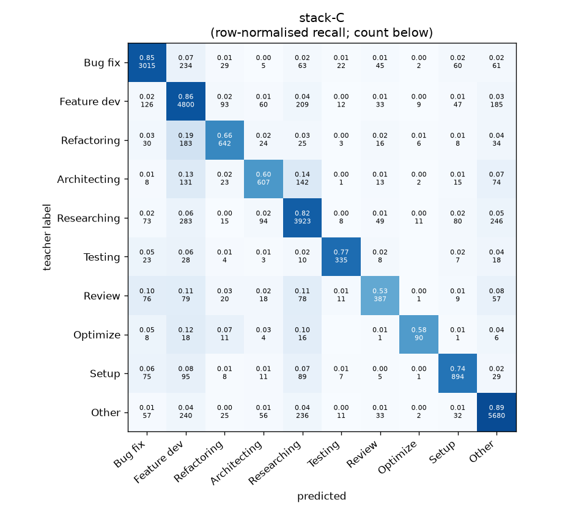
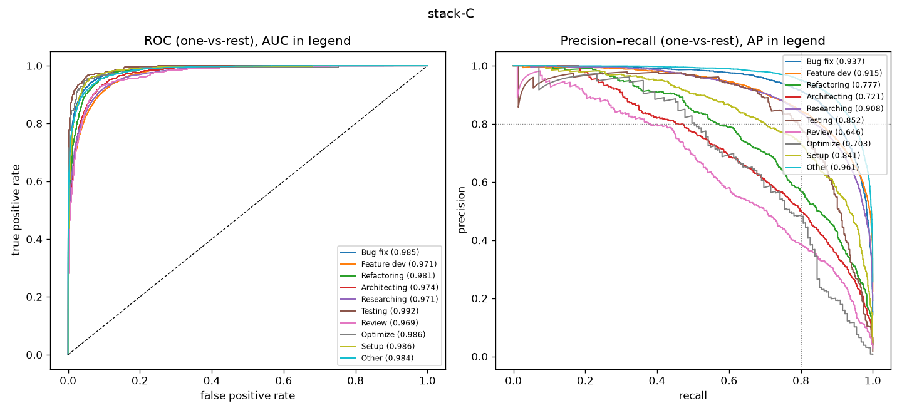

# stack-C

```
{
 "block": 7,
 "features": "stack of emb-qwen3-8b-instr_lr, emb-qwen3-8b-instr_svm, tfidf-WC_lr, emb-qwen3-0.6b-instr_lr",
 "model": "meta-LR",
 "params": "{\"C\": 1.0, \"cw\": null}"
}
```

### stack-C

**Threshold metrics (argmax prediction)**

|              |   support (OOF) |   precision |   recall |    F1 | P 95% CI    | R 95% CI    | F1 95% CI   |   p(F1≤0.8) |
|:-------------|----------------:|------------:|---------:|------:|:------------|:------------|:------------|------------:|
| Bug fix      |            3536 |       0.864 |    0.853 | 0.858 | 0.839–0.884 | 0.830–0.877 | 0.841–0.874 |       0.000 |
| Feature dev  |            5574 |       0.788 |    0.861 | 0.823 | 0.770–0.807 | 0.843–0.879 | 0.808–0.836 |       0.002 |
| Refactoring  |             971 |       0.738 |    0.661 | 0.697 | 0.687–0.789 | 0.601–0.724 | 0.654–0.744 |       1.000 |
| Architecting |            1016 |       0.688 |    0.597 | 0.640 | 0.635–0.745 | 0.535–0.661 | 0.591–0.692 |       1.000 |
| Researching  |            4782 |       0.819 |    0.820 | 0.820 | 0.799–0.839 | 0.799–0.842 | 0.803–0.836 |       0.008 |
| Testing      |             436 |       0.817 |    0.768 | 0.792 | 0.745–0.883 | 0.688–0.844 | 0.734–0.847 |       0.636 |
| Review       |             736 |       0.656 |    0.526 | 0.584 | 0.592–0.727 | 0.457–0.598 | 0.522–0.647 |       1.000 |
| Optimize     |             155 |       0.726 |    0.581 | 0.645 | 0.600–0.871 | 0.436–0.744 | 0.516–0.767 |       0.994 |
| Setup        |            1214 |       0.775 |    0.736 | 0.755 | 0.732–0.821 | 0.686–0.789 | 0.715–0.794 |       0.990 |
| Other        |            6372 |       0.889 |    0.891 | 0.890 | 0.874–0.904 | 0.877–0.905 | 0.879–0.901 |       0.000 |

**Ranking metrics (class scores, one-vs-rest)**

|              |   ROC-AUC | ROC-AUC 95% CI   |   p(AUC=0.5) |   PR-AUC (AP) | PR-AUC 95% CI   |   PR-AUC chance (=prevalence) |
|:-------------|----------:|:-----------------|-------------:|--------------:|:----------------|------------------------------:|
| Bug fix      |     0.985 | 0.982–0.988      |        0.000 |         0.937 | 0.926–0.947     |                         0.143 |
| Feature dev  |     0.971 | 0.967–0.974      |        0.000 |         0.915 | 0.901–0.923     |                         0.225 |
| Refactoring  |     0.981 | 0.975–0.986      |        0.000 |         0.777 | 0.736–0.814     |                         0.039 |
| Architecting |     0.974 | 0.967–0.980      |        0.000 |         0.721 | 0.682–0.765     |                         0.041 |
| Researching  |     0.971 | 0.967–0.975      |        0.000 |         0.908 | 0.896–0.921     |                         0.193 |
| Testing      |     0.992 | 0.987–0.996      |        0.000 |         0.852 | 0.788–0.906     |                         0.018 |
| Review       |     0.969 | 0.958–0.978      |        0.000 |         0.646 | 0.592–0.717     |                         0.030 |
| Optimize     |     0.986 | 0.954–0.997      |        0.000 |         0.703 | 0.589–0.812     |                         0.006 |
| Setup        |     0.986 | 0.981–0.990      |        0.000 |         0.841 | 0.809–0.871     |                         0.049 |
| Other        |     0.984 | 0.981–0.986      |        0.000 |         0.961 | 0.956–0.966     |                         0.257 |

**Overall**

|                       |   value |      lo |      hi |   p-value |
|:----------------------|--------:|--------:|--------:|----------:|
| accuracy              |   0.822 |   0.812 |   0.831 |   nan     |
| macro-F1              |   0.750 |   0.732 |   0.770 |     0.005 |
| min-F1 (bar)          |   0.584 |   0.514 |   0.632 |     1.000 |
| classes with F1 ≥ 0.8 |   4.000 | nan     | nan     |   nan     |
| macro ROC-AUC         |   0.980 | nan     | nan     |   nan     |
| macro PR-AUC          |   0.826 | nan     | nan     |   nan     |




