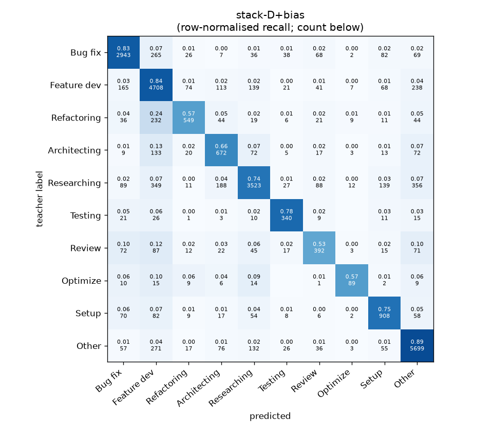
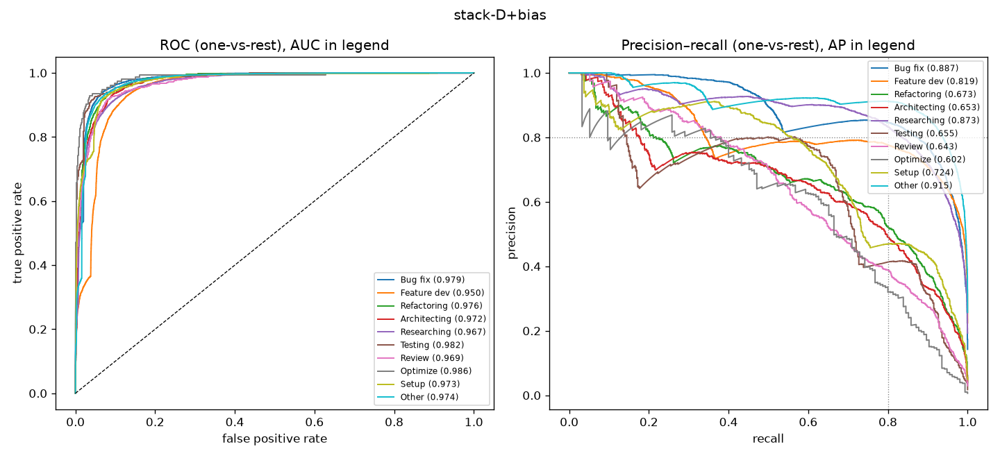

# stack-D+bias

```
{
 "block": 7,
 "features": "stack of emb-qwen3-8b-instr_lr, emb-qwen3-8b-instr_svm, tfidf-WC_lr, emb-qwen3-0.6b-instr_lr, emb-qwen3-8b_lr, emb-qwen3-4b_svm, emb-nomic-code_lr, emb-bge-m3_lr",
 "model": "meta-LR + cross-fitted class bias",
 "params": "{\"C\": 1.0, \"cw\": null, \"bias_all\": [0.25, -0.5, 0.25, 0.0, -0.75, 0.75, 0.0, -0.25, -2.5, -0.25], \"bias_per_fold\": [[0.25, -0.5, 0.0, 0.0, -0.25, 0.75, 0.0, -0.25, -2.5, 0.5], [-1.0, 0.75, -0.75, -0.25, -1.0, 2.5, 0.0, 0.0, 0.5, -0.5], [0.25, -0.5, -0.75, 0.75, -0.75, 0.75, 0.0, -1.25, 0.5, -0.25], [0.25, -0.75, -1.5, 0.75, -0.5, 0.75, 0.0, -0.5, 0.5, 0.75], [-1.0, 0.75, 0.25, 0.0, -0.75, -2.5, 0.0, -0.25, 1.0, -0.25]]}"
}
```

### stack-D+bias

**Threshold metrics (argmax prediction)**

|              |   support (OOF) |   precision |   recall |    F1 | P 95% CI    | R 95% CI    | F1 95% CI   |   p(F1≤0.8) |
|:-------------|----------------:|------------:|---------:|------:|:------------|:------------|:------------|------------:|
| Bug fix      |            3536 |       0.848 |    0.832 | 0.840 | 0.825–0.869 | 0.808–0.856 | 0.821–0.858 |       0.000 |
| Feature dev  |            5574 |       0.763 |    0.845 | 0.802 | 0.744–0.782 | 0.825–0.864 | 0.786–0.816 |       0.415 |
| Refactoring  |             971 |       0.754 |    0.565 | 0.646 | 0.693–0.816 | 0.498–0.630 | 0.592–0.694 |       1.000 |
| Architecting |            1016 |       0.585 |    0.661 | 0.621 | 0.540–0.637 | 0.602–0.720 | 0.576–0.667 |       1.000 |
| Researching  |            4782 |       0.871 |    0.737 | 0.798 | 0.853–0.890 | 0.712–0.763 | 0.781–0.818 |       0.554 |
| Testing      |             436 |       0.697 |    0.780 | 0.736 | 0.628–0.770 | 0.697–0.853 | 0.667–0.791 |       0.988 |
| Review       |             736 |       0.577 |    0.533 | 0.554 | 0.518–0.648 | 0.462–0.603 | 0.493–0.614 |       1.000 |
| Optimize     |             155 |       0.685 |    0.574 | 0.625 | 0.543–0.829 | 0.436–0.719 | 0.500–0.753 |       0.999 |
| Setup        |            1214 |       0.696 |    0.748 | 0.721 | 0.655–0.741 | 0.696–0.799 | 0.682–0.758 |       1.000 |
| Other        |            6372 |       0.859 |    0.894 | 0.877 | 0.843–0.875 | 0.879–0.908 | 0.864–0.888 |       0.000 |

**Ranking metrics (class scores, one-vs-rest)**

|              |   ROC-AUC | ROC-AUC 95% CI   |   p(AUC=0.5) |   PR-AUC (AP) | PR-AUC 95% CI   |   PR-AUC chance (=prevalence) |
|:-------------|----------:|:-----------------|-------------:|--------------:|:----------------|------------------------------:|
| Bug fix      |     0.979 | 0.975–0.982      |        0.000 |         0.887 | 0.868–0.904     |                         0.143 |
| Feature dev  |     0.950 | 0.945–0.955      |        0.000 |         0.819 | 0.800–0.835     |                         0.225 |
| Refactoring  |     0.976 | 0.970–0.981      |        0.000 |         0.673 | 0.623–0.728     |                         0.039 |
| Architecting |     0.972 | 0.965–0.979      |        0.000 |         0.653 | 0.613–0.714     |                         0.041 |
| Researching  |     0.967 | 0.963–0.972      |        0.000 |         0.873 | 0.853–0.891     |                         0.193 |
| Testing      |     0.982 | 0.971–0.988      |        0.000 |         0.655 | 0.575–0.731     |                         0.018 |
| Review       |     0.969 | 0.958–0.978      |        0.000 |         0.643 | 0.591–0.712     |                         0.030 |
| Optimize     |     0.986 | 0.959–0.995      |        0.000 |         0.602 | 0.471–0.733     |                         0.006 |
| Setup        |     0.973 | 0.966–0.979      |        0.000 |         0.724 | 0.682–0.768     |                         0.049 |
| Other        |     0.974 | 0.970–0.977      |        0.000 |         0.915 | 0.899–0.926     |                         0.257 |

**Overall**

|                       |   value |      lo |      hi |   p-value |
|:----------------------|--------:|--------:|--------:|----------:|
| accuracy              |   0.800 |   0.789 |   0.809 |   nan     |
| macro-F1              |   0.722 |   0.704 |   0.740 |     0.005 |
| min-F1 (bar)          |   0.554 |   0.485 |   0.606 |     1.000 |
| classes with F1 ≥ 0.8 |   3.000 | nan     | nan     |   nan     |
| macro ROC-AUC         |   0.973 | nan     | nan     |   nan     |
| macro PR-AUC          |   0.744 | nan     | nan     |   nan     |




