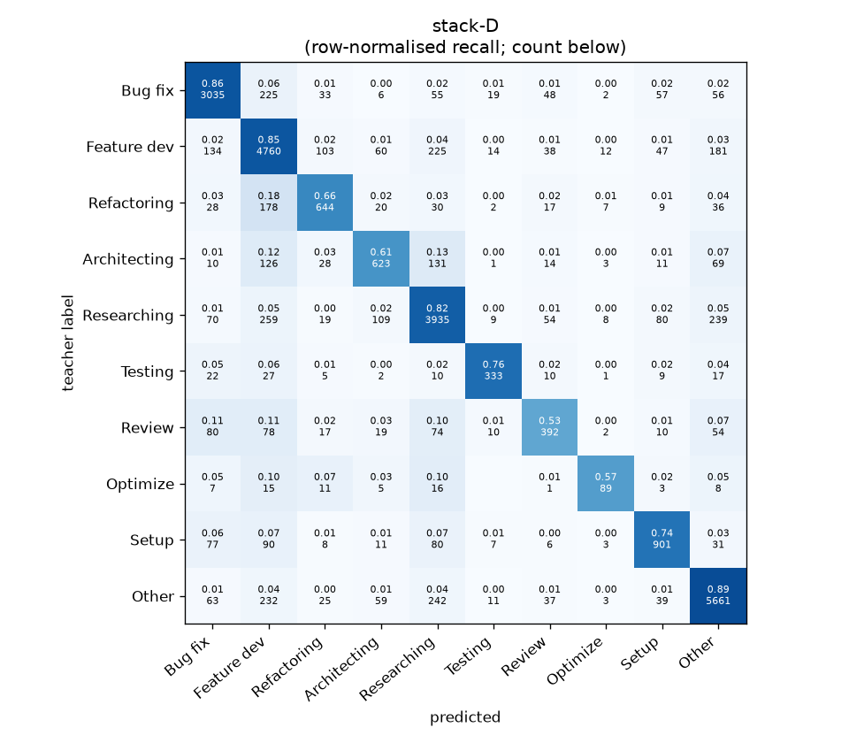
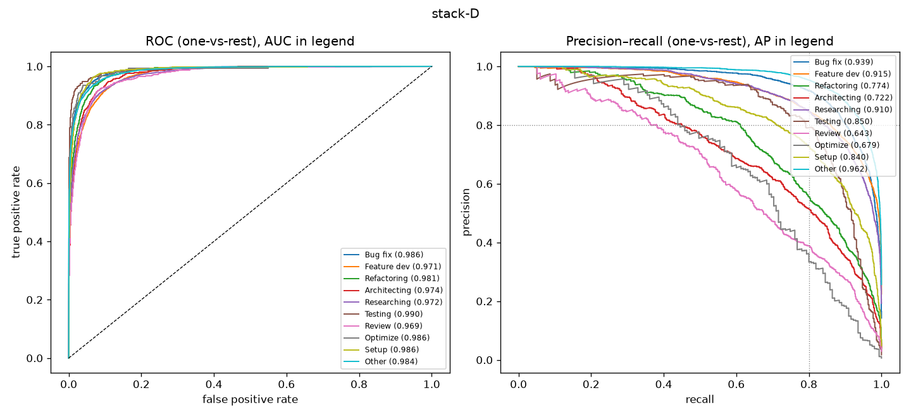

# stack-D

```
{
 "block": 7,
 "features": "stack of emb-qwen3-8b-instr_lr, emb-qwen3-8b-instr_svm, tfidf-WC_lr, emb-qwen3-0.6b-instr_lr, emb-qwen3-8b_lr, emb-qwen3-4b_svm, emb-nomic-code_lr, emb-bge-m3_lr",
 "model": "meta-LR",
 "params": "{\"C\": 1.0, \"cw\": null}"
}
```

### stack-D

**Threshold metrics (argmax prediction)**

|              |   support (OOF) |   precision |   recall |    F1 | P 95% CI    | R 95% CI    | F1 95% CI   |   p(F1≤0.8) |
|:-------------|----------------:|------------:|---------:|------:|:------------|:------------|:------------|------------:|
| Bug fix      |            3536 |       0.861 |    0.858 | 0.860 | 0.839–0.882 | 0.836–0.880 | 0.842–0.876 |       0.000 |
| Feature dev  |            5574 |       0.795 |    0.854 | 0.823 | 0.777–0.813 | 0.834–0.872 | 0.809–0.838 |       0.001 |
| Refactoring  |             971 |       0.721 |    0.663 | 0.691 | 0.671–0.772 | 0.601–0.720 | 0.642–0.733 |       1.000 |
| Architecting |            1016 |       0.682 |    0.613 | 0.646 | 0.628–0.734 | 0.551–0.677 | 0.596–0.697 |       1.000 |
| Researching  |            4782 |       0.820 |    0.823 | 0.822 | 0.801–0.840 | 0.799–0.844 | 0.805–0.838 |       0.008 |
| Testing      |             436 |       0.820 |    0.764 | 0.791 | 0.750–0.888 | 0.688–0.835 | 0.726–0.849 |       0.645 |
| Review       |             736 |       0.635 |    0.533 | 0.579 | 0.570–0.708 | 0.462–0.609 | 0.518–0.640 |       1.000 |
| Optimize     |             155 |       0.685 |    0.574 | 0.625 | 0.542–0.840 | 0.436–0.718 | 0.494–0.744 |       0.996 |
| Setup        |            1214 |       0.773 |    0.742 | 0.757 | 0.725–0.817 | 0.693–0.792 | 0.717–0.795 |       0.987 |
| Other        |            6372 |       0.891 |    0.888 | 0.890 | 0.876–0.906 | 0.873–0.903 | 0.878–0.901 |       0.000 |

**Ranking metrics (class scores, one-vs-rest)**

|              |   ROC-AUC | ROC-AUC 95% CI   |   p(AUC=0.5) |   PR-AUC (AP) | PR-AUC 95% CI   |   PR-AUC chance (=prevalence) |
|:-------------|----------:|:-----------------|-------------:|--------------:|:----------------|------------------------------:|
| Bug fix      |     0.986 | 0.983–0.989      |        0.000 |         0.939 | 0.927–0.948     |                         0.143 |
| Feature dev  |     0.971 | 0.967–0.974      |        0.000 |         0.915 | 0.903–0.924     |                         0.225 |
| Refactoring  |     0.981 | 0.975–0.985      |        0.000 |         0.774 | 0.737–0.810     |                         0.039 |
| Architecting |     0.974 | 0.968–0.981      |        0.000 |         0.722 | 0.684–0.770     |                         0.041 |
| Researching  |     0.972 | 0.968–0.976      |        0.000 |         0.910 | 0.898–0.922     |                         0.193 |
| Testing      |     0.990 | 0.980–0.996      |        0.000 |         0.850 | 0.790–0.903     |                         0.018 |
| Review       |     0.969 | 0.958–0.978      |        0.000 |         0.643 | 0.591–0.712     |                         0.030 |
| Optimize     |     0.986 | 0.964–0.996      |        0.000 |         0.679 | 0.552–0.788     |                         0.006 |
| Setup        |     0.986 | 0.981–0.990      |        0.000 |         0.840 | 0.810–0.872     |                         0.049 |
| Other        |     0.984 | 0.982–0.987      |        0.000 |         0.962 | 0.956–0.967     |                         0.257 |

**Overall**

|                       |   value |      lo |      hi |   p-value |
|:----------------------|--------:|--------:|--------:|----------:|
| accuracy              |   0.822 |   0.812 |   0.832 |   nan     |
| macro-F1              |   0.748 |   0.729 |   0.767 |     0.005 |
| min-F1 (bar)          |   0.579 |   0.493 |   0.627 |     1.000 |
| classes with F1 ≥ 0.8 |   4.000 | nan     | nan     |   nan     |
| macro ROC-AUC         |   0.980 | nan     | nan     |   nan     |
| macro PR-AUC          |   0.824 | nan     | nan     |   nan     |




