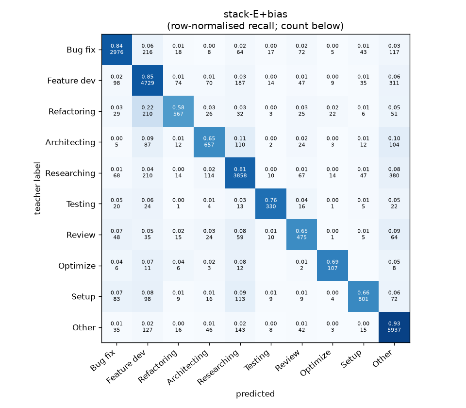
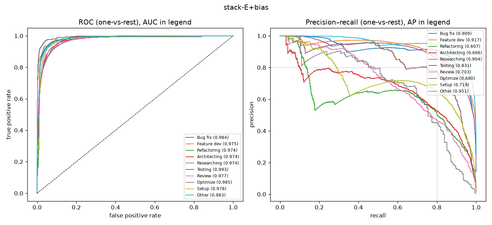

# stack-E+bias

```
{
 "block": 7,
 "features": "stack of emb-qwen3-8b-instr_lr, emb-qwen3-8b-instr_svm, tfidf-WC_lr, emb-qwen3-0.6b-instr_lr, ft-qwen3-0.6b-lora",
 "model": "meta-LR + cross-fitted class bias",
 "params": "{\"C\": 1.0, \"cw\": null, \"bias_all\": [-0.25, -0.5, -1.75, -0.75, -0.5, -1.0, 0.0, 0.25, -2.0, 0.5], \"bias_per_fold\": [[-0.25, -0.5, -2.0, -0.75, -0.25, -0.5, 0.0, 0.25, -2.0, 0.0], [-1.0, -0.5, -1.75, -0.5, -0.25, -0.25, 0.0, 0.0, -2.0, 0.5], [-1.0, -0.5, 0.75, -0.25, -0.5, -0.5, 0.0, 0.75, -2.0, 0.0], [-1.25, -0.5, -1.75, 0.5, -0.5, -1.5, 0.0, 0.25, 0.0, 0.5], [-0.25, -0.25, -1.5, -0.25, -0.5, -0.5, 0.0, 0.25, 0.0, 0.5]]}"
}
```

### stack-E+bias

**Threshold metrics (argmax prediction)**

|              |   support (OOF) |   precision |   recall |    F1 | P 95% CI    | R 95% CI    | F1 95% CI   |   p(F1≤0.8) |
|:-------------|----------------:|------------:|---------:|------:|:------------|:------------|:------------|------------:|
| Bug fix      |            3536 |       0.884 |    0.842 | 0.862 | 0.863–0.903 | 0.820–0.863 | 0.844–0.877 |       0.000 |
| Feature dev  |            5574 |       0.823 |    0.848 | 0.835 | 0.805–0.839 | 0.829–0.866 | 0.821–0.849 |       0.000 |
| Refactoring  |             971 |       0.775 |    0.584 | 0.666 | 0.719–0.832 | 0.523–0.646 | 0.613–0.717 |       1.000 |
| Architecting |            1016 |       0.679 |    0.647 | 0.662 | 0.627–0.732 | 0.591–0.709 | 0.616–0.712 |       1.000 |
| Researching  |            4782 |       0.840 |    0.807 | 0.823 | 0.820–0.859 | 0.784–0.828 | 0.807–0.839 |       0.005 |
| Testing      |             436 |       0.819 |    0.757 | 0.787 | 0.752–0.890 | 0.679–0.835 | 0.727–0.845 |       0.702 |
| Review       |             736 |       0.610 |    0.645 | 0.627 | 0.557–0.667 | 0.576–0.717 | 0.574–0.679 |       1.000 |
| Optimize     |             155 |       0.633 |    0.690 | 0.660 | 0.512–0.771 | 0.538–0.846 | 0.545–0.769 |       0.995 |
| Setup        |            1214 |       0.827 |    0.660 | 0.734 | 0.785–0.871 | 0.611–0.710 | 0.693–0.775 |       0.998 |
| Other        |            6372 |       0.840 |    0.932 | 0.884 | 0.824–0.857 | 0.918–0.942 | 0.873–0.895 |       0.000 |

**Ranking metrics (class scores, one-vs-rest)**

|              |   ROC-AUC | ROC-AUC 95% CI   |   p(AUC=0.5) |   PR-AUC (AP) | PR-AUC 95% CI   |   PR-AUC chance (=prevalence) |
|:-------------|----------:|:-----------------|-------------:|--------------:|:----------------|------------------------------:|
| Bug fix      |     0.984 | 0.981–0.987      |        0.000 |         0.909 | 0.889–0.924     |                         0.143 |
| Feature dev  |     0.975 | 0.971–0.978      |        0.000 |         0.917 | 0.903–0.926     |                         0.225 |
| Refactoring  |     0.974 | 0.967–0.979      |        0.000 |         0.607 | 0.554–0.666     |                         0.039 |
| Architecting |     0.974 | 0.966–0.981      |        0.000 |         0.666 | 0.619–0.726     |                         0.041 |
| Researching  |     0.974 | 0.970–0.978      |        0.000 |         0.904 | 0.891–0.919     |                         0.193 |
| Testing      |     0.993 | 0.987–0.996      |        0.000 |         0.831 | 0.773–0.887     |                         0.018 |
| Review       |     0.977 | 0.967–0.985      |        0.000 |         0.703 | 0.651–0.763     |                         0.030 |
| Optimize     |     0.985 | 0.950–0.997      |        0.000 |         0.680 | 0.557–0.805     |                         0.006 |
| Setup        |     0.978 | 0.972–0.983      |        0.000 |         0.719 | 0.678–0.764     |                         0.049 |
| Other        |     0.983 | 0.980–0.985      |        0.000 |         0.951 | 0.942–0.958     |                         0.257 |

**Overall**

|                       |   value |      lo |      hi |   p-value |
|:----------------------|--------:|--------:|--------:|----------:|
| accuracy              |   0.824 |   0.814 |   0.834 |   nan     |
| macro-F1              |   0.754 |   0.736 |   0.771 |     0.005 |
| min-F1 (bar)          |   0.627 |   0.543 |   0.663 |     1.000 |
| classes with F1 ≥ 0.8 |   4.000 | nan     | nan     |   nan     |
| macro ROC-AUC         |   0.980 | nan     | nan     |   nan     |
| macro PR-AUC          |   0.789 | nan     | nan     |   nan     |




