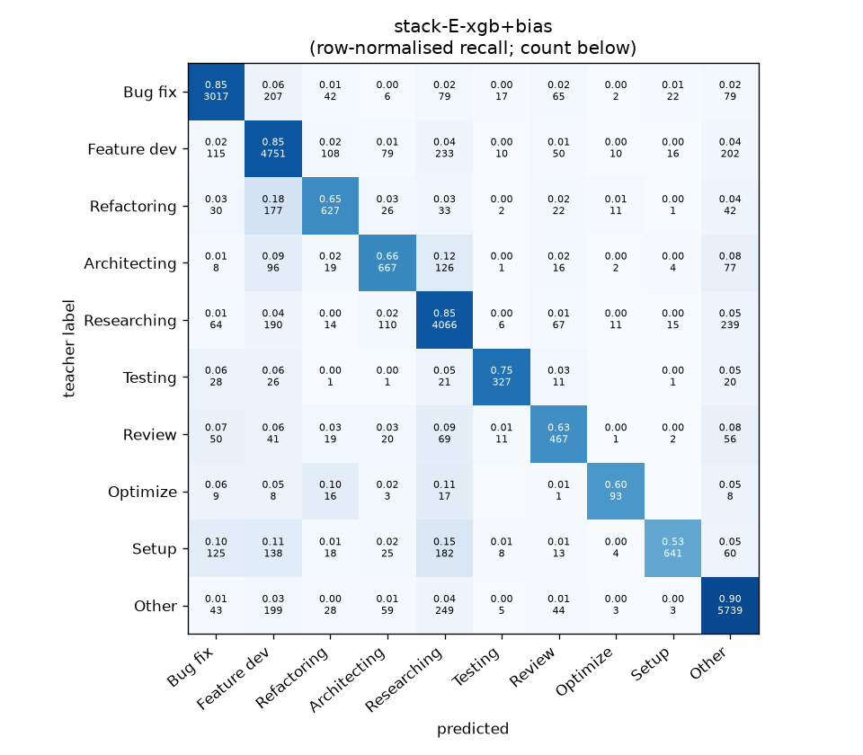
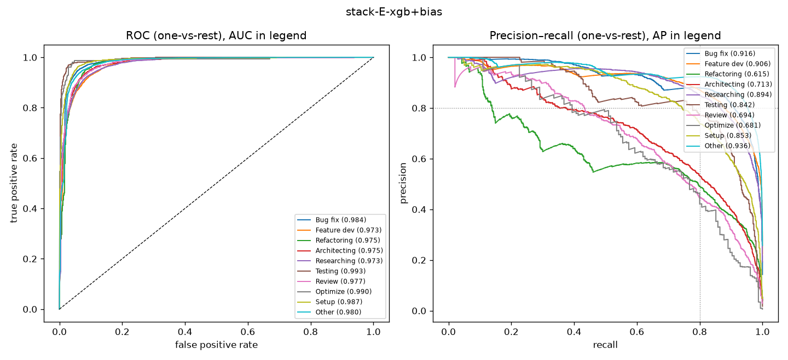

# stack-E-xgb+bias

```
{
 "block": 7,
 "features": "stack of emb-qwen3-8b-instr_lr, emb-qwen3-8b-instr_svm, tfidf-WC_lr, emb-qwen3-0.6b-instr_lr, ft-qwen3-0.6b-lora",
 "model": "meta-XGBoost + cross-fitted class bias",
 "params": "{\"max_depth\": 3, \"learning_rate\": 0.05, \"subsample\": 0.8, \"colsample_bytree\": 0.8, \"min_child_weight\": 5, \"reg_lambda\": 1.0, \"tree_method\": \"hist\", \"n_jobs\": 8, \"eval_metric\": \"mlogloss\", \"best_iterations_per_fold\": [182, 186, 178, 167, 162], \"n_estimators_final\": 176, \"bias_all\": [-0.25, -0.25, -1.25, -0.25, -0.25, -0.5, 0.0, 0.0, -2.0, 0.0], \"bias_per_fold\": [[-0.25, -0.25, -1.5, -0.25, 0.25, -1.5, 0.0, -0.25, -2.0, -0.75], [-0.75, -0.5, 0.0, -0.5, -0.25, -0.5, 0.0, -0.75, -2.0, 0.0], [-0.25, -0.5, -1.5, 0.0, -0.25, -0.5, 0.0, 0.0, -1.75, 0.25], [-0.25, -0.25, -0.75, 0.0, -0.25, -1.25, 0.0, -0.5, -2.0, 0.0], [-1.25, 0.0, 1.0, 0.0, -0.25, -0.5, 0.0, 0.0, -2.0, -0.5]]}"
}
```

### stack-E-xgb+bias

**Threshold metrics (argmax prediction)**

|              |   support (OOF) |   precision |   recall |    F1 | P 95% CI    | R 95% CI    | F1 95% CI   |   p(F1≤0.8) |
|:-------------|----------------:|------------:|---------:|------:|:------------|:------------|:------------|------------:|
| Bug fix      |            3536 |       0.865 |    0.853 | 0.859 | 0.843–0.886 | 0.831–0.876 | 0.842–0.875 |       0.000 |
| Feature dev  |            5574 |       0.815 |    0.852 | 0.833 | 0.795–0.832 | 0.833–0.869 | 0.819–0.846 |       0.000 |
| Refactoring  |             971 |       0.703 |    0.646 | 0.673 | 0.654–0.757 | 0.584–0.708 | 0.627–0.721 |       1.000 |
| Architecting |            1016 |       0.670 |    0.656 | 0.663 | 0.622–0.720 | 0.598–0.717 | 0.618–0.710 |       1.000 |
| Researching  |            4782 |       0.801 |    0.850 | 0.825 | 0.782–0.820 | 0.829–0.870 | 0.810–0.839 |       0.002 |
| Testing      |             436 |       0.845 |    0.750 | 0.795 | 0.779–0.912 | 0.661–0.826 | 0.730–0.851 |       0.621 |
| Review       |             736 |       0.618 |    0.635 | 0.626 | 0.563–0.684 | 0.565–0.707 | 0.571–0.683 |       1.000 |
| Optimize     |             155 |       0.679 |    0.600 | 0.637 | 0.545–0.828 | 0.461–0.744 | 0.514–0.758 |       0.998 |
| Setup        |            1214 |       0.909 |    0.528 | 0.668 | 0.866–0.949 | 0.475–0.581 | 0.617–0.711 |       1.000 |
| Other        |            6372 |       0.880 |    0.901 | 0.890 | 0.865–0.895 | 0.886–0.913 | 0.879–0.901 |       0.000 |

**Ranking metrics (class scores, one-vs-rest)**

|              |   ROC-AUC | ROC-AUC 95% CI   |   p(AUC=0.5) |   PR-AUC (AP) | PR-AUC 95% CI   |   PR-AUC chance (=prevalence) |
|:-------------|----------:|:-----------------|-------------:|--------------:|:----------------|------------------------------:|
| Bug fix      |     0.984 | 0.981–0.987      |        0.000 |         0.916 | 0.901–0.929     |                         0.143 |
| Feature dev  |     0.973 | 0.969–0.976      |        0.000 |         0.906 | 0.892–0.918     |                         0.225 |
| Refactoring  |     0.975 | 0.969–0.980      |        0.000 |         0.615 | 0.565–0.662     |                         0.039 |
| Architecting |     0.975 | 0.967–0.982      |        0.000 |         0.713 | 0.673–0.763     |                         0.041 |
| Researching  |     0.973 | 0.969–0.977      |        0.000 |         0.894 | 0.878–0.909     |                         0.193 |
| Testing      |     0.993 | 0.989–0.997      |        0.000 |         0.842 | 0.794–0.891     |                         0.018 |
| Review       |     0.977 | 0.966–0.985      |        0.000 |         0.694 | 0.640–0.760     |                         0.030 |
| Optimize     |     0.990 | 0.960–0.997      |        0.000 |         0.681 | 0.551–0.801     |                         0.006 |
| Setup        |     0.987 | 0.981–0.991      |        0.000 |         0.853 | 0.816–0.882     |                         0.049 |
| Other        |     0.980 | 0.976–0.983      |        0.000 |         0.936 | 0.926–0.945     |                         0.257 |

**Overall**

|                       |   value |      lo |      hi |   p-value |
|:----------------------|--------:|--------:|--------:|----------:|
| accuracy              |   0.823 |   0.813 |   0.831 |   nan     |
| macro-F1              |   0.747 |   0.728 |   0.765 |     0.005 |
| min-F1 (bar)          |   0.626 |   0.514 |   0.656 |     1.000 |
| classes with F1 ≥ 0.8 |   4.000 | nan     | nan     |   nan     |
| macro ROC-AUC         |   0.981 | nan     | nan     |   nan     |
| macro PR-AUC          |   0.805 | nan     | nan     |   nan     |




