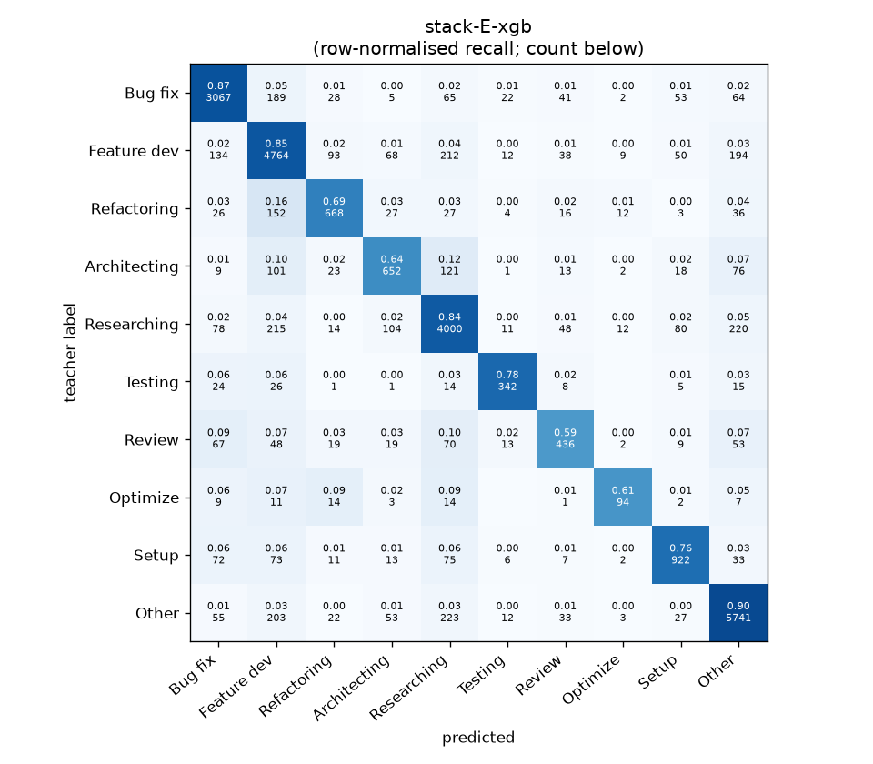
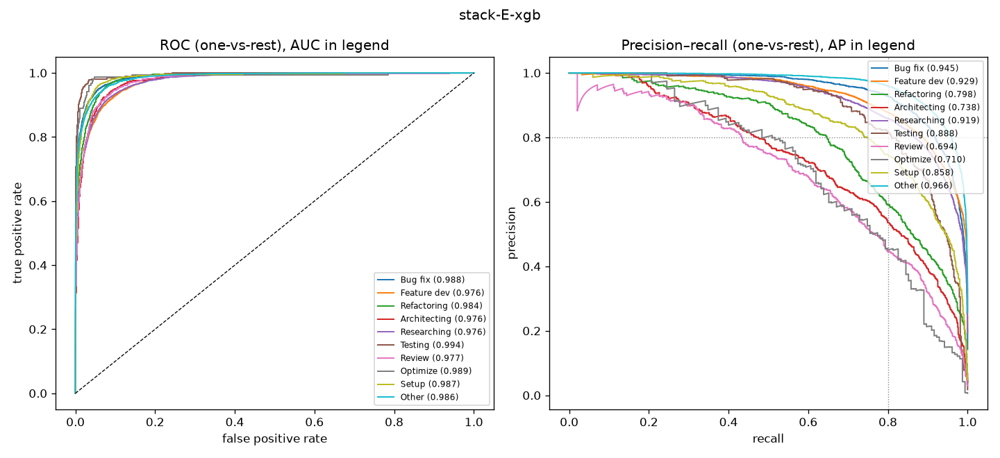

# stack-E-xgb

```
{
 "block": 7,
 "features": "stack of emb-qwen3-8b-instr_lr, emb-qwen3-8b-instr_svm, tfidf-WC_lr, emb-qwen3-0.6b-instr_lr, ft-qwen3-0.6b-lora",
 "model": "meta-XGBoost",
 "params": "{\"max_depth\": 3, \"learning_rate\": 0.05, \"subsample\": 0.8, \"colsample_bytree\": 0.8, \"min_child_weight\": 5, \"reg_lambda\": 1.0, \"tree_method\": \"hist\", \"n_jobs\": 8, \"eval_metric\": \"mlogloss\", \"best_iterations_per_fold\": [182, 186, 178, 167, 162], \"n_estimators_final\": 176}"
}
```

### stack-E-xgb

**Threshold metrics (argmax prediction)**

|              |   support (OOF) |   precision |   recall |    F1 | P 95% CI    | R 95% CI    | F1 95% CI   |   p(F1≤0.8) |
|:-------------|----------------:|------------:|---------:|------:|:------------|:------------|:------------|------------:|
| Bug fix      |            3536 |       0.866 |    0.867 | 0.867 | 0.845–0.885 | 0.846–0.889 | 0.850–0.882 |       0.000 |
| Feature dev  |            5574 |       0.824 |    0.855 | 0.839 | 0.806–0.842 | 0.836–0.872 | 0.825–0.852 |       0.000 |
| Refactoring  |             971 |       0.748 |    0.688 | 0.717 | 0.699–0.800 | 0.626–0.749 | 0.671–0.761 |       1.000 |
| Architecting |            1016 |       0.690 |    0.642 | 0.665 | 0.637–0.743 | 0.587–0.697 | 0.620–0.709 |       1.000 |
| Researching  |            4782 |       0.830 |    0.836 | 0.833 | 0.811–0.850 | 0.816–0.858 | 0.817–0.849 |       0.000 |
| Testing      |             436 |       0.809 |    0.784 | 0.796 | 0.743–0.876 | 0.706–0.853 | 0.736–0.849 |       0.558 |
| Review       |             736 |       0.680 |    0.592 | 0.633 | 0.623–0.753 | 0.522–0.663 | 0.578–0.692 |       1.000 |
| Optimize     |             155 |       0.681 |    0.606 | 0.642 | 0.553–0.829 | 0.462–0.744 | 0.519–0.761 |       0.996 |
| Setup        |            1214 |       0.789 |    0.759 | 0.774 | 0.750–0.832 | 0.710–0.805 | 0.736–0.809 |       0.932 |
| Other        |            6372 |       0.892 |    0.901 | 0.896 | 0.876–0.907 | 0.887–0.914 | 0.885–0.907 |       0.000 |

**Ranking metrics (class scores, one-vs-rest)**

|              |   ROC-AUC | ROC-AUC 95% CI   |   p(AUC=0.5) |   PR-AUC (AP) | PR-AUC 95% CI   |   PR-AUC chance (=prevalence) |
|:-------------|----------:|:-----------------|-------------:|--------------:|:----------------|------------------------------:|
| Bug fix      |     0.988 | 0.986–0.990      |        0.000 |         0.945 | 0.934–0.954     |                         0.143 |
| Feature dev  |     0.976 | 0.972–0.978      |        0.000 |         0.929 | 0.917–0.936     |                         0.225 |
| Refactoring  |     0.984 | 0.979–0.988      |        0.000 |         0.798 | 0.759–0.836     |                         0.039 |
| Architecting |     0.976 | 0.968–0.982      |        0.000 |         0.738 | 0.700–0.783     |                         0.041 |
| Researching  |     0.976 | 0.972–0.979      |        0.000 |         0.919 | 0.908–0.930     |                         0.193 |
| Testing      |     0.994 | 0.990–0.998      |        0.000 |         0.888 | 0.846–0.925     |                         0.018 |
| Review       |     0.977 | 0.966–0.985      |        0.000 |         0.694 | 0.640–0.760     |                         0.030 |
| Optimize     |     0.989 | 0.955–0.997      |        0.000 |         0.710 | 0.591–0.830     |                         0.006 |
| Setup        |     0.987 | 0.981–0.991      |        0.000 |         0.858 | 0.826–0.885     |                         0.049 |
| Other        |     0.986 | 0.984–0.988      |        0.000 |         0.966 | 0.960–0.971     |                         0.257 |

**Overall**

|                       |   value |      lo |      hi |   p-value |
|:----------------------|--------:|--------:|--------:|----------:|
| accuracy              |   0.834 |   0.825 |   0.844 |   nan     |
| macro-F1              |   0.766 |   0.749 |   0.785 |     0.005 |
| min-F1 (bar)          |   0.633 |   0.519 |   0.668 |     1.000 |
| classes with F1 ≥ 0.8 |   4.000 | nan     | nan     |   nan     |
| macro ROC-AUC         |   0.983 | nan     | nan     |   nan     |
| macro PR-AUC          |   0.844 | nan     | nan     |   nan     |




