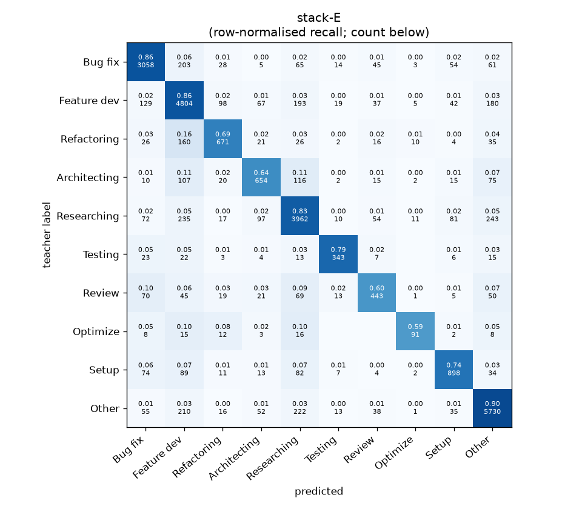
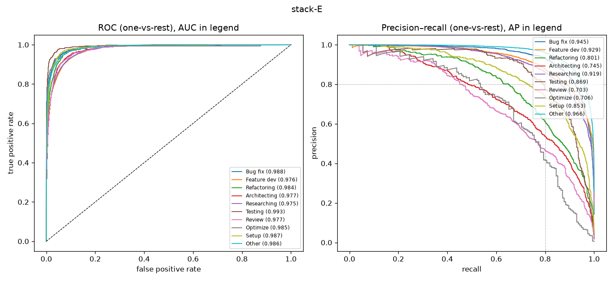

# stack-E

```
{
 "block": 7,
 "features": "stack of emb-qwen3-8b-instr_lr, emb-qwen3-8b-instr_svm, tfidf-WC_lr, emb-qwen3-0.6b-instr_lr, ft-qwen3-0.6b-lora",
 "model": "meta-LR",
 "params": "{\"C\": 1.0, \"cw\": null}"
}
```

### stack-E

**Threshold metrics (argmax prediction)**

|              |   support (OOF) |   precision |   recall |    F1 | P 95% CI    | R 95% CI    | F1 95% CI   |   p(F1≤0.8) |
|:-------------|----------------:|------------:|---------:|------:|:------------|:------------|:------------|------------:|
| Bug fix      |            3536 |       0.868 |    0.865 | 0.866 | 0.848–0.887 | 0.843–0.886 | 0.849–0.881 |       0.000 |
| Feature dev  |            5574 |       0.816 |    0.862 | 0.838 | 0.798–0.833 | 0.843–0.878 | 0.824–0.851 |       0.000 |
| Refactoring  |             971 |       0.750 |    0.691 | 0.719 | 0.701–0.801 | 0.634–0.753 | 0.674–0.766 |       1.000 |
| Architecting |            1016 |       0.698 |    0.644 | 0.670 | 0.647–0.752 | 0.587–0.705 | 0.623–0.718 |       1.000 |
| Researching  |            4782 |       0.832 |    0.829 | 0.830 | 0.812–0.852 | 0.807–0.849 | 0.814–0.846 |       0.000 |
| Testing      |             436 |       0.811 |    0.787 | 0.799 | 0.745–0.879 | 0.706–0.853 | 0.741–0.853 |       0.557 |
| Review       |             736 |       0.672 |    0.602 | 0.635 | 0.612–0.736 | 0.532–0.674 | 0.577–0.693 |       1.000 |
| Optimize     |             155 |       0.722 |    0.587 | 0.648 | 0.583–0.875 | 0.436–0.744 | 0.515–0.767 |       0.996 |
| Setup        |            1214 |       0.786 |    0.740 | 0.762 | 0.743–0.830 | 0.690–0.789 | 0.725–0.799 |       0.981 |
| Other        |            6372 |       0.891 |    0.899 | 0.895 | 0.876–0.905 | 0.884–0.912 | 0.884–0.905 |       0.000 |

**Ranking metrics (class scores, one-vs-rest)**

|              |   ROC-AUC | ROC-AUC 95% CI   |   p(AUC=0.5) |   PR-AUC (AP) | PR-AUC 95% CI   |   PR-AUC chance (=prevalence) |
|:-------------|----------:|:-----------------|-------------:|--------------:|:----------------|------------------------------:|
| Bug fix      |     0.988 | 0.985–0.990      |        0.000 |         0.945 | 0.935–0.954     |                         0.143 |
| Feature dev  |     0.976 | 0.972–0.978      |        0.000 |         0.929 | 0.916–0.936     |                         0.225 |
| Refactoring  |     0.984 | 0.978–0.988      |        0.000 |         0.801 | 0.765–0.841     |                         0.039 |
| Architecting |     0.977 | 0.970–0.983      |        0.000 |         0.745 | 0.707–0.789     |                         0.041 |
| Researching  |     0.975 | 0.972–0.979      |        0.000 |         0.919 | 0.908–0.930     |                         0.193 |
| Testing      |     0.993 | 0.987–0.997      |        0.000 |         0.869 | 0.810–0.916     |                         0.018 |
| Review       |     0.977 | 0.967–0.985      |        0.000 |         0.703 | 0.651–0.763     |                         0.030 |
| Optimize     |     0.985 | 0.946–0.997      |        0.000 |         0.706 | 0.570–0.817     |                         0.006 |
| Setup        |     0.987 | 0.981–0.991      |        0.000 |         0.853 | 0.822–0.882     |                         0.049 |
| Other        |     0.986 | 0.984–0.988      |        0.000 |         0.966 | 0.961–0.971     |                         0.257 |

**Overall**

|                       |   value |      lo |      hi |   p-value |
|:----------------------|--------:|--------:|--------:|----------:|
| accuracy              |   0.833 |   0.824 |   0.842 |   nan     |
| macro-F1              |   0.766 |   0.749 |   0.785 |     0.005 |
| min-F1 (bar)          |   0.635 |   0.515 |   0.670 |     1.000 |
| classes with F1 ≥ 0.8 |   4.000 | nan     | nan     |   nan     |
| macro ROC-AUC         |   0.983 | nan     | nan     |   nan     |
| macro PR-AUC          |   0.844 | nan     | nan     |   nan     |




