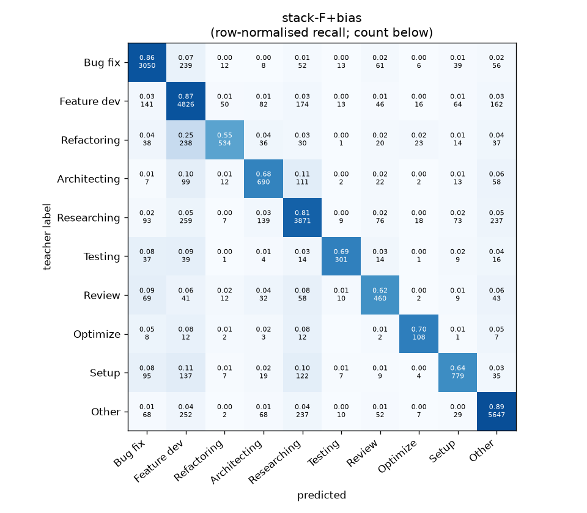
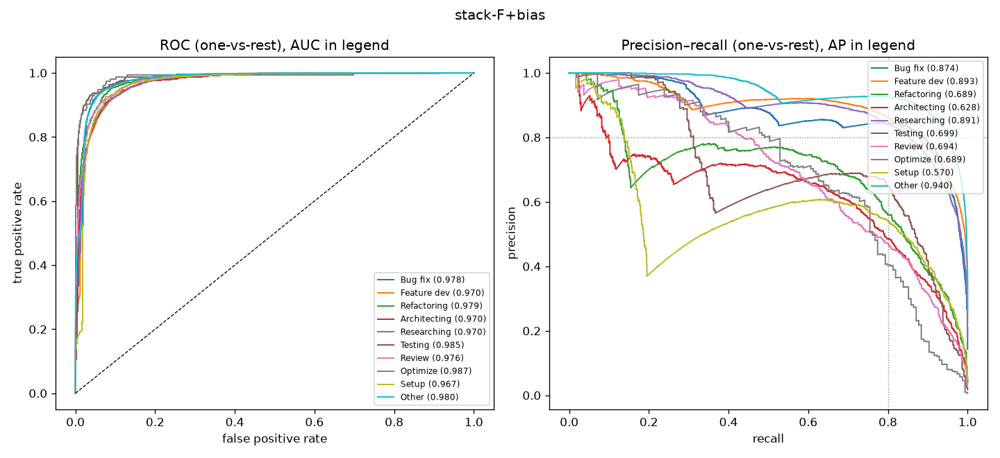

# stack-F+bias

```
{
 "block": 7,
 "features": "stack of emb-qwen3-8b-instr_lr, ft-qwen3-0.6b-lora",
 "model": "meta-LR + cross-fitted class bias",
 "params": "{\"C\": 1.0, \"cw\": null, \"bias_all\": [-1.0, -0.75, -1.75, 0.5, -0.75, 0.5, 0.0, 0.75, -2.0, -0.25], \"bias_per_fold\": [[0.5, -0.5, -1.75, -0.5, -0.25, -2.5, 0.0, 0.75, -2.0, -1.0], [-1.25, 0.0, -1.5, 0.25, -0.75, 0.5, 0.0, 0.25, -2.0, -0.25], [-0.5, -0.5, 0.0, -0.5, -0.25, -2.5, 0.0, 1.0, -2.0, -0.25], [0.5, -0.5, -1.5, 1.0, -0.25, -2.5, 0.0, 0.75, 1.75, -0.25], [-1.0, 0.0, -1.5, -0.5, -0.75, 0.5, 0.0, 0.75, -2.0, -1.0]]}"
}
```

### stack-F+bias

**Threshold metrics (argmax prediction)**

|              |   support (OOF) |   precision |   recall |    F1 | P 95% CI    | R 95% CI    | F1 95% CI   |   p(F1≤0.8) |
|:-------------|----------------:|------------:|---------:|------:|:------------|:------------|:------------|------------:|
| Bug fix      |            3536 |       0.846 |    0.863 | 0.854 | 0.825–0.867 | 0.839–0.885 | 0.837–0.869 |       0.000 |
| Feature dev  |            5574 |       0.786 |    0.866 | 0.824 | 0.766–0.803 | 0.847–0.882 | 0.810–0.837 |       0.000 |
| Refactoring  |             971 |       0.836 |    0.550 | 0.663 | 0.789–0.893 | 0.490–0.617 | 0.612–0.717 |       1.000 |
| Architecting |            1016 |       0.638 |    0.679 | 0.658 | 0.593–0.693 | 0.622–0.736 | 0.615–0.704 |       1.000 |
| Researching  |            4782 |       0.827 |    0.809 | 0.818 | 0.807–0.847 | 0.788–0.831 | 0.801–0.834 |       0.017 |
| Testing      |             436 |       0.822 |    0.690 | 0.751 | 0.750–0.893 | 0.596–0.771 | 0.674–0.814 |       0.935 |
| Review       |             736 |       0.604 |    0.625 | 0.614 | 0.552–0.665 | 0.554–0.696 | 0.565–0.668 |       1.000 |
| Optimize     |             155 |       0.578 |    0.697 | 0.632 | 0.469–0.711 | 0.564–0.846 | 0.523–0.747 |       1.000 |
| Setup        |            1214 |       0.756 |    0.642 | 0.694 | 0.711–0.802 | 0.587–0.693 | 0.652–0.735 |       1.000 |
| Other        |            6372 |       0.897 |    0.886 | 0.891 | 0.882–0.912 | 0.869–0.901 | 0.879–0.903 |       0.000 |

**Ranking metrics (class scores, one-vs-rest)**

|              |   ROC-AUC | ROC-AUC 95% CI   |   p(AUC=0.5) |   PR-AUC (AP) | PR-AUC 95% CI   |   PR-AUC chance (=prevalence) |
|:-------------|----------:|:-----------------|-------------:|--------------:|:----------------|------------------------------:|
| Bug fix      |     0.978 | 0.974–0.981      |        0.000 |         0.874 | 0.852–0.892     |                         0.143 |
| Feature dev  |     0.970 | 0.966–0.973      |        0.000 |         0.893 | 0.878–0.905     |                         0.225 |
| Refactoring  |     0.979 | 0.973–0.984      |        0.000 |         0.689 | 0.642–0.745     |                         0.039 |
| Architecting |     0.970 | 0.962–0.977      |        0.000 |         0.628 | 0.582–0.687     |                         0.041 |
| Researching  |     0.970 | 0.966–0.974      |        0.000 |         0.891 | 0.876–0.905     |                         0.193 |
| Testing      |     0.985 | 0.974–0.992      |        0.000 |         0.699 | 0.627–0.775     |                         0.018 |
| Review       |     0.976 | 0.966–0.984      |        0.000 |         0.694 | 0.637–0.760     |                         0.030 |
| Optimize     |     0.987 | 0.957–0.996      |        0.000 |         0.689 | 0.552–0.806     |                         0.006 |
| Setup        |     0.967 | 0.960–0.973      |        0.000 |         0.570 | 0.526–0.619     |                         0.049 |
| Other        |     0.980 | 0.977–0.982      |        0.000 |         0.940 | 0.931–0.949     |                         0.257 |

**Overall**

|                       |   value |      lo |      hi |   p-value |
|:----------------------|--------:|--------:|--------:|----------:|
| accuracy              |   0.817 |   0.808 |   0.827 |   nan     |
| macro-F1              |   0.740 |   0.722 |   0.758 |     0.005 |
| min-F1 (bar)          |   0.614 |   0.523 |   0.649 |     1.000 |
| classes with F1 ≥ 0.8 |   4.000 | nan     | nan     |   nan     |
| macro ROC-AUC         |   0.976 | nan     | nan     |   nan     |
| macro PR-AUC          |   0.757 | nan     | nan     |   nan     |




